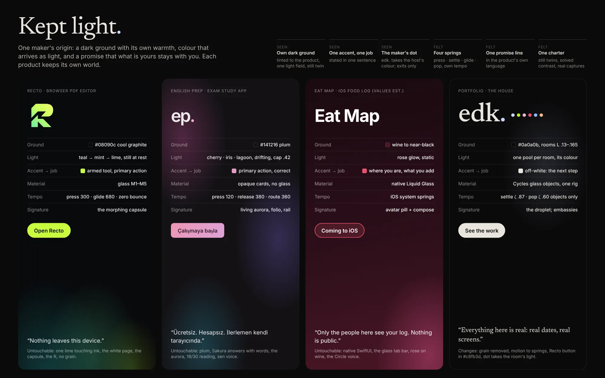

# Family vision: Kept light

**Status:** accepted in part 2026-10-09 (§0 lists what the owner answered and what stays open;
an ADR records it when the rest is answered) · **Kit:** `docs/family-kit/` turns the accepted
parts into portable files and a prompt per app ·
**Rests on:** brief §7 (2026-10-09, *Family vision*, *Page character*, *Liveliness*);
`research/2026-10-product-family.md` (cases, strategies A–I), `research/2026-10-family-audit.md`
(DNA, rhymes C1–C10 clashes, untouchables), `research/2026-10-page-worlds.md` (concept D,
"embassies"; the lightness window and the single rig), `research/2026-10-readability.md`,
`research/2026-10-craft-audit.md` §4–5, ADR-0003, 0005, 0006, 0007 · **Not yet read:**
`research/2026-10-liveliness.md` (in progress); §3.5 below names what it may change ·
**Revised** the same evening after owner input: embassies approved in principle (§3.1 now
specifies them); type researched as its own question (§2.5); "one house, four rooms" (page
worlds, concept A) is referenced but nothing here depends on it.

The owner, in their words: instead of trapping every product in one design and breaking its variety,
each keeps its own UI, motion, colour, structure and details, and they meet at a shared place.
*"They all come from the same place, but each is original and different in its own way."* They worked
hard on Recto's and English Prep's UIs, Recto above all. This document never asks them to change
to match anything; the portfolio adapts first, and the apps only ever opt in.

---

## 0. The owner's answers (2026-10-09, late; brief §7 *boost and the family kit*)

| Question | Answer | What it changes here |
|---|---|---|
| §6.1 Q1: what reads first as "the same maker" | **Light is the visible constant**: near-black grounds of each product's own temperature, colour arriving as light. The dot *maybe*. | V1 leads; V3 is demoted from a seen constant to an endorsement until its wider role is decided |
| §6.1 Q2: where `edk.` may appear outside the portfolio | **Only at exits** (About or credits, press and social assets), never in working UI | V3, §4.1 stand as written |
| §6.1 Q5: type | **Each product keeps its own faces** | §2.5 stands; option d (the drawn mark in app credits) is not yet chosen, so credits default to the product's type |
| §6.1 Q4: texture | **Grain stays in the portfolio.** It is not a family rule either way: no product must add it, none must remove it | §2.1, §3.4: the grain removal is withdrawn |
| Recto's "grain ban" (Q-1) | **A misrecording.** The owner had asked to fix the glass object's wrong render and its banding, not to ban grain | §2.3's Recto row no longer cites it; Recto's own record is corrected in Recto by the owner's session for that repo, not from here |
| Family kit | **First**: shared design files and a ready prompt per app, so each app's work runs in its own session | `docs/family-kit/` |

**Still open:** the dot's wider role (whether it ever becomes a seen constant, and whether
`recto` or Eat Map's mark takes one; only each mark's designer decides that), and Recto's object
(§6.1 Q3). The ink half of Q4 was not asked again: the house keeps its warm ink and embassies use
each product's ink, the recommended default, until the owner says otherwise. Eat Map's real values
are still to be read from Xcode.

---

## 1. Thesis

Eren's products already share a hand they were never told to share: each sits on a dark ground of
its own temperature, lets its one colour arrive as **light** rather than paint, and makes the same
quiet promise that what is yours stays with you (*Nothing leaves this device. · İlerlemen kendi
tarayıcında. · Nothing is public.*). The family is that hand made explicit, not a kit laid over
four products. We share **few, bold, visible constants** (a dark ground with its own warmth, one
light per product, one accent with one job; the maker's dot only at exits, §0) and **a method you feel rather
than see** (one spring grammar played at each product's tempo, one voice, one quality charter);
everything else (hue, material, type, structure, signature interaction, language) stays each
product's own and is listed as untouchable. The portfolio is the **house** where they meet; each
project view is that product's **embassy**, where its own ground, light and real captures take
over inside a frame the house keeps.

**The name: Kept light.** Two true things about this maker in two words. *Light*: in all four
products colour enters as light on a dark ground, never as wallpaper. *Kept*: every product keeps
what belongs to the user (local files, progress in the browser, a private circle), and the maker
keeps their promises with proof (Recto's "proof before promise", English Prep's solved contrast,
the Record's real dates). It also describes the portfolio itself: a dark house where each
product's light is kept. Used internally and, if the owner likes it, once in a credits line;
never as a logo.

---

## 2. Constants and variables

### 2.1 The rule of few

The research is blunt (MIT Media Lab 2011, Adobe 2020, Google Workspace 2020, Vox): many subtle
constants read as sameness, and variety the eye cannot read is not variety. So: **three constants
you see, three you feel, and nothing else shared.** Test for every proposed constant: a stranger
shown a 64 px greyscale thumbnail of any screen must still name the product (variety is readable);
shown four screens side by side, they should guess "same maker" (the origin is readable).

**Seen (V1–V3), felt (F1–F3):**

| # | Constant | The rule | Why this one |
|---|---|---|---|
| V1 | **Dark ground, own temperature; colour arrives as light** | Ground is near-black (OKLCH L ≤ 0.20) and tinted toward the product's own hue, never pure `#000`, never a mid-tone. Each product has exactly **one light field** (aurora, glow, pool) in its own pigments, behind content, never on it; it has a still twin and pauses when hidden. Large surfaces are never painted in the accent. | True in all four today (audit §3.1); the owner named it first (brief §5). |
| V2 | **One accent, one job** | Each product has one accent and gives it one job, stated in a sentence. Other colours may exist (English Prep's iris, lagoon, apricot) but have named roles below the accent. | Already true (audit §3.2); keeps colour meaningful. |
| V3 | **The maker's dot** *(endorsement at exits only, §0; its wider role is open)* | A lowercase name may end in a period set in the product's colour (`edk.`, `ep.`). In the house, the dot of `edk.` takes the light of the room you are in. The endorsement anywhere outside the house is `edk.` with its dot in the host's colour, at entry and exit points only (About, credits, press kit), never inside working UI. | The owner liked it twice (E's dot, `ep.`); one typographic gesture, cheap, unmistakable. |
| F1 | **One spring grammar, own tempo** | Four named springs: **press, settle, glide, pop**, all from one spring function (mass 1, stiffness k, damping c), exported as `linear()`. Each product sets its own k and c and decides whether it uses pop at all. Rest is still; motion answers an action or a change of place; ambient light is the only thing allowed to drift, ≥ 9 s cycles, paused when hidden. | Recto and English Prep already derive springs (research §6); Mastercard's one melody in many arrangements. |
| F2 | **One voice, one promise line** | Plain, specific, first person or direct address, no hype, sentence case. Each product carries **one promise line** about what stays with the user, written in its own language and register, never translated from another. | Shared value in all three products (audit §3.6); survives every redesign. |
| F3 | **One quality charter** | §2.4. Already practised in all three repos; written once. | The origin people trust (Rams, Ghibli, Supergiant). |

Rejected as constants (and why): **glass** (English Prep removed it by decision, C6), **one
typeface** (§2.5: type stays each product's own; the house's serif becomes the maker's voice), **one motion
curve or duration** (C7), **one icon style**, **one navigation pattern** (all are capsules today
by coincidence; nothing requires it), **grain** (owner, §0: it stays in the portfolio and is not a
family rule either way; C5 rested on a misrecording).

### 2.2 The four products across the constants

Concrete values where they exist; *(est.)* for Eat Map until read from Xcode.

| | Recto | English Prep | Eat Map *(est.)* | Portfolio (the house) |
|---|---|---|---|---|
| **V1 ground** | cool graphite `#08090c` (hue 265) | plum `#141216` | wine `#4a1626` → near-black, rose glow | neutral `#0a0a0b`, room temperatures within L 0.13–0.165 (page worlds §4) |
| **V1 light** | lime aurora teal `#1f9996` → mint `#58da98` → lime `#bbed26` → lemon `#faee40`; still at rest, moves on events, settles ≤ 5 s, never within 64 px of a page | three clusters cherry `#a04278`, iris `#6350a5`, lagoon `#28798a`; 9.75/11.75/13.75 s drift; one parent cap .42 dark | rose glow `#ec5794` lower right, static | one pool per room in its colour (edk `#c9d4ff`, Record `#8fb8ff`, About `#f3b886`, project colours on Work) |
| **V2 accent → job** | lime `#c8fb3d` → "the armed tool and the one primary action"; always touches ink `#08090c`; never on the page | Sakura pair `#ed96b4` → `#dca2d8` → "the one primary action, and *correct*" (with check mark and the word *Doğru*) | rose `#eb4f6b` → "where you are and what you add" (selected tab, compose) | off-white pill `#e9e5de` → "the next step"; each world's colour is light, not a button, except inside an embassy |
| **V3 dot** | none in the product; the R is Recto's sign (brand rules forbid effects) | `ep.` Sakura dot `#efb1cb` (exists) | owner to name the mark | `edk.` dot takes the current room's light |
| **F1 press** | 300 ms, ζ 1, scale .97 mouse / .94 touch | 120 ms inner compression | system highlight | k 600 c 49 (ζ 1.0), scale .98 |
| **F1 settle** | smooth 530 ms, zero bounce | 380 ms continuous release | system `.smooth` | ui k 300 c 30 (ζ .87, ≈ 450 ms) |
| **F1 glide** | glide 680 ms; View Transitions 240 ms | route 360 ms over 12 px; scene 560 ms | push navigation | k 170 c 26 (ζ 1.0): sheet, room change |
| **F1 pop** | pop 410 ms (b .25), success only | answer pop and shake | system `.bouncy` on compose | object k 180 c 16 (ζ .60), objects only |
| **F2 promise** | "Nothing leaves this device." | "Ücretsiz. Hesapsız. İlerlemen kendi tarayıcında." | "Only the people here see your log … Nothing is public." | proposed: "Everything here is real: real dates, real screens." |
| **F2 register** | English + Turkish *siz*, terse | Turkish *sen*, warm, "refine, not teach" | English, private, plain | English, first person |

### 2.3 What each product keeps as untouchable

This list outranks everything else in this document. If a family idea touches a row here, the
idea loses.

| Product | Untouchable (never changed for the family) |
|---|---|
| **Recto** | One lime `#c8fb3d`, touching ink, one fill per view, never on the page · the white page as the brightest thing · the morphing glass capsule (dock ⇄ palette ⇄ pages ⇄ compare ⇄ locked) · glass M1–M5 and its rules · the lime aurora, still at rest · zero-bounce springs, idle frames = 0 · the "Dengeli" R and its mint `#69EAA3` → lime `#CBFF5F` → yellow-lime `#EDFA6D` gradient at 46.75°, and the brand doc's usage rules · Inter Recto, sentence case, Phosphor outline → fill · clean glass renders without banding (Q-1 as the owner meant it; its "no grain" wording is a misrecording, §0) · A-1…A-24 |
| **English Prep** | Plum ground and Sakura / periwinkle answer semantics with words and marks · the living three-cluster aurora under one parent cap · Inter reading 18/30 in a ~600 px column · `ep.` with the Sakura dot · the 120 ms press and 380 ms release · v0.72 route choreography (ADR 013) · the rail · Turkish *sen* voice · settled navigation (two peers in the capsule, Profil in the header) · no build step, no `innerHTML` | *(2026-10-10: glass is allowed again, measured; About may be redesigned from scratch; see English Prep docs/handover/AUDIT.md)*
| **Eat Map** | Native SwiftUI and iOS conventions · Liquid Glass capsule tab bar with the avatar pill and the round compose button · rose `#eb4f6b` on wine · the "Circle" privacy voice |
| **Portfolio** | Black ground · Newsreader for the name and titles (pairing 2) · per-world colours accepted 2026-10-09 · pre-rendered Cycles objects (ADR-0006), one rig, one droplet · every tab a page (ADR-0007) |

### 2.4 The quality charter (F3)

One page, linked from the house's footer ("How these are made") and, if the owner agrees, from
each app's About. Every rule is already practised somewhere in the family:

1. **Every effect has a still twin**: reduced motion, no WebGL, Low Power Mode and phones get a
   complete product.
2. **Contrast is solved, not chosen**: WCAG 2 enforced, APCA supplementary, measured through the
   real material (glass, aurora envelope) in CI.
3. **Real, never mock**: product images are real captures of the shipping build; no fake device
   bezels, no stock, no invented metrics.
4. **No characters as icons**: no emoji or Unicode arrows; icons are drawn to a contract.
5. **Rest is still**: no idle loops on controls; ambient light alone may drift, and pauses when
   hidden.
6. **Decisions are written**: ADRs and specs, cited in code comments.
7. **Seen before shipped**: screenshots at 1440×900, 1180×820 touch and 390×844 for every UI change.
8. **The promise is proven**: every privacy line links to its evidence.

### 2.5 Type: does differing type break the shared origin?

The owner's question: should each product keep its own faces (Recto: Inter Recto; English Prep:
Inter; Eat Map: SF Pro; portfolio: Newsreader + Inter), or does differing type break the origin?
**Answer: keep them. Type is a variable, not a constant. The portfolio's serif becomes the maker's
signature voice: inside an embassy it sets only what Eren says (title, section heads, their
narrative, credits), never what the product says.**

**The family's own evidence (M).** Recto and English Prep already use the *same* face, Inter, and
look nothing alike (contact sheet, audit §1): Recto is 600 at moderate tracking with optical
sizes and sentence case; English Prep is 600 at very tight tracking (the mark at −0.065 em) with
18/30 reading. Most of a type voice lives in size, weight, tracking, measure and colour, so "same
face" was never what made them a family, and "different face" will not unmake one.

**Cases** (grades as in the research files: E primary source opened, P press or practitioner, F
secondary or aggregated):

| Case | Shared or varied | Lesson for us | Grade |
|---|---|---|---|
| Apple HIG | Shared system faces for reading; Branding: "It can work well to use a custom font for headlines and subheadings while using system fonts for body copy and captions." Typography: "Minimize the number of typefaces you use, even in a highly customized interface." | A family can share the reading layer and free the display layer, and each member keeps few faces | E (HIG Branding, Typography, read 2026-10-09) |
| Google | Google Sans across products (now open, with Sans Flex, 2025); YouTube keeps its own YouTube Sans (Saffron, 2017) | Even a branded house lets its member with the strongest identity keep its own face | P |
| Microsoft | Segoe UI Variable for Windows, Aptos for Office; both by Steve Matteson | One hand across different faces: a family by maker, not by font | P |
| Airbnb (Cereal), Spotify (Circular) | One face for logo, site and app | Single-product branded houses; the wrong model for four independent products | P |
| Nothing | Ndot *is* the identity; when OS 3 used it less, users wrote that the phone "lost its identity" | If a face is your signature, ration it, never drop it: the case for keeping Newsreader as a rationed signature rather than spreading it or removing it | P (forum, Android Authority) |
| Teenage Engineering | No single confirmed house face; the family is carried by material, pictograms and naming | A strong family does not need shared type | F |
| Panic | No documented house face; each app its own icon character, tied by craft touches (Iconfactory) | The hand shows in craft, not in a font | P |
| Supergiant | Each game's lettering made for that game (Hades' wordmark and UI lettering); no shared studio face found | Works by one hand need not share type | F |
| Annapurna Interactive | The label's site has its own face (Name Sans), picked to put the games "center stage"; the label's still logo opens each game; every game keeps its own type | The closest analogue: the house has its own voice, the works keep theirs, the mark sits at the threshold | P |
| Condé Nast | Each title its own masthead and faces (Vogue's Didone masthead and Vogue AG; The New Yorker's Irvin with Caslon) under one publisher | Titles share a publisher, not a face; the publisher lives in the colophon | P/F |

**Why keep them.** (1) Changing a product's face is the most expensive flattening there is: it
touches every screen, English Prep's per-size contrast pairs (`tools/palette.mjs`) and Recto's
A-gates; the brief forbids it. (2) The origin is carried by V1–V3 and the objects; readable type
differences are exactly the variety the research asks for. (3) Newsreader is the only serif in
the family and the house's most distinctive asset (pairing 2, accepted), so it can mark *where
the maker speaks*, as Annapurna's face marks the label.

**The rule: Newsreader is the maker's voice; the product's face is the product's voice.**

| Where | Newsreader (maker) | Product's face | Inter (house UI) |
|---|---|---|---|
| Porch | product name, title | the quoted promise line, the primary button label | facts, meta |
| Embassy | section heads, narrative prose (21 px, readability T1) | captions that quote UI words, any reproduced label | meta |
| Credits | the `edk.` mark | — | the line itself |
| Inside an app | never as running text; at most the `edk.` mark as a drawn logo (§6.1 Q5 d) | everything | — |

**Engineering.** Embassies load no new font bytes. Recto and English Prep are both Inter: the
house's Inter subset is set with each product's sizes, weights, tracking and `tnum`, which is
visually Inter Recto within subset differences. SF Pro is licensed for Apple platforms only and
cannot be embedded on the web: Eat Map's embassy uses `system-ui` (SF on Apple devices) with Inter
as fallback; its captures carry the true SF. Recto Signature (Inter italic 300) is never used:
it exists only for typed signatures.

*Type sources:* Apple HIG Branding and Typography (developer.apple.com JSON, opened); search
extracts: Google Design (Google Sans Flex, YouTube Sans), microsoft.design and learn.microsoft.com
(Aptos, Segoe UI Variable), nothing.community and Android Authority (OS 3), fontsinuse.com and
avid.wiki (Annapurna), madegooddesigns.com (Vogue, Hades, Airbnb, Spotify), Iconfactory portfolio
(Panic). No source confirmed TE's or Supergiant's faces; those rows are inference.

---

## 3. How the portfolio expresses the family

### 3.1 The house and its embassies (approved in principle, 2026-10-09)

The owner approved the direction: a project view enters the app's own world (Recto graphite and
lime, English Prep aurora and Sakura, Eat Map wine and rose) inside the portfolio's frame and
title. The house (Home, Work, Record, About) keeps its own language: black, warm ink, Newsreader,
glass objects, the droplet. **Rooms** (page worlds concept A, to be prototyped later) may vary the
house's pages; embassies do not depend on them: the porch stands on the house ground with the
project's light, which holds with or without rooms. If rooms ship, Work's room is simply where
embassies are opened from.

**Anatomy.** Desktop: the sheet of ADR-0007 (≥ 900 px, native `<dialog>`, URL `/work/<slug>/`).
Phone and direct links: the same order as a page of its own.

| Band | Ground | Holds | Type | Motion |
|---|---|---|---|---|
| Frame (always) | — | sheet edge, close control, the live bar above, `edk.` whose dot takes the product's colour | house | sheet opens on the house glide, closes in 320 ms |
| 1 Porch | house `#0a0a0b` + the project's light pool | object (poster, then clip), title, the promise line, facts (status, platform, started, last moved), primary and secondary buttons | §2.5 | only the object's clip, at the product's tempo |
| 2 Threshold | 200 px static gradient, house ground → product ground (120 px on phones) | nothing but the product's light beginning | — | none; scrolling reveals it (Alexander's entrance transition) |
| 3 Embassy | product ground and light | What it is (hero capture) · Signature (clip) · Why · How (captures) · What I learned · Next · In the record (the project thread) | Newsreader heads and prose in the product's ink; product face for UI words | the product's own light behaviour; captures still; the clip plays once in view, then rests on its poster |
| 4 Foot | product ground | credits "Kept light · how these are made", Open the app, Code, Back | house | — |

**Rules inside an embassy:**

- **Tokens are copied, never redrawn.** Each project carries `content/projects/<slug>/world.json`:
  ground, raised, ink 1–3, hairline, accent, accent ink, accent radius, the accent's job sentence,
  light layers (colours, positions, behaviour: still, event or drift with timings), font stack,
  press and settle. Generated from Recto's `tokens.css` and English Prep's `css/style.css` /
  `tools/palette.mjs`; Eat Map's by hand from Xcode with source references. A new project's world
  is data, never code (ADR-0002).
- **The accent keeps its job.** It appears on the primary button and as light, nothing else.
  Links in prose underline in the product's ink: rose on wine is 4.93:1, below the 7:1 prose target.
- **The product's motion is its truth.** Recto's aurora is still and answers one event: on arriving
  at the embassy band it brightens slightly and settles within 5 s. English Prep's clusters drift
  at their own timings under the .42 cap, paused when the band is off screen or the tab hidden.
  Eat Map's glow is static. Buttons press with the product's press (Recto: .97 on its 300 ms
  spring; English Prep: 120 ms compression, 380 ms release). Reduced motion: every light still
  (English Prep's three still pools), clips as posters.
- **Contrast is measured per world (M):** Recto ink 16.4:1, secondary 8.1:1; English Prep 15.5:1,
  supporting 11.6:1; Eat Map white on wine 14.7:1. Every pair runs through the house's checks.
- **The lightness window holds:** the object only ever stands on the porch; captures are images.
- **Leaving is calm:** close or Back fades the dialog; no ground flashes, nothing slides.
- **Later, opt-in:** "a live taste". English Prep is same-origin (`/english-prep/`), so one real
  question from its data could be answered inside its embassy with its own feedback; Recto links
  to its sample document. Not in the first embassies.

**Per embassy:**

| | Recto | English Prep | Eat Map |
|---|---|---|---|
| Ground → ink | `#08090c` → `#e8e9ec` | `#141216` → `#eee9ed` | wine → white *(est.)* |
| Light | teal → mint → lime, still, one arrival event | cherry / iris / lagoon, drifting, cap .42 | rose glow, static |
| Primary button | "Open Recto" `#c8fb3d`, label `#08090c`, radius 999 | "Open English Prep", Sakura pair, ink `#301b27`, radius 8 | "Coming to iOS", rose ring, or none |
| Product face | house Inter with Recto's sizes and 600 titles | house Inter with English Prep's tracking | `system-ui`, Inter fallback |
| Captures | Library, Markup with the capsule palette, Pages grid; 1440×900, 1180×820 | Eğitim, an answered question, the folio; 1440×900, 390×844 | simulator screens at 3×, from Xcode, not a photo |
| Signature clip (≤ 8 s, poster first) | the capsule morphing dock → palette → pages | an answer: press, release, Sakura *Doğru* | the Liquid Glass tab moving to the avatar pill, then compose |
| Promise line | its own English line | its own Turkish line, English gloss in meta | its own line |

### 3.2 Real captures are first-class content

Captures replace mock UI everywhere in project views (clash C8). Rules: shot from the shipping
build with a script kept in the product's repo (Recto and English Prep already shoot themselves);
2× wide and 3× phone WebP/AVIF; the product's own corner radius, no bezels, no tilt, no hover
lift; a 1 px `rgba(255,255,255,.06)` hairline; video as AV1 → HEVC → H.264 with a poster first,
as ADR-0006; reduced motion and Save-Data show the poster. A capture older than the product's last
release shows its date in meta, so the record stays honest.

### 3.3 The objects speak each product's language

The audit's verdict (C3, craft audit §5.2): the objects read as toy-like 3D emoji, painted in
saturated colour, using generic symbols (file, speech bubble, pin) that the products themselves
never use, and Recto's brand plan explicitly dropped the generic file icon. **The new brief keeps
ADR-0006 whole**: one rig (`tools/objects/rig.json`, warm key `#fff4e8` upper left front, rim in
the page colour from behind right), one shared droplet, the lean grid, one interaction clip, the
poster first. What changes is *what* is rendered and *how colour arrives*.

**Rules for every object:**

1. **Derived, not symbolic.** Each object is built from something the product actually owns: its
   mark, its signature component or its own interaction. Never a category icon.
2. **Colour as light, not paint.** Clear or lightly tinted glass and satin materials; the
   product's colour enters as internal light, caustics and the rim. No glossy painted bodies.
3. **The interaction clip plays at the product's tempo** (F1): Recto's clip never overshoots;
   English Prep's has the press-and-release feel; Eat Map's follows iOS springs; only edk uses the
   object spring's overshoot.
4. **Thumbnail test.** At 64 px, greyscale, each object is named correctly and no two share a
   silhouette.
5. **The mark's owner signs off.** Where an object is built from a mark the owner designed (the R),
   it is shown to them as a still before any overnight render.

**Object briefs:**

| Object | Form | Material and light | Interaction clip | Droplet |
|---|---|---|---|---|
| **edk** (Home) | The letters `edk.` in clear glass as now, plus the **dot as a small glass sphere** | Letters neutral clear glass, cool `#c9d4ff` rim. The dot is clear and highly refractive; it is rendered once clear and once per room light (six short dot-only passes composited on the letters), or lit by the CSS pool behind it, so the colour-changing dot of E becomes physical | the dot rolls a few millimetres and the letters lean after it (object spring, ζ .60, one overshoot) | the dot is the last thing to melt and the first to form |
| **Recto**, option R (needs the owner's OK as the mark's author) | The **"Dengeli" R** extruded from its two polygons (`recto-mark.svg`), about 12 % of its height deep, the diagonal notch kept as a true gap | Thick glass with the brand gradient as **internal light** graded along the mark's 46.75° axis, mint low-left to yellow-lime top-right; faces stay clear so the gradient reads as light inside glass; no outline, no bevel effects | the leg, cut by the notch, turns up and right like a page corner (the brand doc's own reading of the mark) and settles with zero bounce (Recto's glide, 680 ms) | the R loses its chamfer first |
| **Recto**, option P (respects the brand doc's "no effects on the mark") | **A white page resting on a glass capsule**: the capsule is the dock's shape (radius 999), the page is the brightest thing | Capsule in Recto's M2 glass; a lime under-light `#c8fb3d` beneath it, as the armed tool's under-light in the app; page matte white | the capsule morphs wider and the page lifts (the capsule morph, Recto's signature) | the capsule rounds into the droplet |
| **English Prep** | **The folio**: three thin leaves fanned slightly, as on its About (Oku · Uygula · Geri dön), with `ep.` embossed on the top leaf and its **dot as a Sakura glass bead** | Leaves in satin plum card (`#1d1a20` family; English Prep chose opaque, so no glass leaves), each leaf's edge lit by one of its pigments: cherry, iris, lagoon. The bead is the only glass: the family's dot | the leaves fan and close (stack 860 ms, angle 680 ms, its own folio values), the bead catches the light on release | the bead melts last |
| **Eat Map** (values to confirm in Xcode; if the app has an icon, derive from it instead) | **A round tile of smoked wine glass** engraved with a few street lines, one **rose bead** standing on it as the place, three small clear beads in a ring around it as the circle | Wine-tinted glass on the house ground (the object does not sit on the wine ground, page worlds §3); rose `#eb4f6b` as the bead's internal light and the tile's rim | the rose bead drops onto the tile and a ring of light passes through the three circle beads (iOS-like spring, slight settle) | the tile's rim closes into the droplet |
| **Record** (house, not a product) | Keep the microphone idea for now; same rules: clear glass, `#8fb8ff` as light and rim, not a painted blue body | | | |

Cost: one overnight render each; order Recto, English Prep, edk dot, Eat Map (Eat waits for real
values). Until a new object ships, the old one stays; nothing goes blank.

### 3.4 The portfolio's own changes

| Change | From → to | Why |
|---|---|---|
| **Grain** | full-page tile → **stays** (owner, §0). *Withdrawn proposal:* remove it because of Recto's Q-1; Q-1's grain wording was a misrecording | The house's own texture; not a family rule either way |
| **Motion** | `--d-1…5` + cubic eases → the four springs of §2.2 as `linear()`, durations derived. Crossfades for opacity stay eased ≤ 160 ms | F1; the portfolio is the one member without springs (research §6) |
| **Recto colour** | one `--recto` `#bbed26` for everything → `--recto-light` `#bbed26` (glow, spine mark) and `--recto-action` `#c8fb3d` with `#08090c` label (buttons) | C4: lime touches ink, as in Recto |
| **Ink temperature** | warm `#e9e5de` → keep in the house; embassies switch to the product's ink (owner question 4 offers a neutral nudge) | C2: a warm house is character; the clash only shows when a product sits inside it, which the embassy solves |
| **The dot** | static → takes the room's light on every page (G track), and the product's colour inside an embassy | V3 |
| **Credits** | none → footer line "Kept light · how these are made" linking the charter | F3 |
| **Objects** | painted symbols → §3.3 | C3 |

### 3.5 What the liveliness study may change

Brief §7 asks for life on desktop; the study is still running. This vision constrains it in only
three ways: liveliness answers the pointer and changes of place (F1 "rest is still" applies to UI,
not to an object responding to a hand); it never animates reading text (readability M1); and
whatever method wins (live, rendered, mixed) must keep each object's clip at its product's tempo.
If the study recommends live 3D for objects, §3.3's forms and materials carry over unchanged.

---

## 4. How the apps can show the origin later (opt-in, case by case, owner's OK each time)

Nothing in this section is scheduled. The brief says improving the in-product presentation is
"much later"; each move below is small, reversible and lives at an entry or exit point, never in
the working UI (HIG: "resist the temptation to display your logo throughout your app").

### 4.1 Shared patterns

- **The credits line.** One line at the foot of the product's About: "Made by `edk.`" (or
  "`edk.` tarafından yapıldı"), the dot in the product's accent, linking to the portfolio's
  project view, in the product's own type (the `edk.` mark itself only if §6.1 Q5 d is chosen).
- **Presentation assets in one format.** Social card 1200×630 on the product's ground with its own
  mark left and `edk.` small bottom right; captures at the family sizes (§3.2); a press folder
  with the mark files, captures and the promise line.
- **The charter link.** "How this is made" in About: the charter plus the product's own bar.

### 4.2 Per app: the smallest, highest-value moves

| App | Moves, in order of value | Must never change |
|---|---|---|
| **Recto** | 1. About v2 (waiting on drop D4) ends with the credits line, lime dot. 2. Social card and press kit in the family format, made by the existing `tools/media` pipeline. 3. Its object (§3.3) offered as About hero art, only if the owner likes it. | Everything in §2.3's Recto row; the mark's usage rules; no dot added to the "recto" wordmark unless the owner, as its designer, wants one |
| **English Prep** | 1. The folio About gets the credits line, Sakura dot (`ep.` and `edk.` then rhyme on one screen). 2. Its captures (already real 3×/2× WebPs) shared with the portfolio's embassy from one source. 3. Charter link beside the existing "how it is built" disclosures. | Everything in §2.3's English Prep row; the CHANGELOG `x` stays 0; no new runtime dependency; `test` is live, so any move passes `npm run check` and `verify` first |
| **Eat Map** | 1. A "Made by edk." row in its settings/about, system type, rose dot. 2. App Store screenshots and app icon in the family format, when it goes public. | Everything in §2.3's Eat Map row; no web-style chrome in a native app |
| **Portfolio** | It is the house: all of §3. | §2.3's portfolio row |

---

## 5. Panel critique of this draft

Seven lenses read the draft. Each objection is the strongest one that lens raised; the answer
is what changed or why it stands.

**Art director.** *"'Dark ground plus coloured light' is what every dark-mode product on earth
does. It is not an origin; it is a genre. Your visible constants are too generic to be anyone's."*
Answer: true of V1 alone, so it is never alone: grounds tinted to each product, light still at
rest, the coloured dot, and above all the **objects** (one rig, one droplet, colour as inner
light, each from the product's own mark). The thumbnail test checks "generic" instead of arguing.

**Brand strategist.** *"The endorsement is too weak. If `edk.` only appears in About pages, no one
using Recto will ever know Eren made it; you've built a house of brands for someone whose whole
goal is to be seen."* Answer: the portfolio is where being seen happens; it is the link on
LinkedIn (brief §7). Inside a product, a visible maker's mark costs the product its own presence
(the HIG, Muji). The endorsed position is deliberate: products carry the credits line at exits,
the house carries the products at full volume. Owner question 2 offers a stronger option if they
want it.

**UX and retention.** *"The embassy makes the visitor cross four visual languages in one visit.
A recruiter opening two projects in a row sees two different sites and loses the thread. And a
sheet that changes ground halfway may feel like a bug."* Answer: one embassy is on screen
at a time, and the frame (close, bar, Newsreader title, case-study order) is identical in all, so
the thread is the frame. The threshold is static and sits below the porch, so every project view
opens in the house. Retention comes from captures of the real product (C8); delight from its clip.

**Motion designer.** *"Four named springs with per-product values is a naming convention, not a
grammar. Recto's press at 300 ms and English Prep's at 120 ms have nothing in common but a
word."* Answer: agreed that names alone are thin, so the grammar is three rules plus the names:
one spring function (no hand-drawn béziers for movement), rest is still (only ambient light may
drift, ≥ 9 s, paused when hidden), and every token has a reduced-motion twin. The tempos differ on
purpose; Mastercard's melody is recognisable in an opera and in EDM because the *intervals* hold,
here the *roles* hold (press answers the finger, settle ends every move, glide carries you between
places, pop is rare). The portfolio adopting springs is the only real change, and it is cheap.

**Accessibility and engineering.** *"Embassies import three palettes the house never tested;
copied tokens will drift from the source; per-room dot renders multiply the object budget; and
removing grain may bring back banding in the light pools."* Answer: embassy tokens are generated
from each product's own token file and checked against the source in CI where the repo is
reachable, and every embassy ink/ground pair goes through the house's contrast check (WCAG 2 ≥ 7:1
for prose, APCA supplementary). The dot passes are dot-only crops (a few hundred KB, desktop only;
phones get the poster with a CSS-lit dot). Banding is measured, not assumed: the dither is a
fallback inside a pool, never a page layer. English Prep's drifting light in its embassy pauses
off screen and has its own still pools; embassies add no font bytes (§2.5).

**Typographer.** *"Four type voices on one site (Newsreader, Inter as Recto, Inter as English
Prep, SF) is a font salad; and putting the house serif over app screenshots makes every embassy
look like a magazine wrapped around a product."* Answer: only two voices are ever on screen: the
maker's serif and one product's face, each with a fixed job (§2.5 table). The serif never touches
a capture or a UI word, so it reads as the narrator, not as decoration. Recto and English Prep
share Inter already; their difference is size, weight and tracking, which the embassy reproduces.

**Product owner's ear (the owner's own words as a lens).** *"Will this flatten Recto?"* Answer:
§2.3 outranks the document, §4 is opt-in per move, and no constant requires Recto to change a
single token. The one place Recto's brand is touched (the R as an object) is offered as an option
with a safer twin and their sign-off first.

---

## 6. Decisions for the owner, and adoption

### 6.1 Questions (recommended option first)

1. **What should a stranger notice first as "the same maker"?**
   a. The objects: one glass language, each built from its product's own mark *(recommended)*.
   b. The light: the same still-at-rest coloured light on every product's dark ground.
   c. The dot: `edk.` and its coloured period, everywhere the maker appears.
   **Answered 2026-10-09: b, the light** ("light, certainly; the dot maybe").
2. **Where may `edk.` appear outside the portfolio?**
   a. Only at exits: a credits line in each app's About, press kits, social cards *(recommended)*.
   b. Nowhere in the apps; the portfolio alone shows the family.
   c. Also a small mark inside each app's main UI (not recommended: logo-slapping).
   **Answered 2026-10-09: a, only at exits.**
3. **Recto's object.**
   a. The "Dengeli" R in glass, its gradient as light inside, the leg turning like a page; you
      approve a still first *(recommended)*.
   b. A white page on a glass capsule with lime under-light (leaves your mark untouched).
   c. Keep a document object, re-made in clear glass with lime as light.
   **Open.**
4. **The house's texture and ink.**
   a. Remove the grain; keep the warm ink in the house; embassies use each product's ink
      *(recommended)*.
   b. Remove the grain and nudge the ink to neutral (`#e7e5e1`) so products sit closer to it.
   c. Keep both as they are.
   **Answered 2026-10-09 for the grain: it stays** (so neither a nor b as written). The ink was not
   asked again; the warm house ink stays, as a recommended.
5. **Type inside the family** (embassies themselves are approved; this is their voice).
   a. Each product keeps its faces; Newsreader is the maker's voice in embassies: title, section
      heads, narrative, credits *(recommended)*.
   b. Each keeps its faces; embassies set everything in the product's face, Newsreader only on the
      porch title.
   c. One face for all: the portfolio drops Newsreader for Inter (undoes pairing 2; not
      recommended).
   d. As a, and the `edk.` mark, drawn from Newsreader, may appear as a logo in app credits.
   **Answered 2026-10-09: each product keeps its own faces (a).** Whether d is added is part of
   the dot's open role; the outlined mark exists (`docs/family-kit/mark/`) so either answer is ready.

Also needed, not taste: Eat Map's real ground, light and accent values, its mark (if any) and
whether it has a light theme, read from the Xcode project.

### 6.2 Phased adoption

| Phase | What | Where | Gate |
|---|---|---|---|
| 0 | The owner answers §6.1; an ADR ("family: Kept light") records the constants, the untouchables and the charter | docs | owner |
| 1 | House changes that need no new media: springs (`docs/family-kit/springs.js`), `--recto-action`, the dot taking the room's light, charter page, credits line; grain stays | portfolio | `npm run verify`, three screenshot sizes |
| 2 | Objects re-made one at a time (Recto, English Prep, edk dot, Eat Map), each shown as a still first, then rendered; old objects stay until replaced | `tools/objects`, `media/objects` | owner sees each still; thumbnail test; seam check |
| 3 | Embassies (approved in principle): `world.json` per project, captures and one clip each, porch / threshold / embassy, type per §2.5; Recto first; full content when project texts are written (brief §7) | portfolio project views | contrast per embassy; reduced motion; phone pass |
| 4 | Apps, opt-in, one move at a time from §4.2, each a separate yes from the owner and done in that app's repo under its own rules | Recto, English Prep, Eat Map | owner, per move |
| 5 | Yearly review of this document against the four-year arc (brief §2.3): a new product joins by filling one column of §2.2 and one row of §2.3 | docs | — |

---

## Türkçe özet (sahip için)

- **Tez ve ad:** Ürünlerin zaten ortak bir eli var: kendi sıcaklığında koyu zemin, boya değil ışık
  olarak gelen renk ve "senin olan sende kalır" sözü. Adı **Kept light** (saklanan ışık).
- **Görünen üç sabit:** kendi tonunda koyu zemin ve tek ışık alanı; tek vurgu rengi, tek görev;
  `edk.` noktası (bulunduğun yerin rengini alır). **Hissedilen üç:** aynı dört yay (press, settle,
  glide, pop) her ürünün kendi temposunda; her ürünün kendi dilinde tek söz cümlesi; tek kalite tüzüğü.
- **Dokunulmazlar her şeyden önce gelir:** Recto'nun limonu, kapsülü, camı, R'si, sıfır sekmesi;
  English Prep'in mürdümü, Sakura cevapları, aurorası, camsızlığı, *sen* sesi; Eat Map'in iOS camı ve gülü.
- **Elçilikler (onaylandı):** proje görünümü önce evin zemininde nesne, başlık ve bilgilerle açılır,
  sonra ürünün dünyasına geçer: kendi zemini, ışığı, hareketi, gerçek ekran görüntüleri, imza videosu.
  Renkler ürünün kendi dosyalarından kopyalanır.
- **Yazı tipi:** her ürün kendi yazı tipini korur; kaynağı bozmaz (Recto ve English Prep aynı Inter'le
  hiç benzemiyor). Newsreader "yapanın sesi": elçilikte başlık, bölüm başlıkları, anlatı ve imza.
- **Nesneler** üründen türer: camda "Dengeli" R (önce senin onayın), Sakura boncuklu folio, gül
  boncuklu şarap rengi cam harita. Aynı ışık düzeni, aynı damla.
- **Kararların (2026-10-09):** görünen ortak sabit ışık; nokta yalnızca çıkışlarda (About, künye,
  basın) bir imza, daha geniş rolü açık; her ürün kendi yazı tiplerini korur; gren portföyde kalır
  ve aileye kural değildir; Recto'daki "gren yasağı" yanlış kayıt, Recto'nun kendi oturumunda
  düzeltilecek. Açık kalanlar: noktanın geniş rolü ve Recto'nun nesnesi. Ortak dosyalar:
  `docs/family-kit/`.
- **Portföyde:** gren kalır, hareket yaylara geçer, Recto düğmesi `#c8fb3d` olur. Uygulamalara
  sonra, tek tek ve onayınla yalnızca "Made by edk." gibi küçük imzalar.
- **Önceki sorular (§6.1):** ilk ne fark edilsin; `edk.` nerede; Recto nesnesi; gren ve mürekkep; yazı tipinin
  rolü. Eat Map'in gerçek renk değerleri Xcode'dan gerekiyor.
