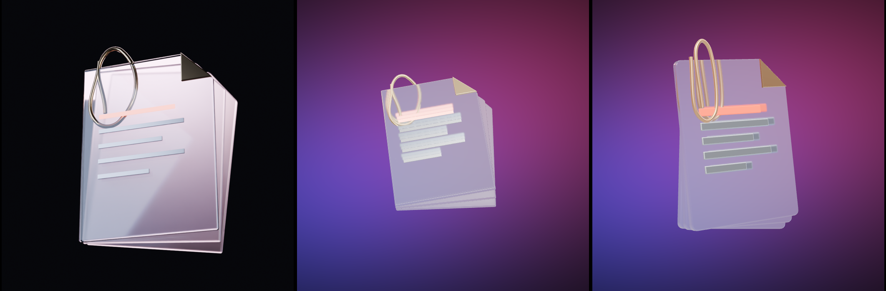

# Research: making premium 3D objects without a GUI (2026-10-08)

**Status:** history. The Blender pipeline test behind ADR-0005; pre-rendering (ADR-0006) replaced
its GLB path.

A hands-on test in the agent container. Comparison of one object, three ways:

Left: Blender Cycles render. Middle: the Blender GLB in three.js. Right: procedural three.js.

## Results

| Pipeline | Worked here | Result | Cost |
|---|---|---|---|
| Headless Blender (`pip install bpy`, 5.2.2 LTS, Python 3.13) | yes (Cycles CPU; EEVEE lacks libEGL) | richest look; GLB 5.3k tris, 40.6 KB meshopt, 17 KB gz; transmission/IOR/clearcoat survive as glTF extensions | 1 GB install, 70 s; poster 1200² ≈ 105 s; 36-frame turntable ≈ 150 s → mp4 88 KB / sprite 179 KB |
| Procedural three.js (Extrude, RoundedBox, Tube, MeshPhysicalMaterial, PMREM) | yes | clean "3D icon" quality; lighting matters more than geometry | object code 1.6 KB gz; three core 142 KB gz |
| CC0 libraries (Poly Haven, ambientCG, Kenney, Sketchfab) | blocked by egress, except npm `@pmndrs/assets` HDRIs and three.js example assets on raw GitHub | right for lighting, wrong subject for hero objects | free |
| AI text/image-to-3D (Meshy, Tripo, Rodin, Hunyuan3D, TRELLIS, SF3D) | not tried | poor at crisp stylised hard-surface glass; baked lighting, dense meshes; licences vary (Hunyuan3D excludes EU/UK) | paid APIs; open weights need a large GPU |

Gotchas: transmission only refracts opaque things behind it; bloom washes out a black ground
(needs a threshold or selective bloom); metal looks premium only with well-placed light.
KTX2 untested (no `toktx` available).

Phone cost: transmission renders the scene again each frame, so one transmissive object at a
time on phones, or fake glass; cap DPR ~1.5; no bloom. Objects here are 5–12k triangles,
far under a ~50k per-object budget.

## Recommended pipeline

Each object is a committed, deterministic Blender script (`tools/objects/`) that outputs a
meshopt GLB for real-time desktop, a Cycles poster (AVIF/WebP) and a short turntable video or
sprite, which is the still twin for phones, reduced motion and no WebGL. Lit in three.js with a
CC0 HDRI from `@pmndrs/assets` plus coloured rim lights. Simple shapes may be procedural.
Nothing needs to be bought; optional extras are a paid AI generator for one organic object and
allow-listing Poly Haven and KTX-Software for this environment.

Sources: vendor comparisons (3daistudio, costbench, pasqualepillitteri, 2026), Hunyuan3D-2
licence, TRELLIS.2 legal notes and issue #298, Stability licence and SF3D model card.
