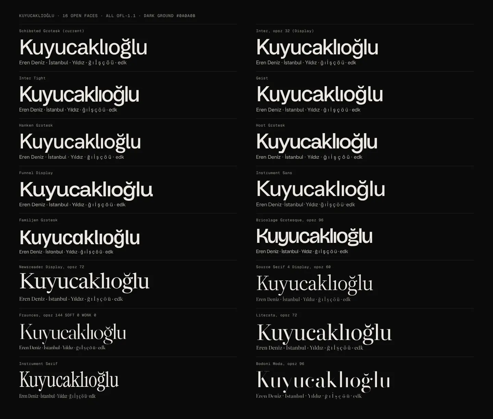
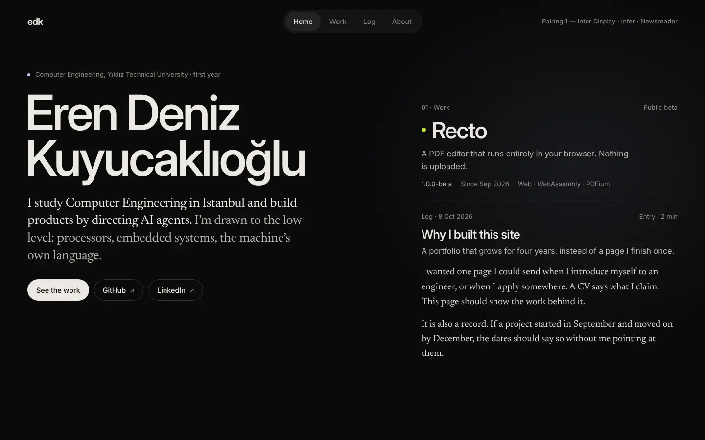
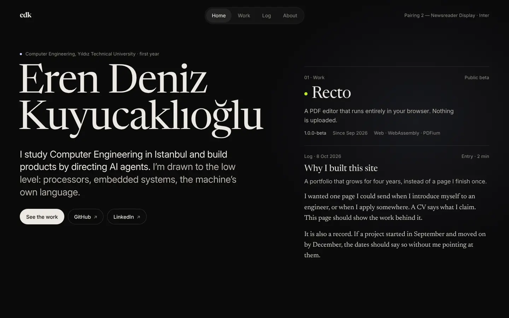
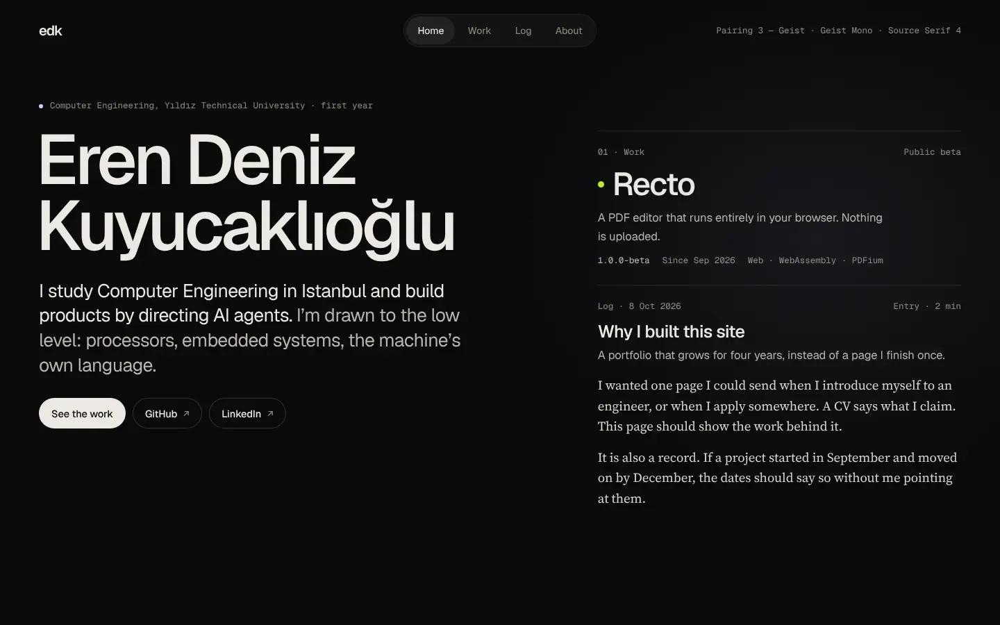
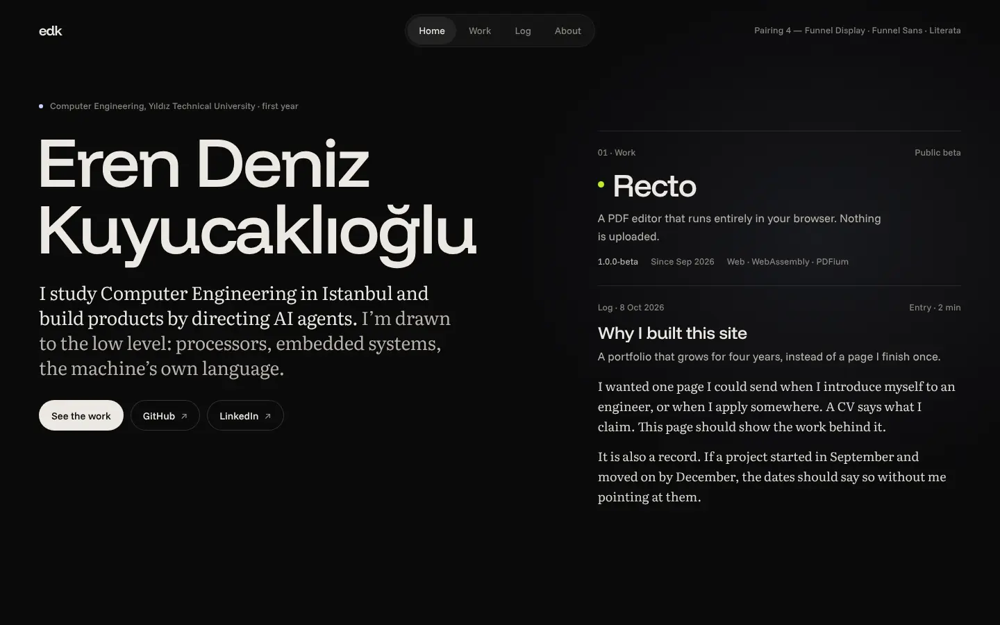
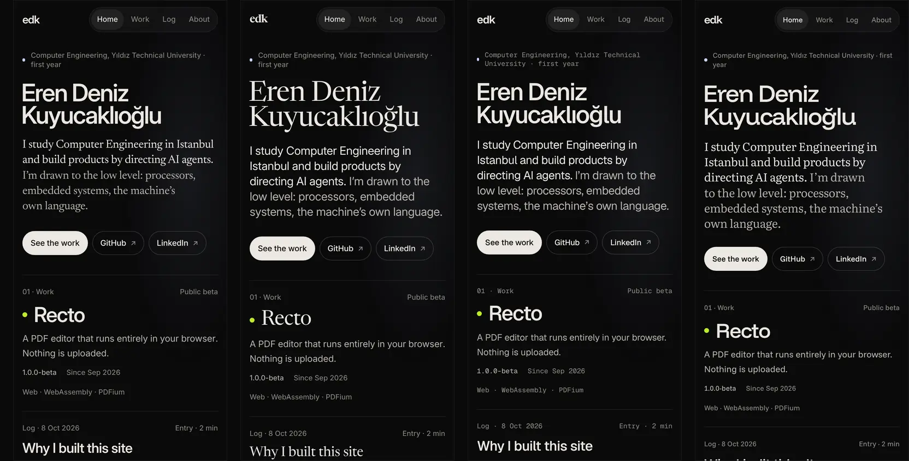

# Research: craft audit of prototype E, and a type and motion system (2026-10-09)

Track 3 of `docs/PLAN.md`. The owner's bar (brief §7, 2026-10-09): fonts, motion and images
must never feel cheap; the site is brand-led and social, dark, quiet, premium (brief §7,
2026-10-08). This file audits prototype E against that bar, researches type with licences,
compares four free pairings on the real hero, and proposes the motion and imagery systems
that prototype F should be built on.

Evidence grades, as in `2026-10-requirements.md`, plus one:

- **E** verified: a primary document, licence file, or font file opened in this research.
- **P** practitioner, **F** folklore (guides, aggregators, vendor copy).
- **M** measured: our own measurement (font files, screenshots, the prototype's source).
- **K** prior knowledge, not re-checked. The sandbox blocked every foundry site
  (klim.co.nz, grillitype.com, abcdinamo.com, pangrampangram.com, fontshare.com,
  fonts.google.com); only npm and search extracts were reachable. Every price below is
  K or F and must be checked at checkout before anyone buys.

Specimen page: built in the session scratchpad (`craft/specimen.html?p=1..4`, fonts from
`@fontsource-variable/*` 5.3.x on npm). Images are in `docs/research/assets/2026-10-craft-*`.

---

## 1. Audit of prototype E

Read from `prototypes/e-dark/index.html` (CSS lines 1–555, markup 556–985, page script
987–1462, stage module 1471–2420) and the shots in `prototypes/e-dark/shots/`.

The verdict first: the bones are right (dark ground, warm ink, one light per view, honest
content, real focus views). What reads as cheap is not any one face but **accumulated
decoration**: 96 elements in tracked mono caps, glowing dots and lines, figure captions,
01/02/03 numbering, a live clock, a polaroid, gradient-clipped text, a serif-italic flourish.
Each is a known template signal; together they make the page look assembled from a
dark-portfolio kit rather than designed for one person. Taking things away is most of the fix.

### P1: must fix before prototype F

1. **Mono caps everywhere.** `.mono` (line 61: Geist Mono 500, 11px, +0.08em, uppercase) is
   on 96 elements (M): kicker, clock, captions, section numbers, tile meta, "OPEN THE PROJECT →",
   dates, length tags, facts labels, crumbs, status, footer. Tracked mono caps is the single
   strongest "developer portfolio template" tell, and it flattens hierarchy: everything small
   shouts at the same pitch. Monospace is already wide; tracking it again (+0.08em) makes the
   letters drift apart. It also uppercases the lowercase mark: "FIG. 1 · EDK, IN GLASS"
   (`desktop-home.png`), which contradicts the brief's mark "edk" (brief §7, 2026-10-09).
   **Fix:** labels in the UI sans, 13px, sentence case, `--ink-3`, `tabular-nums`. Mono only
   for code in log entries. Caps only for at most a two-word micro label, 11px, +0.06em, in
   the sans.
2. **No type scale.** 24 distinct sizes inside `font:` shorthands alone, from 10px to 112px,
   with steps like 14 / 14.5 / 15 / 15.5 / 16 / 16.5 (M). Half-pixel neighbours read as
   mistakes, not hierarchy. **Fix:** the nine-step scale in §3.4; every rule uses a token.
3. **Roles are mixed.** The serif is the hero lede, the log prose and the case-study h3s
   (line 417), but case-study body copy is sans 17px (line 419) and track copy is sans. A
   reader meets three voices in one screen of the focus sheet (sans display, serif h3, mono
   labels, sans body: `desktop-focus-2.png`). **Fix:** one rule: the reading face is for
   reading (lede and log prose), the interface face for everything that is interface; the
   display face for names and titles only. See §3.
4. **Decoration that reads as template** (remove all; each is cheap to delete):
   - glowing dots and lines: `.mark i`, `.kicker .tick`, `.dot`, `.ind::after`,
     `.teaser::before`, `.tile::before` all carry `box-shadow: 0 0 10–14px` glows (lines 108,
     135, 150, 221, 225, 252). Colour already carries the meaning; the glow adds "neon".
   - the kicker pattern "● — A — B — C" with hairline dashes (lines 148–151).
   - the live "ISTANBUL 09:20" clock (line 139, script 1050–1054): a 2023–25 folio trope;
     it changes every visit and says nothing about the work.
   - "Fig. 1 · …" captions (lines 594, 677, 763): an editorial affectation, and wrong while
     the object changes (`flow-1-mid-morph.png` shows Recto above "edk, in glass").
   - 01/02/03 numbering on sections, teasers, tiles, case sections and decisions (six
     numbering systems). Keep numbers only where order means something (decisions, maybe).
   - gradient-clipped surname (line 195): dims the descender of "ğ" and "y", and gradient
     text is a recognised tell.
   - serif-italic emphasis on "the machine's own language" (line 197, lede `em`): the
     italic-flourish-in-the-hero pattern of 2024–26 landing pages. Keep the words, drop the
     styling.
5. **The first screen hides the work.** At 1440×900 the teaser row is cut through its titles
   at the fold (`desktop-home.png`, "Recto" sliced at y≈890), because `.hero` has
   `min-height: calc(100svh - var(--bar-h) - 120px)` (line 189). The requirements say the
   first screen must show who, what, and where the best work is (requirements §2). A title
   cut in half also looks accidental. **Fix:** `min-height: auto`, tighten the hero (lede
   ≤ 3 lines at 1440), and bring the three project names fully above 900px; on phones the
   first project name should show within 844px.
6. **The About photos fight the page.** `.print-mat` (line 320) puts a `#e9e4d9` paper mat
   around both photos, the brightest large area on the site, brighter than the name, with a
   −0.8° tilt and hover lift (line 334): a scrapbook trope that breaks "quiet". **Fix:** §5.1.
7. **Objects change on raw hover.** `pointerenter` on each tile calls `setWorkProject`
   immediately (script 1146–1150), which starts a 640ms melt-and-re-form. Moving the mouse
   down the list fires a morph per row: it looks nervous. **Fix:** hover intent (150ms
   dwell), and never start a new morph until the current one passes its midpoint.
8. **Springs are too bouncy for "premium".** Damping ratios computed from the stage module
   (line 1992, ζ = c / 2√k): default `spring(170,14)` ζ≈0.54 (≈14% overshoot); `pop`
   `spring(260,9)` ζ≈0.28 (≈40% overshoot, a jelly wobble); `rep(200,11)` ζ≈0.39; `fan`
   ζ≈0.59. Jelly overshoot is the motion equivalent of a gradient button. **Fix:** §4.

### P2: should fix

1. **Schibsted Grotesk is tuned past its comfort.** −0.052em on the name (line 192) and
   −0.048em on view titles closes counters at 100px+; −0.035 to −0.04em is the face's limit.
   `font-feature-settings: "ss01"` (line 50) does nothing: the Google/Fontsource build of
   Schibsted Grotesk has no `ss01` in its GSUB, only `locl` and `tnum` (M, fontTools on the
   5.3.0 files). The Google builds strip stylistic sets from most faces, Inter included, so
   feature-dependent tuning needs the foundry files.
2. **Fonts load from Google's CDN** (line 560): render-blocking third-party CSS, a request to
   Google from every visitor (a German court fined a site for this in 2022, LG München I,
   K), and no control over subsetting. **Fix:** self-host WOFF2 subsets (§3.5) with
   metric-matched fallbacks (`size-adjust`, `ascent-override`) so swap causes no reflow, as
   English Prep already does in `css/fonts.css`.
3. **One event, four durations.** A tab change runs the view slide 340/420ms, the indicator
   520ms, the light colour 600ms and the object morph 800ms (lines 92, 131, 108, script
   1105–1117, module 2226). Nothing lands together, so the change feels loose. **Fix:** one
   duration family per event (§4.2).
4. **Nav pill has three cues for one state.** The indicator has a fill, an inset ring and a
   glowing underline in the view's light (lines 126–137), plus `saturate(1.4)` blur and a
   104px fade band behind the bar. **Fix:** a flat fill (`rgba(255,255,255,.07)`), no ring, no
   underline, no saturate. Keep the spring slide.
5. **Focus sheet chrome.** Three 44px bordered circles (prev, next, close) dominate the bar
   and duplicate the prev/next cards at the bottom (`desktop-focus.png`). The object sits in a
   square `.sheet-stage` (line 403) whose radial fill differs from the sheet surface, so the
   poster reads as a picture in a box; at desktop the mid-fan render shows a smeared
   translucent page (`desktop-focus.png`, left of the stack: flag to track 1/2). The lime
   backlight (line 367, 34% mix) turns olive on black. **Fix:** close button only in the bar
   (prev/next stay at the end and on ←/→ keys); the stage bleeds into the sheet with no box;
   sheet ground equals page ground so posters match; backlight at ≤16% and desaturated for
   lime.
6. **The view transition stretches a text row into a card.** `view-transition-name: focus`
   morphs a borderless tile row into a rounded sheet with `object-fit: cover` snapshots
   (lines 440–446): the old snapshot is a wide strip of text scaled into a tall box. **Fix:**
   morph only the project title (shared element: tile name → sheet h2) and let the sheet rise
   and fade; do not morph boxes that have no shape at the source.
7. **Primary action leaves the site.** The hero's only buttons are GitHub and LinkedIn
   (line 587). The presentation goal (brief §2.1) wants the visitor in the work first.
   **Fix:** one solid button "See the work" and two quiet links.
8. **About track cards** (line 343) are the only rounded gradient cards on the site: the
   generic "two feature cards" block. Use two hairline columns like the rest.

### P3: polish

- Underline sweep on hover and the rotating ↗ circle on tiles (lines 221, 272) are common
  patterns; keep one, not both.
- `.tile-name` slides 6px on hover (line 262); fine alone, busy with the line sweep and the
  object change.
- Grain (line 85) is an SVG `feTurbulence` over a fixed layer twice the viewport, at 4.5%
  soft-light on near-black, where soft-light is almost invisible. See §5.3.
- Reduced motion (line 551) zeroes all transitions including short opacity fades; keep
  ≤150ms crossfades so state changes are still perceptible.
- `abbr` YTU on phones in the kicker is good; the desktop kicker should not uppercase
  "Yıldız" either (uppercasing Turkish names in an English page risks İ/I errors; set
  `lang="tr"` on Turkish names if they are ever uppercased).

### What is already good (keep)

Warm off-white ink `#e9e5de` on `#0a0a0b` (≈16:1) instead of pure white; one light per view;
honest "sample" and placeholder labelling; tabular figures on dates; the focus view's
structure (teaser → what → why → how → learned → next) and its URL; phone bottom sheet with
swipe; the still twin for every object; `text-wrap: balance/pretty`; measures of 30–36em.

---

## 2. Type research

### 2.1 Free and open faces

Licences and coverage verified on the npm packages (`@fontsource*` 5.3.x, `license` field
and font files; fontTools cmap and fvar). "TR" = Ğ ğ İ ı Ş ş Ç ç Ö ö Ü ü all present.

| Face | Licence | TR | Axes (variable) | WOFF2, latin + latin-ext | Notes | Grade |
|---|---|---|---|---|---|---|
| Inter 4 | OFL-1.1 | yes | wght 100–900, **opsz 14–32** | 201 KB (opsz file) | opsz folds in "Inter Display"; ubiquitous | E/M |
| Geist / Geist Mono | OFL-1.1 | yes | wght 100–900 | 44 / 36 KB | Vercel's family; strongly associated with Vercel/shadcn templates | E/M |
| Schibsted Grotesk | OFL-1.1 | yes | wght 400–900 | 66 KB | current E face; news-brand grotesk | E/M |
| Instrument Sans | OFL-1.1 | yes | wght 400–700, wdth 75–100 | — | width axis useful for long names | E/M |
| Instrument Serif | OFL-1.1 | yes | none (Regular + Italic) | — | one weight; its italic hero is a 2024–26 landing-page cliché | E/M |
| Newsreader | OFL-1.1 | yes | wght 200–800, **opsz 6–72** | 213 KB (+236 italic) | Production Type; real display optical size | E/M |
| Source Serif 4 | OFL-1.1 | yes | wght 200–900, opsz 8–60 | 218 KB | display cut thins on black | E/M |
| Fraunces | OFL-1.1 | yes | opsz 9–144, wght, SOFT, WONK | — | hairlines vanish on black at opsz 144; whimsy risk | E/M |
| Literata | OFL-1.1 | yes | wght 200–900, opsz 7–72 | 195 KB | screen reading face (Google Play Books) | E/M |
| Funnel Display / Sans | OFL-1.1 | yes | wght 300–800 | 26 / 26 KB | NORD ID, 2024; distinctive, light files | E/M |
| Hanken, Host, Familjen Grotesk; Inter Tight; Onest; Albert Sans | OFL-1.1 | yes | wght | 40–70 KB | Host and Hanken are the calmest of these | E/M |
| Bricolage Grotesque | OFL-1.1 | yes | opsz 12–96, wght, wdth | — | quirky; reads Gen-Z startup | E/M |
| Bodoni Moda | OFL-1.1 | yes | opsz 6–96, wght | — | hairlines disappear on dark | E/M |
| IBM Plex Sans / Mono, JetBrains Mono, Fragment Mono, Martian Mono | OFL-1.1 | yes | Plex static | — | Plex reads corporate IBM | E/M |
| Satoshi, General Sans, Switzer, Zodiak, Erode, Gambetta (Fontshare / ITF) | ITF Free Font License: free for commercial use; self-hosting the files is described inconsistently by secondary sources | unverified (site blocked) | some variable | — | treat self-hosting as unclear until the FFL text is read; Satoshi and General Sans are very common on template sites | F |
| Velvetyne library | libre/open, per-font licence (mostly OFL; some e.g. CUTE) | per font | — | — | experimental display faces; credit requested | E (FAQ extract) |
| Collletttivo open catalogue | free for personal and commercial use, modify and redistribute; credit asked | per font | — | — | Apfel Grotezk etc.; strong character, risky for body | F |
| Pangram Pangram trials | free trial for personal, non-commercial use only; a public portfolio is arguably personal but a trial file is incomplete and the licence does not cover a public site as a product | yes (most) | — | — | do not ship trial files | F |

Two measured facts that matter for the build:

- **The Google/Fontsource builds have no stylistic sets** for Schibsted, Inter, Geist and most
  others (only `locl`, `tnum`) (M). Inter's `cv11` single-storey a or `ss01` open digits need
  the files from `github.com/rsms/inter`.
- **Turkish is in latin-ext.** "Kuyucaklıoğlu" always needs ı and ğ, so every page loads the
  latin-ext file. Subsetting that file to the six Turkish letters outside Latin-1 cuts it to
  4.6 KB (Inter) and 8.7 KB (Newsreader) (M).

### 2.2 Paid benchmarks

What people associate with premium sites, with rough web licence costs for a personal site at
the lowest traffic tier. All prices K or F: verify at checkout.

| Face (foundry) | Why it reads premium | Web licence model and rough cost | TR | Grade |
|---|---|---|---|---|
| Söhne (Klim) | the Akzidenz memory, OpenAI/Stripe-era tech brands | per style, tiered by pageviews; Klim's FAQ gives $60 for a first style (licence type unstated); expect ≈ $60–100 per style, $250–500 for a working set | yes (K) | F/K |
| GT America, GT Alpina (Grilli Type) | Swiss precision; Alpina for editorial serifs | per style by pageviews; ≈ $50–90 per style at the lowest tier; trial EULA forbids public use | yes (K) | K |
| Graphik, Lyon (Commercial Type) | quiet editorial, magazine heritage | per style by pageviews; industry range for small sites $30–150 per weight | yes (K) | F/K |
| ABC Diatype, ABC Favorit (Dinamo) | contemporary studio look | priced by the licensee's company size, not traffic (Dinamo FAQ); a one-person licence ≈ €50–80 per style | yes (K) | E (model) / K (price) |
| PP Neue Montreal (Pangram Pangram) | the most-used "agency" grotesk of 2020–25 | free trial personal only; licences from $30 on the product page; overused, so it no longer signals premium | yes (K) | F |
| Displaay faces (e.g. Rhymes, Hoves) | sharp contemporary display | per style ≈ €40–60 | mostly (K) | K |

**Reading:** a paid sans would cost roughly $150–500 once for two to four styles. It would
add polish in the details (spacing, figures, stylistic sets), but what made E look cheap was
how the faces were used, not which faces they were (§1). Free faces, chosen and tuned well,
meet the bar. The system below is token-based, so the sans can be swapped for Söhne or
Diatype later in one change if the owner wants a signature.

---

## 3. Four pairings on the real hero

Each pairing sets the same roles on the same content: kicker, name, lede, nav, a project
title with its meta row, and a log entry excerpt, on `#0a0a0b`. Every pairing already
applies the fixes from §1 (no mono caps, sentence-case labels, tabular figures, one light),
so the comparison is about the faces only. The right column holds project and log for the
specimen; in the site it holds the object.

*"Kuyucaklıoğlu" in 16 open faces. Every face draws ğ and ı cleanly; Bodoni Moda and
Fraunces at opsz 144 lose their hairlines on black; Bricolage and Familjen read as quirky.*

| | Pairing | Display | Interface | Reading | Fonts shipped (TR subset, see §3.5) |
|---|---|---|---|---|---|
| 1 | Inter Display + Inter + Newsreader | Inter opsz 32, 560, −0.042em | Inter opsz auto | Newsreader (lede, log) | ≈ 121 KB |
| 2 | **Newsreader Display + Inter** | Newsreader opsz 72, 400, −0.022em | Inter opsz auto (incl. lede) | Newsreader text (log) | ≈ 121 KB |
| 3 | Geist + Geist Mono + Source Serif 4 | Geist 540, −0.05em | Geist; Geist Mono meta | Source Serif 4 (log) | ≈ 100 KB |
| 4 | Funnel Display + Funnel Sans + Literata | Funnel Display 500, −0.035em | Funnel Sans | Literata (lede, log) | ≈ 90 KB |

### 3.1 Ranking

1. **Pairing 2: Newsreader Display + Inter. Recommended.** The name set in a real display
   serif is the only option that looks like a person rather than a product, which is what
   "brand-led and social" asks for (brief §7). Newsreader's opsz 72 cut is sharp and calm at
   120px on black, its ğ and k are handsome, and it carries project names ("Recto") and log
   titles with the same voice. Inter does all interface work and the lede in plain,
   legible sans, so the engineering side stays crisp. Two families, one of which E already
   uses; the serif's text optical size also sets the log, so the reading face and the
   display face are one file. The soft serif against hard glass objects is a good contrast.
   Risk: a serif name can read "literary" if it is set too light or too loose; keep 400,
   −0.02em, and never italic.
2. **Pairing 1: Inter Display + Inter + Newsreader.** The safest premium: Inter's display
   optical size is tighter and blacker than the text cut, and the Newsreader lede adds
   warmth. It is what E should have been. It ranks second because Inter is the default face
   of the industry; the page looks right but not anyone's in particular.
3. **Pairing 4: Funnel Display + Funnel Sans + Literata.** The most distinctive sans: wide,
   open, friendly, very light files (26 KB each). Literata is sturdy for long reading but a
   little bookish as a lede. A good choice if the owner wants a sans-led brand with more
   personality than Inter; less proven, smaller family (no italics in Funnel Display).
4. **Pairing 3: Geist + Geist Mono + Source Serif 4.** Honest for an engineer and the
   lightest sans files, but Geist plus mono meta is the exact look of Vercel and shadcn
   templates (phones image: the mono kicker is the template tell again). Source Serif 4 is a
   fine log face. Ranked last for the owner's "never template" bar.

The owner chooses (taste question, PLAN.md open questions). Show the two phone and desktop
images for pairings 2 and 1 first.

### 3.2 Pairing 2 in detail

- **Display** (name, view titles, project names, log entry titles): Newsreader, opsz 60–72,
  wght 400, `letter-spacing: -0.022em` at ≥ 64px, −0.015em at 25–48px. Never italic, never
  gradient. Line-height 0.92 for the two-line name.
- **Interface and lede**: Inter with `font-optical-sizing: auto` (opsz follows size 14→32),
  400 for text, 500 for buttons and active nav. Lede 21–27px, −0.018em.
- **Reading** (log prose, case-study prose): Newsreader text optical size (auto), 19px/1.6,
  measure 34–36em, colour `#dcd7ce`.
- **Meta**: Inter 13px/1.35, `--ink-3`, tabular figures, sentence case ("Log · 8 Oct 2026",
  "Public beta", "Since Sep 2026").
- **Mono**: none in the interface. Load a mono (Geist Mono, 36 KB) only on a log entry that
  contains code.

### 3.3 Tracking rules (any pairing)

Negative tracking grows with size and stops before counters close: 13px +0.005em; 15–17px 0;
21–27px −0.015em; 36–48px −0.025em; 64px+ −0.03 to −0.045em for grotesks, −0.02em for
serifs. Caps, if any: +0.06em at 11px, never on mono.

### 3.4 Scale

Nine steps, the only sizes the site uses:

| Token | Size / line-height | Use |
|---|---|---|
| `--t-meta` | 13 / 1.35 | labels, dates, status |
| `--t-ui` | 15 / 1.45 | nav, buttons, secondary text |
| `--t-body` | 17 / 1.6 | interface paragraphs |
| `--t-read` | 19 / 1.6 | log and case-study prose (reading face) |
| `--t-lede` | clamp(21px, 1.85vw, 27px) / 1.34 | hero and view ledes |
| `--t-h3` | 25 / 1.2 | entry titles, case sections |
| `--t-h2` | clamp(36px, 3.4vw, 48px) / 1.05 | year headers, section titles |
| `--t-title` | clamp(46px, 5.2vw, 80px) / 0.96 | view titles, project names |
| `--t-name` | clamp(52px, 7.8vw, 122px) / 0.92 | the name only |

### 3.5 Payload

The requirements budget is about 150 KB before the object (requirements §20). The opsz
variable files are heavy as shipped (Inter 201 KB, Newsreader 213 KB for latin + latin-ext,
M). For pairing 2, measured with fontTools on the Fontsource files:

- narrow the axes to what is used (Newsreader wght 400–500, opsz 16–72; Inter wght 400–600,
  opsz 14–32) and subset Latin to Basic Latin, Latin-1 and the punctuation the site uses:
  Newsreader 70 KB, Inter 37 KB;
- latin-ext reduced to Ğ ğ İ ı Ş ş: 8.7 KB and 4.6 KB;
- **total ≈ 121 KB**, roman only. Italic is not needed (no italic in the system). Pairing 1
  is about the same. Pairing 4 ≈ 90 KB (Funnel Display 15 + Funnel Sans 14 + Literata 47,
  plus Turkish letters) and pairing 3 ≈ 100 KB (Geist 24 + Geist Mono 19 + Source Serif 4
  44, plus Turkish letters), measured the same way. The serif is always the heavy file.

Preload only the display and interface Latin files; `font-display: swap` with metric-matched
fallbacks so nothing reflows.

---

## 4. Motion system

Principle: **still by default, motion as an event**, as in Recto ADR-0025. Motion answers
something the reader did or a change of place; nothing loops to look alive. Transform and
opacity only. One event, one duration family. Exits faster than entries.

### 4.1 Tokens

| Token | Value | Use |
|---|---|---|
| `--d-1` | 120ms | press, colour on hover |
| `--d-2` | 200ms | hover reveals, small fades, tooltips |
| `--d-3` | 320ms | disclosures (log entry), view content in |
| `--d-4` | 480ms | focus sheet open, light colour change |
| `--d-5` | 720ms | object change (3D), the longest thing on the site |
| `--ease-out` | `cubic-bezier(0.2, 0.7, 0.1, 1)` | everything that enters or settles |
| `--ease-in` | `cubic-bezier(0.4, 0, 1, 1)` | exits, at 60–70% of the entry duration |
| `--ease-move` | `cubic-bezier(0.65, 0, 0.35, 1)` | things that move from rest to rest without a hand on them |

**Springs** (for what the hand drives or what must feel physical), mass 1:

- `ui` k=300, c=30 (ζ≈0.87): nav indicator, sheet drag release, object lean. No visible
  overshoot. Export to CSS as a `linear()` curve, about 450ms.
- `object` k=180, c=16 (ζ≈0.60): only for a 3D object's response to a poke (≈ 9% overshoot,
  once). Replaces E's `pop` (ζ 0.28) and `rep` (ζ 0.39).
- Nothing below ζ 0.6 anywhere.

### 4.2 Choreography

- **Tab change**: outgoing view fades out in 160ms `--ease-in` (no slide); incoming view rises
  from 12px and a 24px shift in tab direction, 320ms `--ease-out`; indicator springs (`ui`);
  light colour crossfades 480ms; object change starts at the same instant and lasts 720ms.
  Scroll resets before the incoming view paints.
- **Stagger**: at most three groups (kicker+name, lede+links, the rest), 40ms apart, only when
  a view first appears in a session. Never per paragraph, never per letter.
- **Focus sheet**: project title morphs from the tile to the sheet (shared element), sheet
  rises 24px and fades in 480ms; page behind dims to 0.7 brightness, no scale. Close 320ms.
  Phone: bottom sheet 420ms, drag follows the finger 1:1, release with the `ui` spring.
- **Log entry**: height via `interpolate-size: allow-keywords` where supported, else the
  current grid-rows trick, 320ms; content fades in 200ms after a 60ms delay.
- **Hover**: colour and underline only, `--d-1`/`--d-2`. One hover effect per element.
- **Objects**: change on click, focus or 150ms hover dwell; never restart mid-morph; no idle
  bob or sway (E module lines 2348–2350); a lean toward the pointer is allowed at small
  amplitude with the `ui` spring.

### 4.3 What never animates

The name and any heading text (no split-text reveals, no typewriter); body text; numbers (no
count-ups); scroll (no smooth-scroll libraries or scroll hijacking); the cursor (no custom
cursor); every block on scroll (no fade-up-on-scroll for each section, the most common
template tell); the page ground and grain; blur on large areas; layout properties other than
the one disclosure height.

### 4.4 Reduced motion

Keep crossfades of 150ms or less so changes stay perceptible; no transforms; objects as
posters; the sheet appears with a fade. This is the "still twin" rule of CLAUDE.md.

---

## 5. Imagery

### 5.1 Photographs

- No paper mat, no tilt, no hover lift. Photo edge radius 4px (or none), set directly on the
  ground with a 1px `rgba(255,255,255,.06)` inner hairline.
- Grade both photos into the page: black point lifted to the ground colour (`#0a0a0b`, so the
  photo's blacks meet the page), −10% saturation, a slight warm split-tone matching the ink.
  Export WebP/AVIF at 1× and 2×.
- The gate selfie is the human moment of the site (brief §7: "casual but clean"): give it
  the About hero at 4:5, caption in meta style beneath. The lens photo works better as an
  image with the glasses object beside it than as a second framed print.
- The link preview card (1200×630, requirements §20) is name in the display face plus the edk
  poster, on the ground: it is the first thing LinkedIn shows, so it gets the same care.

### 5.2 Posters and objects

- Posters must be rendered on the exact surface they sit on. The focus sheet's `#121214`
  against posters rendered for `#0a0a0b` makes the visible square in `desktop-focus.png`.
  Either make the sheet ground the page ground or render a sheet variant.
- A note for tracks 1 and 2: the saturated painted bodies (lime page stack, orange pin) read as
  3D emoji or icon-pack renders more than as glass lit by colour. A shared material language
  (clear or tinted glass, the project colour as light and rim, not as paint) would read more
  premium and more like one family.

### 5.3 Grain and aura

- Grain only where there is a gradient: inside the light, masked, 3–4%, overlay blend, from a
  small static tile (128px PNG or AVIF) instead of an SVG filter over a 2× viewport layer.
  Never animated grain.
- One aura per view, tied to the object's light, low (at most ~8% luminance lift), still by
  default (Recto ADR-0025; English Prep's opacity cap); if it moves, ≥ 20s cycles and only on
  desktop. Dither with the grain so it never bands.
- Lime on black goes olive at low alpha: for Recto, keep the backlight at ≤16% and shift it
  toward a cooler, less saturated yellow-green, or light only the object's rim.
- No glows on UI (dots, lines, indicator). Light belongs to the objects and the aura.

---

## 6. For prototype F

1. Apply the P1 list of §1.
2. Owner picks a pairing (recommendation: 2, then 1). Record it in ADR-0007 with §3.2–3.5.
3. Motion tokens and springs of §4 in one `motion.css`, cited by every animation.
4. Imagery rules of §5 for the About photos, posters and aura.

## Sources

Fontsource packages on npm (`@fontsource-variable/*`, `@fontsource/*` 5.3.x; licence fields
and font files read locally). Inter 4.0 release notes (github.com/rsms/inter/releases, via
search extract): Display designs on an opsz axis, also shipped as the static family "Inter
Display". Fontshare / ITF Free Font License summaries (madegooddesigns.com, alternativeto.net,
indiantypefoundry.com news, via search extracts). Klim FAQ and licence pages
(klim.co.nz/faqs, /licences/web-fonts, via search extracts). Dinamo licensing FAQ
(abcdinamo.com/licenses, /faq, via search extracts). Pangram Pangram product page and
licenseorg.com guide (via search extracts). Velvetyne FAQ (velvetyne.fr/about/faq, via search
extract). Collletttivo journal "Open Source & Hyper-capitalism" (via search extract). Grilli
Type trial EULA (grillitype.com, title only). madegooddesigns.com "How much do fonts cost"
(2026). Recto ADR-0025 and English Prep `css/fonts.css` (the owner's own repos).
