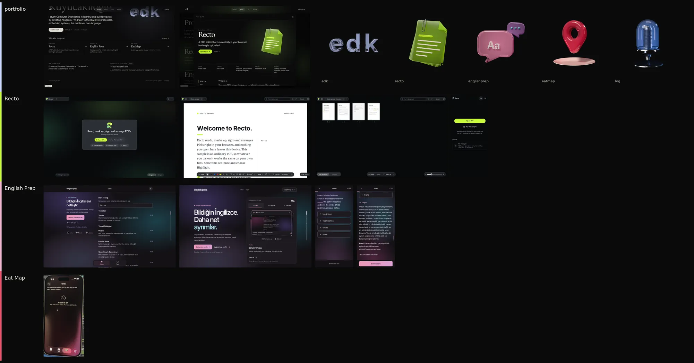
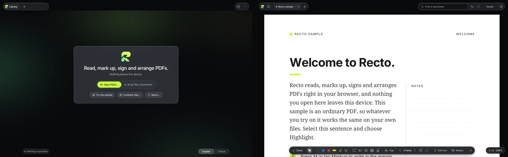
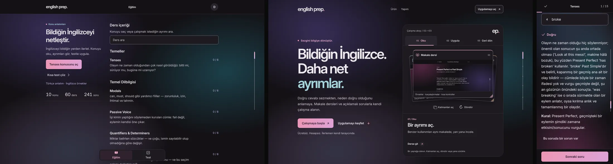
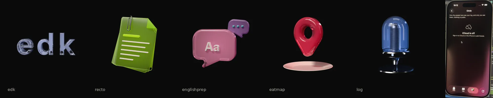

# Research: family audit of Recto, English Prep, Eat Map and the portfolio (2026-10-09)

**Status:** history. Input to the family vision, which the Family chat now owns. Paths under
`scratchpad/` cited here were session scratch, not kept.

**Why:** brief §7 (2026-10-09, after seeing v0): the apps, the portfolio and the objects feel
mismatched. Each should keep its own character (UI, motion, colour, structure) and all should
meet at a shared origin; the owner worked hard on Recto's and English Prep's UIs, so do not
flatten them. This file is the evidence for that vision: each product's DNA, where they already
rhyme, where they clash, and what is untouchable. It proposes no design.

**Sources and method.** Read-only. Recto: `docs/design/redesign-2026-10/language.md`,
`quality-bar.md`, `docs/specs/redesign.md`, `docs/brand/README.md`, `apps/web/src/styles/*.css`,
`shell/capsule/`, `about/` (repo at `5abb766`). The production build was made in a scratch clone
(the offline install failed; an online `pnpm install --frozen-lockfile` worked) and shot with
Playwright in Chromium (SwiftShader WebGL). English Prep: `CLAUDE.md` (v0.75),
`docs/margin-design-system.md` (v0.74), ADR 013, `docs/design/motion-v073.md`, `about-v072.md`,
`css/editorial.css`, `css/interactions.css`, `js/brand.js`, `js/icons.js` (at `2026-10-04`),
served statically and shot in Chromium. Eat Map: **only** the owner's simulator photo (iPhone 17
Pro, iOS 26.5, Xcode); every Eat Map value below is estimated from a phone photo of a screen and
is marked *(est.)*. Portfolio: `src/styles/global.css`, `media/objects/*/manifest.json`, ADR-0006,
`research/2026-10-craft-audit.md`, `tools/icons/README.md`, prototype F shots. The live sites
were unreachable (proxy 403), so nothing here comes from production URLs.

Legend: **verified** = read in source or measured in a screenshot; *(est.)* = judged from an
image; *owner* = a decision recorded as owner feedback.

---

## 1. DNA profiles

### 1.1 Recto: "Recto Glass" (content solid, controls glass, lime light beneath)

A browser PDF editor. The language is an engineered system: every value is solved, tested in CI
and cited to a research id. Desktop and tablet first; phones get a read-only compact edition
(ADR-0033).

| Facet | Values (verified unless marked) |
|---|---|
| Ground | Dark graphite, hue 265: canvas n1 `#08090c`, frame n3 `#17191e`, raised n4 `#1f2227`; light theme equal from day one (canvas n4 `#e6e8eb`) |
| Ink | n12 `#e8e9ec` primary, n10 `#a1a5ab` secondary, n9 `#91949a` tertiary (cool) |
| Accent | **One lime** `#c8fb3d` (oklch 0.921 0.210 124): focus light band, armed tool, primary action, brand. "Lime always touches ink" (`#08090c` label). Never on the page. One lime fill per view at rest |
| Content colour | Page `#ffffff`, never themed; selection blue `#4e61ed` (4.93:1 on white) |
| Atmosphere | WebGL aurora: teal `#1f9996` → mint `#58da98` → lime `#bbed26` → lemon `#faee40` (hottest cores). Still by default, moves on events (arrival, drag-over, success), drifts only on the empty Library and About, settles within 5 s; never within 64 px of a page |
| Brand gradient | Mark "Dengeli" R (owner's own): mint `#69EAA3` → lime `#CBFF5F` @59 % → yellow-lime `#EDFA6D`, 46.75°. Mono `#0B0C0E`; wordmark lowercase "recto" |
| Materials | One glass in five densities: M1 chip `rgb(30 32 37/.50)` σ5–8 · M2 bar `/.55` σ7–10 · M3 panel `/.74` σ40 · M4 menu `/.78` σ12–24 · M5 sheet `/.86` σ24–48, each with `saturate()·brightness()`; coverage rule c ≥ 0.985 (σ ≤ h/5). Light glass floor `contrast(.45) brightness(1.4)`. No glass in glass; ≤ 4 glass surfaces at rest |
| Depth | e0–e5 shadows, e3 `0 10px 28px -10px rgb(0 0 0/.6), 0 2px 6px -2px rgb(0 0 0/.35)`; "controls never glow, only light glows" |
| Type | `'Inter Recto'` (Inter 4.1, opsz 14–32, self-hosted subset, 98 KB); 11/12/13/15/17/22/28/40 px; weights 400/500/600 (Q-8); sentence case, no uppercase labels; `tnum` on changing numbers |
| Icons | Phosphor regular + fill, built at compile time; outline at rest, fill when selected; 16/20/24 px at 1/16 stroke (1.0/1.25/1.5 px); custom glyphs on the 256 grid |
| Shape | Radii 2 (page) · 4 · 8 · 12 · 16 · 20 · 28 · **999 (every bar, chip, text button)**; `superellipse(1.5)` ×1.35 where supported; icon buttons are circles |
| Motion | Seven springs, zero bounce except pop/fling: press 300 ms, quick 420, smooth 530, glide 680, fling 560 (b .15), pop 410 (b .25), track 150; eases `cubic-bezier(0.2,0,0,1)` in, `(0.3,0,0.8,0.15)` out; View Transitions 240 ms; press scale .97 mouse / .94 touch. "Rest is still; motion answers." Idle frames = 0 (CI) |
| Signature motion | **The capsule morph**: one glass pill changes its own width/height (dock ⇄ Markup palette ⇄ Pages bar ⇄ Compare ⇄ Locked), radius 999 throughout, contents FLIP inside (Q-6); lime under-light slides beneath the armed tool; conic processing ring (2.4 s); success bloom |
| Structure | Library as welcome; top strip of floating glass pieces; labelled dock *Pages · Markup · Fill & sign · More*; page pill `1 / 4 · 169%`; one sidebar; sheets; Esc ladder; ⌘K for every action |
| Voice | English and Turkish (*siz*), sentence case, plain and factual: "Read, mark up, sign and arrange PDFs. Nothing leaves this device." "Proof before promise": every privacy claim links to evidence |
| Accessibility | A-1…A-24 as CI gates; WCAG 2.2 + APCA computed through the glass model; two-band focus ring (lime light, `#08090c` dark); forced colours; every effect has a solid twin (Glass Solid, Ambient Off, Reduce motion) |
| Self-presentation | About at `/recto/about/` is still the pre-M9 page (generic file glyph, empty media frame in the build); About v2, press kit and social card wait for drop D4 from the owner's kit |
| Owner cares about | "Glass, light, motion like butter", "smart, rich and expensive", Apple Preview/Notability natural; *owner* 2026-10-04: no grain, no broken glass, no mismatched buttons, no broken bottom-menu animation (→ Q-1…Q-14); *owner* 2026-10-08: `marker-circle` icon, glass pieces count once (F1) |

### 1.2 English Prep: "Margin / Sakura" (a dark academic reading space with a living atmosphere)

A static, no-build study app for Turkish proficiency exams, mobile first. Its character comes
from the learner (competence without labels) and from many rounds of owner feedback.

| Facet | Values (verified) |
|---|---|
| Ground | Plum neutrals: page `#141216`, card `#1d1a20`, raised `#28242c`; light theme `#fbf7fa`; new visits start dark |
| Ink | `#eee9ed` main, `#d2c9d3` supporting (plum-tinted); hairline `#39313d`, essential edge `#95899b` |
| Accent | Cherry/Sakura gradient pair `#ed96b4` → `#dca2d8` (120°) with ink `#301b27` on the one primary action; Sakura text `#efb1cb`; focus `#d4b5f8` |
| Supporting roles | Iris/secondary `#c8b4e9` (structure), lagoon/cool `#a4d3db` (context, "application"), apricot/tertiary `#e9bb95` (attention, "return") |
| Answer semantics | Correct = opaque Sakura `#eeb4d1` on `#392532`, edge `#bb8ca4`; selected-incorrect = periwinkle `#b6c6ed` on `#252d42`, edge `#8d9bbd`; always with a check/cross and the words *Doğru/Yanlış* |
| Atmosphere | Three bounded clusters behind every route, each cycling cherry `#a04278`, iris `#6350a5`, lagoon `#28798a`; drift 9.75/11.75/13.75 s, colour cycles 13.5/15.75/18 s; **one parent opacity** .42 dark / .09 light; paused when hidden; reduced motion = three still pools |
| Materials | **Deliberately no glass now**: Margin sets `--glass: var(--page)`, `backdrop-filter: none !important` on the nav; cards opaque; elevation `0 8px 28px #00000024` plus a 1 px inner highlight. Glass belonged to the superseded UI 3 skin |
| Type | Inter variable only (both languages); page title 30/36 → 36/43 @600; section 20/28; **reading 18/30 @400**; meta 14/20; control 16 @600. `lang="en"` on English |
| Icons | Hand-drawn set on a 24 grid: stroke 2, round caps/joins, corner radius 2, 2-unit padding; fill only for the two nav destinations |
| Shape | Radii 6/8/12/14 (buttons 8, answer rows 10, nav 14, nav indicator 8); controls 48 px, primary 52 px, targets ≥ 44 |
| Motion | Press 100–120 ms compression, release `--d-release` 380 ms; reveal 220; route 360 ms over 12 px (v0.72, restored); scene 560; completion 720; story 900; flow 1100; ease `cubic-bezier(0.22,1,0.36,1)` |
| Signature motion | Living aurora; elastic scroll rail (1.5 px thread, 5 px thumb → 8 px held, inward curve ≤ 14 px); drawn completion signature; About folio (stack 860 ms, angle 680 ms, drag ±16°) |
| Structure | Fixed shell, one scrolling region: bar · body · foot. Two peers in a bottom capsule (Eğitim, Test), Profil in the header; companion pane from 1080 px; reading column ~592–608 px at every width |
| Brand mark | `ep.` / `english prep.` lowercase Inter 600, tracking −0.065 em, **Sakura dot** `#efb1cb` (`js/brand.js`) |
| Voice | Turkish UI in *sen*, short and warm: "Bildiğin İngilizceyi netleştir." "Ücretsiz. Hesapsız. İlerlemen kendi tarayıcında." English example sentences; "refine, not teach from zero" |
| Accessibility | Colours solved, not chosen: `npm run color` (WCAG 2 enforced, APCA supplementary) across the whole aura colour envelope; main prose ≥ 9.66:1, supporting ≥ 7.19:1, focus ≥ 6.49:1; 320 px reflow; forced colours drop the decoration |
| Self-presentation | `/about/` opens with an inspectable three-leaf folio of real 3×/2× captures (Oku · Uygula · Geri dön), Sakura/lagoon/apricot per chapter, a lagoon word in a neutral headline; no gallery |
| Owner cares about | *owner*: UI 2 was ugly → UI 3; top menu removed and Profil out of the tab bar; v0.73's 620 ms downward entrance removed, v0.72 restored (ADR 013); visible button press kept; flat browser backing band fixed; the rail "did not turn out as the owner imagined" (portfolio brief) |

### 1.3 Eat Map: an iOS-native private food log (from one photo)

| Facet | Values *(est.)* from the simulator photo |
|---|---|
| Platform | Native SwiftUI on iOS 26 (Xcode, `Shell/RootView.swift`, CloudKit sync visible); iOS system type (SF Pro) and SF Symbols |
| Ground | Dark burgundy-brown at the top, graded to a rose-mauve glow toward the bottom right; a warm wine field rather than black (portfolio token `--eat-wine` `#4a1626`) |
| Accent | **Rose `#eb4f6b`** (owner-confirmed, brief §7); a pinker `#ec5794` in the glow |
| Materials | Liquid Glass capsule tab bar (*Feed · Map · You*); the selected tab is a rose-tinted pill holding the user's photo avatar; a separate round compose button with a rose ring and glow; round glass back button |
| Type | Bold centred nav title ("Circle"), regular body, bold empty-state title ("iCloud is off") |
| Icons | SF Symbols, filled in the tab bar; outline cloud-slash in the empty state |
| Structure | Three tabs plus a floating compose action; push navigation |
| Voice | Plain and private: "Only the people here see your log, and only you see theirs. Nothing is public." |
| Self-presentation | None yet (private, iOS); portfolio describes it as "description to come" |
| Untested | Light mode, motion, real colour values, accessibility; all need the owner or the Xcode project |

### 1.4 The portfolio (edk): quiet serif type on black, objects lit from behind

| Facet | Values (verified, `global.css` and manifests) |
|---|---|
| Ground | `#0a0a0b` flat black plus one static grain tile (`grain.png`, 128 px) over the whole page |
| Ink | Warm: `#e9e5de`, `#b6b1a8`, `#8c877f`, `#5f5b55`; reading `#dcd7ce` |
| Accents | One per world: Recto `#bbed26` (glow `#a6d873`), Prep `#efb1cb`, iris `#9a9cf0`, lagoon `#6fc9cf`, Eat `#eb4f6b` / `#ec5794` / wine `#4a1626`, edk `#c9d4ff`, Record `#8fb8ff`, About `#f3b886` |
| Light | A CSS radial glow per object in its accent (11 % → 4 % → 0); objects drawn ground-subtracted with `plus-lighter` |
| Materials | One glass element: the tab pill `rgba(22,22,25,.66)` + `blur(16px)`, 1 px inner rim, soft drop shadow; buttons are off-white pills (`#e9e5de` on `#0b0b0c`) or the project tint |
| Type | **Newsreader** (serif) for name, titles and reading 19/1.6; **Inter** for UI 15 and meta 13; name up to 122 px |
| Icons | Code-drawn set (`tools/icons`): stroke = the Inter stem at the paired size and weight, 16/20/24 drawn separately; brand marks vendored |
| Shape | Pills (999) for tabs and buttons; otherwise rules and hairlines rather than cards |
| Motion | `--d-1…5` 120/200/320/480/720 ms; ease-out `cubic-bezier(0.2,0.7,0.1,1)`; spring-ui k300 c30 (ζ .87, 450 ms); spring-object k180 c16 (ζ .60, 750 ms, overshoots); the shared **glass droplet** morph between tabs; pointer lean over a Cycles frame grid |
| Objects | Pre-rendered Cycles (ADR-0006): glass `edk` letters, a lime document with a paperclip (Recto), a pink speech bubble "Aa" (English Prep), a red map pin on a pink disc (Eat Map), a blue microphone (Record) |
| Brand mark | "edk" in Newsreader 500; *owner* liked prototype E's colour-changing dot in "edk." |
| Voice | English, first person, plain: "I study Computer Engineering in Istanbul and build products by directing AI agents." |
| Owner cares about | Liveliness and interaction (E's lit, coloured tabs); no 3D for its own sake; no emoji icons; a new thin rail of its own; Record easier and more fun to read |

---

## 2. Side by side

| Facet | Recto | English Prep | Eat Map *(est.)* | Portfolio |
|---|---|---|---|---|
| Ground | `#08090c` cool graphite | `#141216` plum | burgundy-to-rose | `#0a0a0b` + grain |
| Ink temperature | cool `#e8e9ec` | plum `#eee9ed` | white | warm `#e9e5de` |
| Accent | lime `#c8fb3d` (one fill per view) | cherry→lilac gradient, Sakura `#efb1cb` | rose `#eb4f6b` | one per world |
| Light field | WebGL aurora, still by default, event-driven | CSS aurora, always drifting (pausable) | static gradient glow | per-object CSS glow |
| Glass | the whole chrome (M1–M5) | none, by decision | Liquid Glass tab bar | the tab pill only |
| Face | Inter (opsz) | Inter | SF Pro | Newsreader + Inter |
| Weight of display | 600, tight | 600, very tight (−0.065 em mark) | bold | 400–500 serif |
| Nav | glass top strip + morphing dock capsule | opaque bottom capsule (2 tabs) | glass bottom capsule (3 tabs) + round action | glass top pill (4 tabs) |
| Radii | 999 bars, 8–28 | 6–14 | capsule + circles | 999 pills, few boxes |
| Press | scale .97/.94 on a 300 ms spring | 120 ms compression, 380 ms release | system | scale .98, 120 ms |
| Page change | View Transition ≤ 240 ms | 360 ms, 12 px slide | push | droplet morph (object) + view transition |
| Bounce | none on surfaces | none | system | object spring ζ .60 overshoots |
| Brand mark | gradient "Dengeli" R | `ep.` + Sakura dot | not seen | `edk` (dot liked) |
| Privacy line | "Nothing leaves this device." | "Hesapsız. İlerlemen kendi tarayıcında." | "Nothing is public." | none |
| Contrast method | solved through glass, CI | solved across aura envelope, CI | system | per-token, no solver seen |

---

## 3. Where they already rhyme

1. **A dark ground with one coloured light.** All four sit on near-black and let colour arrive
   as light, not as fills: Recto's lime aurora, English Prep's cherry/iris/lagoon clusters, Eat
   Map's rose glow, the portfolio's per-object glow. This is the strongest shared origin, and the
   owner named it first (brief §5: "the colourful aura background shared by the owner's other
   apps").
2. **One accent per product, kept on one job.** Recto: one lime fill per view. English Prep:
   one gradient on the one primary action. Eat Map: rose on the selected tab and compose. The
   portfolio already assigns each product its colour (accepted 2026-10-09).
3. **Inter.** Recto and English Prep both use Inter as the only UI face, at weight 600 for
   titles, with tight tracking and `tnum`; the portfolio's UI is Inter too.
4. **A capsule at the bottom or top.** Recto's dock capsule, English Prep's two-tab capsule with a
   sliding indicator, Eat Map's glass tab capsule, the portfolio's tab pill: every product's main
   navigation is a rounded capsule with a moving selection.
5. **Lowercase marks with a coloured terminal.** `ep.` with a Sakura dot, `recto` lowercase,
   `edk` (the owner liked "edk." with a colour-changing dot). A dot or terminal in the product's
   colour is already half a family convention.
6. **The same promise, three times.** Nothing is uploaded / nothing leaves the device; no
   account, progress stays in your browser; nothing is public. Local, private, honest is a
   shared value across all three products and could be the family's voice.
7. **Engineering discipline as craft.** Both web apps solve colour against contrast in CI, ship
   a still twin for every effect, honour reduced motion and forced colours, and cite decisions in
   ADRs. The portfolio's rule "every effect has a still twin" is the same rule.
8. **Accents already match by value.** Portfolio `--prep` `#efb1cb` = English Prep's Sakura text;
   portfolio `--recto` `#bbed26` = Recto's aurora lime; `--eat` = Eat Map's rose.

## 4. Where they clash

| # | Tension | Evidence | Why it matters |
|---|---|---|---|
| C1 | **Serif-quiet portfolio vs bright sans app UIs.** Newsreader display and warm ink against two Inter-600 products and SF Pro | §2 type row; contact sheet | Screens of the apps inside the portfolio look like a different author; the portfolio reads editorial, the apps read product |
| C2 | **Ink temperature.** Warm portfolio `#e9e5de`, cool Recto `#e8e9ec`, plum English Prep `#eee9ed` | tokens | Side by side, the portfolio's whites look yellow next to Recto's |
| C3 | **The objects do not speak the products' language.** Glossy, saturated, toy-like Cycles renders: a generic lime document with a paperclip, a candy-pink "Aa" bubble, a red map pin, a blue microphone. Recto's real mark is the "Dengeli" R; English Prep's is `ep.`; neither appears. English Prep's UI is muted plum and Sakura, not candy pink; Recto's language forbids glow on controls and bans the "generic file icon" (brand plan, direction 01 dropped) | objects strip vs app shots | The 3D layer is the loudest part of the portfolio and the least faithful to the products |
| C4 | **Recto's lime vs the portfolio's lime.** Product accent `#c8fb3d`; portfolio uses `#bbed26` (Recto's aurora light) | tokens | Defensible (light vs fill) but undocumented; a button "Open Recto" in `#bbed26` is not Recto's button colour |
| C5 | **Grain.** The portfolio lays a grain tile over the whole page; Recto's Q-1 bans grain, noise and raster texture after the owner called the prototype's glass "grainy" | `global.css` `.grain`; quality-bar Q-1 | The one texture the owner explicitly rejected in one product is the portfolio's base layer |
| C6 | **Glass philosophy.** Recto: glass is the whole chrome, tested. English Prep: removed glass on purpose. Eat Map: system Liquid Glass. Portfolio: one glass pill | §2 | "Glass" cannot be the shared origin: one product chose against it |
| C7 | **Motion temperament.** Recto: rest is still, zero bounce, ≤ 240 ms transitions. English Prep: an always-drifting aurora, 380 ms releases, 720–1100 ms story motion. Portfolio: an overshooting object spring (ζ .60) and the droplet morph | motion tokens | A shared motion signature must not impose Recto's stillness on English Prep or English Prep's drift on Recto |
| C8 | **App screenshots vs rendered objects.** The project focus view pairs a Cycles object with UI facts; real captures (which English Prep's About uses and its owner prefers) are absent | prototype F focus; EP About | Visitors meet a symbol, not the product the owner worked hard on |
| C9 | **Language and register.** English Prep is Turkish (*sen*); Recto bilingual (*siz*); portfolio English | copy | Fine by design, but shared copy patterns (the privacy line) must be written per language, not translated |
| C10 | **Recto's About is behind.** It still shows the old file glyph and an empty media frame; English Prep's About is a crafted folio | screenshots | A family link from the portfolio lands on an unfinished page for Recto until D4 |

## 5. Untouchable signatures (do not flatten)

| Product | Keep exactly | Source |
|---|---|---|
| Recto | One lime `#c8fb3d` touching ink, never on the page; the page as the brightest thing; the morphing glass capsule; the lime aurora as event light, still at rest; Phosphor outline→fill; the "Dengeli" R and its mint→lime→yellow gradient; zero-bounce springs | ADR-0022–0028, quality bar, brand plan |
| English Prep | Plum ground and Sakura/periwinkle answer semantics with words and marks; the living three-cluster aurora with one parent cap; Inter reading at 18/30 in a ~600 px column; `ep.` with the Sakura dot; opaque cards (no glass); the 380 ms tactile release; the folio About; Turkish *sen* voice | Margin system, ADR 013, `CLAUDE.md` |
| Eat Map | Rose `#eb4f6b` on a wine ground; native Liquid Glass tab bar with the avatar pill and round compose button; "Circle" privacy voice | photo; brief §7 |
| Portfolio | Black ground; Newsreader for the name and titles (pairing 2, accepted); per-world accent and light; pre-rendered objects as the medium (ADR-0006); the droplet as the moment between worlds | brief §7, ADR-0003/0006 |

## 6. Candidate shared-origin elements (inputs for the vision, not decisions)

Ranked by how much is already true in all four:

1. **Light on dark**: a near-black ground where colour enters only as light. True everywhere;
   each product keeps its own pigments, behaviour and still twin.
2. **The coloured terminal**: a dot or end-stroke in the product's colour after a lowercase
   name (`ep.`, `edk.`; `recto` and Eat Map have room for it). Owner already likes it twice.
3. **The capsule**: a rounded capsule for primary navigation with one moving selection; material
   per product (glass, opaque, system).
4. **The promise line**: one short sentence of local/private honesty per product, in its own
   language.
5. **Craft rules**: solved contrast, a still twin for every effect, no emoji or Unicode icons,
   decisions in ADRs. Already shared in practice; can be stated once.

Weak candidates: glass (C6), a shared motion curve (C7), a shared type pairing (C1; the products
are Inter, the portfolio's serif is its own character).

## 7. Open questions for the owner

- Should the objects become the products' own marks or materials (the R in lime glass, `ep.` in
  Sakura-plum), or stay as symbols? (C3)
- May the portfolio drop its grain, given the owner's verdict on Recto's grainy glass? (C5)
- Is portfolio Recto green the light (`#bbed26`) or the button (`#c8fb3d`)? (C4)
- Eat Map: name its mark, ground and light values from the Xcode project, and whether it has a
  light theme.
- Real app captures inside each project view, beside or instead of the object? (C8)

## Assets

- `assets/2026-10-family-contact.webp`: contact sheet, all four products (2001×1050).
- `assets/2026-10-family-recto.webp`: Recto Library and Markup, 1440×900.
- `assets/2026-10-family-englishprep.webp`: English Prep Eğitim and About at 1440×900, an answered
  question at 390×844.
- `assets/2026-10-family-objects.webp`: the five Cycles posters and Eat Map's screen (crop).

Full-resolution captures (Recto at 1440/1180/390, English Prep at 1440/390, including Test,
Profil, lesson, onboarding) are in the session scratchpad only, not committed.
