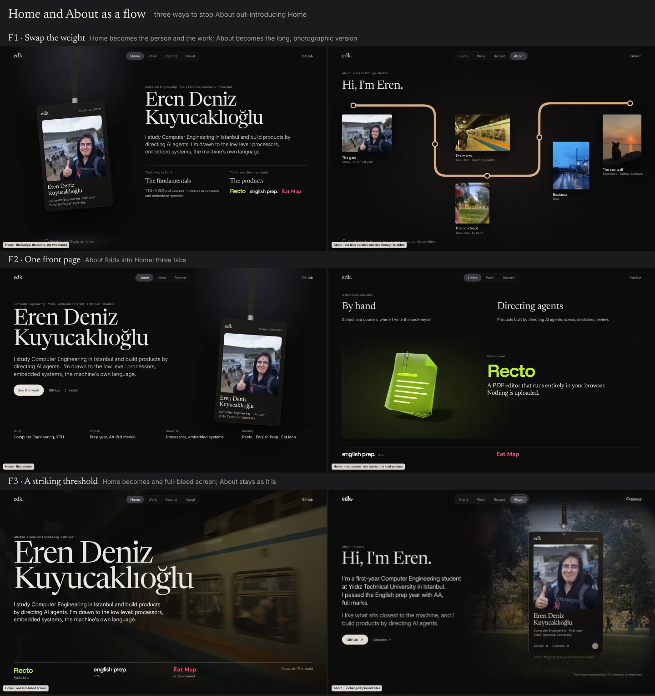
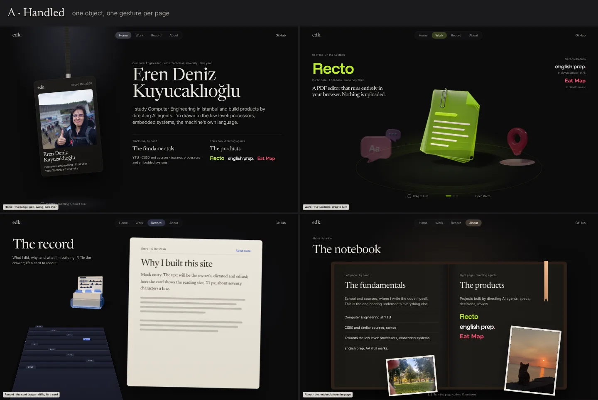
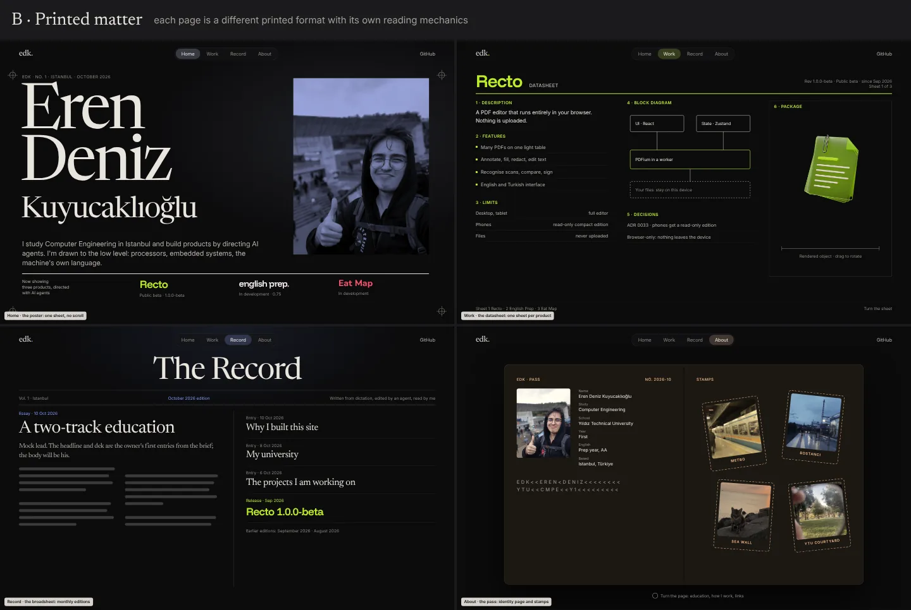
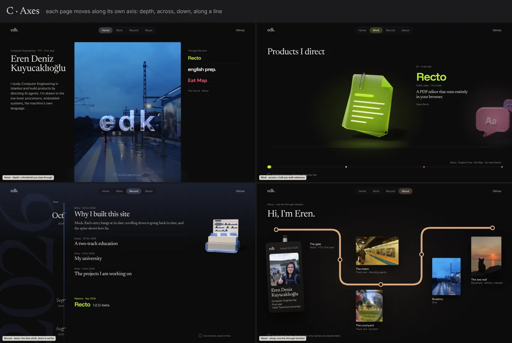
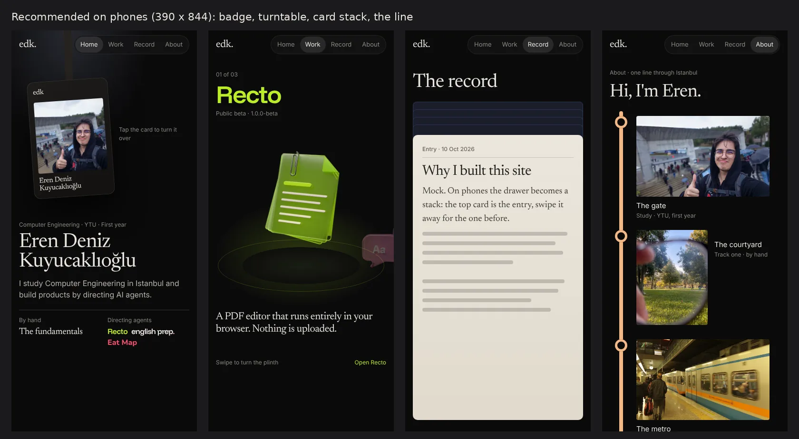

# Research: Home and About as a flow, and pages that differ in system (2026-10-10)

**Status:** superseded 2026-10-10. Round 1 was rejected except F1's Home and F3; the radical
per-page systems were shelved. Paths under `scratchpad/` cited here were session scratch, not kept.

Two owner problems (brief §7, 2026-10-10):

1. **Home vs About.** About introduces the owner better than Home (education, how they work) and
   feels like the real front page; Home looks dull beside it. Re-evaluate the two as a flow, or
   make Home far more striking.
2. **Page worlds, more radical.** Each page should differ in *system and setup*, not only in light
   or sliding text (a workbench and a photo album were illustrations only), while the site stays one
   whole. This goes past "one house, four rooms" (`2026-10-page-worlds.md`, concept A).

Nothing here is built. Mockups are static HTML/CSS with the site's fonts, real posters and real
photos, built in the session scratchpad (`radical/page.html`, `board.html`, `phone.html`). They show
layout, material and interaction intent, not finished design.

Evidence grades: **E** primary source opened, **P** a named practitioner writing publicly, **F**
secondary (search extracts, showcases, aggregators), **M** measured by us. **K** marks recollection
not re-checked this session. The fetch tool could not resolve rauno.me, paco.me, brianlovin.com,
emilkowal.ski or lynnandtonic.com, and the GitHub repos of those sites are not attached, so outside
evidence is mostly F and K. Treat it as direction, not proof.

---

## 1. Why About wins today (M, from `tests/shots/desktop-{home,about}*.png`)

| | Home | About |
|---|---|---|
| A face | none; the hero object is the letters `edk` | the gate selfie, on a card you can pull and turn |
| A place | none | the YTÜ courtyard bleeds behind everything |
| Something to do | nothing until the project plate | the lanyard card: pull, fling, turn over |
| What it says | name, one sentence, then a product pitch | study, year, prep AA, drawn to, based, the two-track education |
| Material | glass letters on black, like every other page | photo, card, lanyard: physical things |

So About wins on three counts: **it shows the person**, **it has a physical thing you can handle**,
and **it carries the thesis** (two tracks: fundamentals by hand, products by directing agents).
Home only has the name and an abstract mark, and the mark repeats the `edk.` in the bar. That is
the same as the brief's own note of the same day: Home "has nothing visual of the owner".

The three readers (requirements §A) want the same three things from the *first* screen: who (face,
name, school), what they build (products), and why to keep reading (the two-track thesis is the
one idea nobody else's page has). Today Home covers one and a half of them, and About covers all three.

## 2. How strong personal sites split Home and About

| Site | Home | About | Grade |
|---|---|---|---|
| Paco Coursey, Brian Lovin, Emil Kowalski | The home *is* the introduction: a short bio paragraph, then work or writing. No hero image | none, or a thin page | M (Paco's repo, requirements survey), K for the others |
| Rauno Freiberg | A whole interface metaphor (described as a desktop OS: dock, sounds, horizontal galleries); the person is in the system, not on a page | not a separate destination | F (showcase extract) |
| Josh Comeau | Writing-first; personality in details (3D avatar, sound toggle, squiggly underlines) | separate, with photo and story | F |
| Bruno Simon | The home is the world (drive a car between projects); achievements reward looking at content | inside the world | F, V in `2026-10-ux-patterns.md` |
| Lynn Fisher | Redesigns yearly; content mostly stays, the system changes each time | separate, long, with interviews and links | F (Adobe interview, andyet case study) |
| Maggie Appleton | A garden: notes by topic and growth stage; library pages browse like a shelf of covers | separate | F |
| Sindre Sorhus | One line ("full-time open-sourcerer & app maker"), then the apps | none needed | F |
| Tobias van Schneider | A studio and ventures front; bio on its own page | separate | F |
| Engineers' sites measured earlier | 9 of 12 lead with dated writing or a short bio, not a hero | mostly none | M (requirements §4) |
| Recruiter-facing guidance | Name, plain specialisation, GitHub, LinkedIn visible without scrolling; projects within the first two sections; skip "Hello, my name is" | where the long version goes | F (several career blogs, consistent) |

**Pattern.** The sites people remember either (a) **merge** the introduction into Home and keep no
About at all (Paco, Lovin, Emil, Sorhus), or (b) **make Home a system or world** that the person
lives inside (Rauno, Bruno, Lynn), with About as the long, quieter version. Nobody strong keeps the
weak version in front and the better one behind a tab. The current site does exactly that.

**Consequence.** Whatever flow is chosen, the face, the card and the two-track thesis must reach the
first screen of Home. About can still exist, but as the *long* version, not the better one.

## 3. Three flows

### F1 · Swap the weight (recommended)

- **Home** = the person and the work. The lanyard card moves to Home and hangs left of the name;
  under the lede a two-column strip states the two tracks, with the three products' wordmarks under
  "directing agents". The lead project plate follows below the fold as now.
- **About** = the long, photographic version. It gives up the card and gains the photos: one line
  through Istanbul with stops (the gate, the courtyard, the metro, Bostancı, the sea wall), each stop
  holding one part of the story (study, track one, track two, now, elsewhere). The facts table and
  the colophon close it.
- **Why:** answers who, what and why on the first screen; About finally uses the seven photos;
  no tab is lost; the ID card (the owner's favourite object) becomes the site's front door.
- **Cost:** low to medium. The card component moves, About gets a new layout. The `edk` glass object
  leaves Home's hero (it can stay as the favicon, the mark and the link card).
- **Risk:** the card must read as the person, not a gimmick; the hint line and keyboard turn stay.
  The About OG card (the gate selfie) stays valid.

### F2 · One front page

- About folds into Home; tabs become **Home · Work · Record**. Home's first screen: the name very
  large, the card, a fact row (study, English, drawn to, building). Next screen: the two tracks, then
  the lead product. `/about/` stays as a URL that lands on Home's introduction.
- **Why:** the engineer pattern (Paco, Lovin, Emil); fewest pages; nothing to compare.
- **Cost:** low. **Risk:** the photos lose their home; the brief asked for "a few tabs" and three is
  thin; the About link card (gate selfie) loses its page; Home grows long.

### F3 · A striking threshold

- Home becomes one full-bleed screen: a photo (the metro platform in the mock) behind the name set
  very large, the three products along the bottom, no scroll. About stays exactly as it is.
- **Why:** the most immediate "wow" for the least change.
- **Risk:** the photo is a place, not the person, so About still introduces them better; strangers
  appear in the metro photo (blurred, from behind; README says crop before any close use); text over
  a photo breaks the house rule "photos never under text" (ux-patterns §3). It treats the symptom.

## 4. Radical systems: what may differ, what must not

Concept A of `page-worlds` varied ground, light, surface, measure and tempo. The owner now wants
the **system** to differ: how you move through the page, how it is laid out, what it is made of. The
variance budget of `page-worlds` §4 is replaced by a different rule: **a page may change its
interaction model, layout logic and material completely, as long as the house constants hold and
the page's system comes from what you do there.**

**House constants (all three systems):**

1. The bar: `edk.` with its coloured dot, the pill nav, its position and behaviour.
2. The two faces (Newsreader display, Inter interface) and the products' own wordmarks.
3. The near-black ground family and colour arriving as light (family vision V1; lightness window,
   `page-worlds` §3). Material may be paper, card or leather, but it sits *on* the dark ground.
4. The glass object language and the single rig (light from upper left).
5. One motion grammar: springs, one choreography per event, the same tab change.
6. Every interaction has a still twin: content is in the DOM, readable without the gesture, with
   reduced motion, without WebGL and on a phone (CLAUDE.md).
7. Content is data: the system renders the same records (ADR-0002); no page needs a code change to
   add a project or an entry.

### System A · Handled: one object, one gesture per page

| Page | Object | Interaction model | Layout logic | Material |
|---|---|---|---|---|
| Home | the lanyard badge | pull, swing, fling, turn over (exists on About now) | split: the badge hangs left, name and two tracks right | card, strap, photo |
| Work | a turntable | drag or scroll turns the plinth one product at a time; the turned-away products wait, dimmed, at the back | one product per screen, centred on a lit round plinth | glass objects on a dark disc lit from below in the product's colour |
| Record | the card drawer (the accepted C2 object, now the page itself) | scroll riffles the cards; month tabs; a card lifts out to read | drawer left, the lifted card right at reading size (21 px, ~70 ch) | warm paper cards, dark ink |
| About | an open notebook | turn the page; prints tucked in lift on hover | a two-page spread: left page by hand, right page directing agents | dark pages, a gold ribbon, framed prints |

- **What makes it one site:** every page is *a thing you hold*, and all things share the rig's light,
  the warm ink and the springs. The interaction teaches the content: turning products, riffling dated
  cards, opening a notebook of two tracks.
- **Fits what exists:** the badge is built (ADR-0008); the turntable needs the turning renders the
  owner already asked for on phones (brief 2026-10-10: "turning, moving pre-rendered objects");
  the drawer is the accepted Record object; the notebook is new.
- **Phones:** badge flips (as now); the turntable becomes a swipe; the drawer becomes a stack of
  cards (top card is the latest entry); the notebook becomes one page at a time.
- **Accessibility:** each gesture has buttons (turn, previous/next, open) and every text is in the
  DOM in reading order. Paper cards need their own contrast check (dark ink on paper, easy).
- **Performance:** the turntable is a sprite or video of 36–72 pre-rendered frames per object
  (ADR-0006 pipeline), lazy after the poster; everything else is CSS.
- **Risks:** the notebook can drift toward skeuomorphism (keep it flat: no stitching, no leather
  grain); a site object must never sit on the paper card: additive light on a light surface turns
  white (M: the first mock showed exactly this, and the Record object was moved to the dark ground).
- **Cost:** medium. Turning renders per object (an overnight batch), one new component per page.

### System B · Printed matter: each page a printed format with its own reading mechanics

| Page | Format | Interaction model | Layout logic | Material |
|---|---|---|---|---|
| Home | a poster | none: one sheet, no scroll; the products are the credits block | the name at poster size, a duotone portrait, registration marks | ink on black, one print colour |
| Work | a datasheet per product | turn the sheet (one product per sheet, 1 of 3) | numbered sections: description, features, limits, block diagram, decisions, package drawing | rules, tables, a diagram; the glass object as the "package" |
| Record | a broadsheet | monthly editions; the latest month is the front page | masthead, a lead story in two columns, a side column of shorter items, a release box | newsprint rules on dark |
| About | a pass (ID booklet) | turn the page: identity page, then stamps | data page with photo and fields; stamps hold the photos | booklet, dashed stamp frames |

- **What makes it one site:** everything is *printed by the same press*: the same two faces, one print
  colour per page (the page light), the same rules and margins.
- **Strongest single idea:** the **datasheet**. It speaks the language of the low level the owner is
  drawn to (a component's datasheet), and it is the exact shape recruiters and engineers want: what
  it is, limits, decisions, verification (requirements §11). Worth keeping whatever is chosen: for
  focus views, or for the "by hand" work later.
- **Phones:** excellent; print layouts reflow to one column, nothing to drag.
- **Accessibility and performance:** the best of the three; all static, real tables and headings.
- **Risks:** the poster and broadsheet are familiar editorial tropes; the pass imitates a state
  document (keep it stylised, never a real passport's layout, crest or machine zone); typographic
  pages can feel cold next to the owner's wish for liveliness (brief 2026-10-09: "live, interactive").
- **Cost:** low to medium; almost no renders.

### System C · Axes: each page moves along its own axis

| Page | Axis | Interaction model | Layout logic | Material |
|---|---|---|---|---|
| Home | depth | scroll steps through a doorway; the glass mark stands in it | a lit opening (Bostancı at dusk) between the name and the product list | photo as a window, light spilling to the floor |
| Work | across | the hall: products stand on a line, scroll moves you sideways, the next one peeks in | one product in view, a position rail at the bottom | plinths on a floor line, each in its light |
| Record | down | the time shaft: down is earlier; a spine with month stops and a huge year behind | entries hang at their date, releases in their product's colour | dark, blue light from the top ("now") |
| About | along a line | scroll rides one line through Istanbul, stop by stop | a transit-map line with photo stops | the photos as stations, gold line |

- **What makes it one site:** a single, explainable rule: *each room has its own axis*. That rule is
  the constant, and it extends to later pages (a "by hand" page would get its own axis).
- **Strongest single idea:** About as **one line through Istanbul**. The owner's photos are already
  a route (gate, courtyard, metro, Bostancı, the sea wall); a line map gives them an order and a
  reason, and it reads at a glance on a phone (a vertical line).
- **Risks:** sideways scrolling on Work is scroll hijacking on desktop (a known annoyance, and it
  fights the scroll rail); the doorway on Home again puts a *place* rather than the person in front;
  the time shaft is close to today's Record. Stop names and captions must come from the owner, never
  invented (the mock marks them as placeholders).
- **Phones:** About and Record are natural (vertical); Work's hall becomes a swipe; Home's depth
  becomes a simple fade.
- **Cost:** medium; scroll-driven animation is an enhancement only in Firefox (ux-patterns §0).

## 5. Comparison

| | A Handled | B Printed | C Axes |
|---|---|---|---|
| Pages feel different in system | strong | medium (all are print) | strong |
| Still one site | strong (all objects, one rig) | strongest (one press) | medium (held by a rule) |
| Shows the person on Home | yes (the badge) | yes (the portrait) | no (a doorway) |
| Liveliness the owner asked for | high | low | medium |
| Uses what exists | badge, Record drawer, objects, turning wish | little | photos |
| Phones | good, each gesture has a phone form | best | good, except Work's hall |
| Accessibility risk | medium (gestures need buttons) | low | medium (scroll hijack) |
| Performance | turning renders, lazy | lightest | light |
| Content as data | yes | yes | yes |
| Cost | medium | low to medium | medium |

## 6. Recommendation

1. **Flow F1**: the badge moves to Home with the name and the two tracks; About becomes the long,
   photographic version.
2. **System A, Handled**, as the frame, with **C's line through Istanbul as About** (instead of the
   notebook). Home = the badge, Work = the turntable, Record = the card drawer, About = the line.
   Each page has its own object and gesture; the line is About's "object". This keeps the person on
   Home, uses every asset the owner already likes, and gives each page a gesture that teaches its
   content.
3. **Keep B's datasheet** in reserve for project focus views (the "how" layer) or the hand-written
   work section; decide after A is seen.
4. **Do not build** C's sideways hall or B's pass.

**Prototype order** (on a branch of the real pages, after the owner chooses):

1. Home with the badge (F1): a move, not a new build. Check the first screen at 1440×900,
   1180×820 and 390×844.
2. Record as the card drawer: the biggest reading change and the accepted object. Paper contrast,
   21 px reading size, the object kept on the dark ground.
3. About as the line: needs the owner's captions and their choice of stops.
4. Work as the turntable: needs turning renders; until then, the plinth with the still posters and
   previous/next buttons.

Each step keeps the still twin (no JS, reduced motion, no WebGL, phone), and records its system in
an ADR ("page systems"), so later pages get a system by the same rule.

## 7. Images

Boards (1440×900 pages at half scale, real fonts, posters and photos; mock text marked as such):

- `assets/2026-10-radical-a-handled.webp`
- `assets/2026-10-radical-b-printed.webp`
- `assets/2026-10-radical-c-axes.webp`
- `assets/2026-10-radical-flows.webp`
- `assets/2026-10-radical-phones.webp`

## Sources

- Lynn Fisher: [Adobe XD interview on the annual redesign](https://xd.adobe.com/ideas/perspectives/interviews/lynn-fishers-annual-portfolio-redesign-skills-sharp),
  [&yet case study](https://blog.andyet.com/2018/01/09/case-study-lynnandtonic-refresh/),
  [web.dev community highlight](https://web.dev/community-highlight-lynn-fisher/) (F)
- Rauno Freiberg: [uiuxshowcase](https://uiuxshowcase.com/portfolio/rauno-freiberg/) (F)
- Josh Comeau: [uxdesign.cc, sixteen portfolios](https://uxdesign.cc/sixteen-incredible-portfolios-4159b3e2c235),
  [Keith J. Grant, Redesign 2023](https://keithjgrant.com/posts/2023/03/redesign-2023/) (F)
- Bruno Simon: [Creative Bloq](https://www.creativebloq.com/news/3d-car-portfolio),
  [GeekNews](https://news.hada.io/topic?id=24963) (F); source and assets measured in `2026-10-ux-patterns.md`
- Maggie Appleton: [Advent of Bloggers 2021](https://jamesg.blog/2021/12/24/advent-of-bloggers-24) (F)
- Sindre Sorhus: [podfeet](https://www.podfeet.com/blog/2025/06/sco-sindre-sorhus-apps/) (F);
  Tobias van Schneider: [vanschneider.com/praxis](https://vanschneider.com/praxis) (F)
- Recruiter-facing guidance (F, consistent across): [devplaybook checklist](https://devplaybook.cc/blog/developer-portfolio-checklist-20-things-hiring-managers),
  [shashiworks guide](https://www.shashiworks.com/developer-portfolio-guide.html),
  [Be Your Own Design Team](https://beyourowndesignteam.beehiiv.com/p/ux-portfolio-crafting-home-page)
- Paco Coursey, Brian Lovin, Emil Kowalski: requirements survey (M for Paco's repo), otherwise K
- Own (M): current screenshots in `tests/shots/`; the mocks in this file; `content/site.json`

## Özet ve seçimler (Türkçe, sahip için)

**Durum, kısaca.** About şu an Home'dan daha iyi tanıtıyor, çünkü üç şeyi var: yüzün (kart üstündeki
fotoğraf), elle oynanan bir nesne (ipten çekilen kart) ve senin asıl fikrin (iki yol: temeller elle,
ürünler yapay zekâ ajanlarını yöneterek). Home'da ise yalnızca isim ve cam "edk" harfleri var. İyi
kişisel siteler ya tanıtımı doğrudan ana sayfaya koyuyor ya da ana sayfayı başlı başına bir dünya
yapıyor; zayıf olanı önde, iyisini arkada tutan yok.

**Önerim.** Kart ana sayfaya taşınsın: ismin yanında asılı dursun, altında iki yol yazsın. About
uzun ve fotoğraflı anlatım olsun: İstanbul'da tek bir hat, durakları senin fotoğrafların (kapı, avlu,
metro, Bostancı, deniz duvarı). Sayfaların sistemi de gerçekten ayrılsın: her sayfada elle tutulan bir
nesne ve bir hareket olsun. Work'te ürünler dönen bir tablada tek tek döner, Record bir kart
çekmecesidir (kartı çekip okursun), About o hat olur. Menü, `edk.` işareti, yazı tipleri, koyu zemin
ve ışık hiç değişmez; site bu yüzden yine tek parça kalır.

**Senin seçmen gerekenler:**

1. **Home ile About nasıl paylaşsın?** Şu an About daha güçlü; hangisinin ne anlatacağını seçmen lazım.
   a) Kart Home'a gelsin, About uzun ve fotoğraflı anlatım olsun (önerim) · b) About'u kaldıralım,
   her şey Home'da olsun, üç sekme kalsın · c) Home tek ekranlık, büyük fotoğraflı bir giriş olsun,
   About aynen kalsın.
2. **Sayfaların sistemi ne olsun?** Her sayfa ayrı bir dünya gibi çalışsın ama tek site kalsın; üç yol
   var. a) Elle tutulan nesneler: kart, döner tabla, kart çekmecesi, defter/hat (önerim) · b) Basılı
   işler: afiş, teknik föy, gazete, pasaport · c) Eksenler: kapıdan içeri, yana yürünen salon, aşağı
   inen zaman, şehirde bir hat.
3. **About'un nesnesi ne olsun?** Fotoğraflar About'a taşınınca onları bir düzen tutmalı.
   a) İstanbul'da tek hat, duraklar fotoğraflar (önerim) · b) Açık bir defter: sol sayfa elle, sağ sayfa
   ajanlarla · c) Şimdiki avlu fotoğrafı arka planda kalsın.
4. **Hangi fotoğraflar, hangi sırayla?** Hattaki durakların adlarını ve altlarına ne yazılacağını sen
   söylemelisin; ben uydurmam. a) Beşini de kullan · b) Yalnızca kapı, avlu ve metro · c) Listeyi sen ver.
5. **Teknik föy fikri?** Ürünleri bir elektronik parçanın teknik belgesi gibi göstermek düşük seviye
   ilgine çok uyuyor. a) Proje pencerelerinde kullan · b) İleride "elle yazdıklarım" bölümünde kullan ·
   c) Hiç kullanma.

Görseller: `docs/research/assets/2026-10-radical-*.webp` (beş pano).
