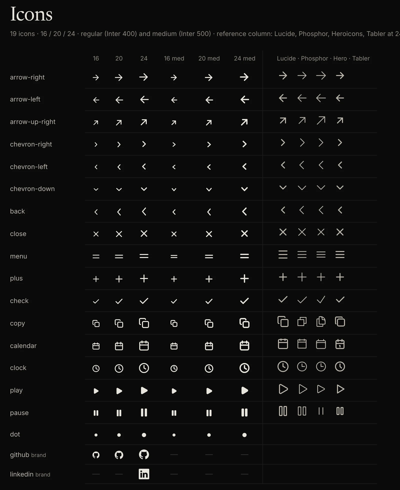
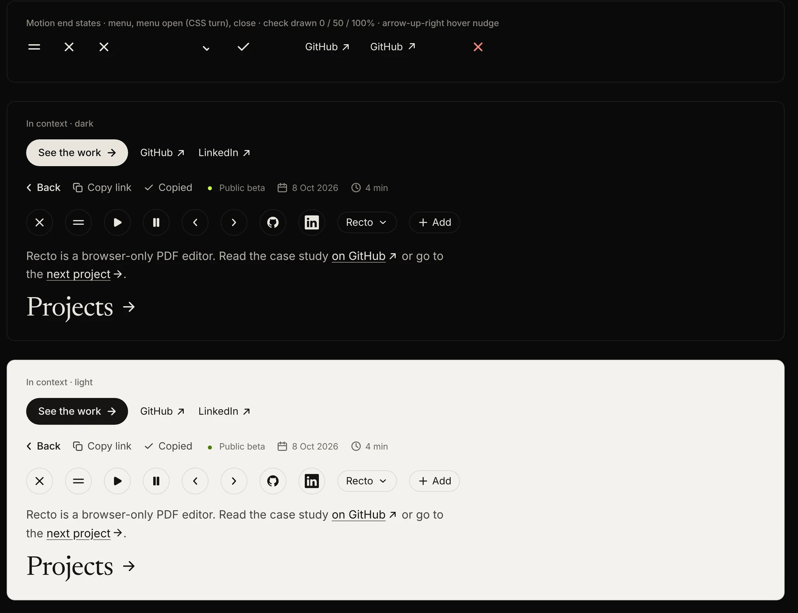

# Research: an icon system at the objects' quality bar (2026-10-09)

**Status:** current. `tools/icons` matches it. Paths under `scratchpad/` cited here were session
scratch, not kept.

Track 8 of `docs/history/plan-2026-10-craft-round.md`. The owner reported icons rendering as emoji on iPhone (brief §7,
2026-10-09 "Fixes") and asked for icons built to the same bar as the objects, "with a system
or tool if one helps" (brief §7, "Icons"). This note covers why the emoji happened, how the
best icon systems get their quality, what was built (`tools/icons/`), and what the owner
still has to supply.

**Evidence grades**, as in `2026-10-tools.md`: **E** verified here (run, measured, or read at
the primary source in this container on 2026-10-09: npm packages, cloned repositories,
Apple's HIG JSON); **P** primary source seen only through a search extract; **F** secondary
sources; **M** recollection, unconfirmed. Several vendor sites (lucide.dev, brand.github.com,
brand.linkedin.com, m3.material.io, primer.style, vercel.com, unicode.org) were blocked by the
sandbox; those facts are P at best.

## Summary

1. **The emoji had a concrete cause (E).** ↗ U+2197 (and ➡ ⬅ ▶ ⏸ ✔ ✖) are emoji code points
   with text-default presentation (emojibase 17.0.0). The Inter subsets from Google Fonts and
   Fontsource contain **no arrows at all** except ↑ ↓ (cmap of `inter-latin-400-normal.woff2`
   and the `unicode-range` of every subset), so the browser falls back to a system font; on
   iOS that is often Apple Color Emoji. A font cannot fix this reliably; **icons must be SVG**,
   and the page must never write symbols as characters.
2. **Quality comes from rules, not from a bigger set.** Every serious system fixes a canvas,
   a keyline, one stroke per size, corner and gap rules, pixel alignment and optical
   corrections, then draws each size on its own grid (Lucide, Octicons, Heroicons, SF Symbols,
   Material Symbols; §2).
3. **Decision: a parametric generator in code** (`tools/icons/`), with Lucide's specification
   as the base rule set and SF Symbols' idea that icon weight follows text weight. Each icon is
   a short function of the rules; a build draws 16/20/24 in two weights, optical-centres,
   snaps, measures ink weight, optimises with svgo and writes SVG, JSON, an ES module and CSS.
   Brand marks are vendored from official drawings, not drawn.
4. **Measured result:** icon centres land within 0.05px of Inter's cap-height centre in flex
   rows and within 0.1px inline (Chromium, 15 to 17px); 19 icons, 106 drawings, 33.8 KB of
   SVG in total (about 320 bytes each); ink weight in line with Lucide at the same stroke.
5. **Owner action:** download the official LinkedIn [in] bug (the build ships a labelled
   interim redraw), or decide to use text links only (recommended for the hero).

## 1. Why icons became emoji

| Fact | Grade |
|---|---|
| U+2197 ↗, U+2196, U+2198, U+27A1 ➡, U+2B05 ⬅, U+25B6 ▶, U+23F8 ⏸, U+2714 ✔, U+2716 ✖ are emoji with text-default presentation; U+2190 ←, U+2192 →, U+2713 ✓, U+00D7 × are not emoji | E (emojibase-data 17.0.0) |
| Prototype E writes ↗ six times, → seven, ← three (`prototypes/e-dark/index.html`) | E |
| Inter's Latin subset `unicode-range` covers U+2191 and U+2193 only among arrows; the font files contain no U+2190, U+2192 or U+2197 | E (fontTools on @fontsource/inter 5.3.0; the same subsets Google Fonts serves) |
| With no glyph in the web font, iOS Safari resolves emoji-capable code points to Apple Color Emoji, even when presentation defaults to text | M (consistent with the owner's report) |

Consequences: ← and → fell back to a system font (wrong design, not emoji); ↗ became an
emoji. Adding U+FE0E (text presentation selector) is unreliable on iOS (M). The fix is the
SVG set below, plus a rule in `tools/icons/README.md`: no symbol characters in the page.

## 2. How top systems get quality

| System | What it does that matters here | Grade |
|---|---|---|
| **SF Symbols** (Apple) | Nine weights, each matching a San Francisco font weight "for precise weight matching between symbols and adjacent text"; three scales "defined relative to the cap height"; symbols vertically centred on the cap height; negative side margins for optical horizontal alignment; rendering modes (monochrome, hierarchical, palette, multicolour); variable colour for values; animations: appear, bounce, scale, pulse, variable colour, replace (down-up, up-up, off-up), Magic Replace, wiggle, breathe, rotate, **Draw On / Draw Off** (SF Symbols 7). Custom symbols come from a template with three master weights | E (HIG JSON); P for the cap-height centring and template detail (WWDC 2021 session 10097, Apple docs extracts) |
| | **Licence:** SF Symbols may only be used in apps for Apple platforms, not on websites | F (Apple forum answers, third-party READMEs; licence text not reachable) |
| **Material Symbols** (Google) | Variable font with four axes: FILL 0–1, wght 100–700, GRAD (fine weight without size change; **−25 recommended for light symbols on dark grounds** to reduce glare), opsz 20–48 (stroke adjusts to keep weight constant across sizes) | P (developers.google.com extract) |
| **Lucide** (ISC) | Written specification: 24×24, 1px safe zone, 2px centred strokes, round caps and joins, 2px radius on shapes ≥ 8px and 1px below, ≈2.41px where diagonals meet at 90°, ≥ 2px gaps, visual weight matched to `circle`/`square` (blur test), optical centring for asymmetric shapes, coordinates and arc centres on the pixel grid, reuse of shared geometry | E (`docs/contribute/icons/specification.md`, `design-principles.md`, cloned) |
| **Octicons** (GitHub, MIT) | Separate natural-size drawings at 16 and 24; **1.5px stroke at both**; round caps and joins; 1px corner radius; 0.25px radius on small filled parts; 1px gaps between overlapping objects, 1.5px around modifiers; outer edges on pixel boundaries; "inspect at natural rendered size: a clean zoomed-in vector can still lose meaning at 16px" | E (`.github/skills/icon-request-review/references/design-review.md`) |
| **Heroicons** (MIT) | Outline 24 (1.5px stroke), Solid 24, Mini 20 and Micro 16 as separately drawn solid sets | E (package files, heroicons 2.2.0) |
| **Phosphor** (MIT) | 256-unit canvas, six weights (thin 8 → bold 24 units, i.e. 0.75 → 2.25px at 24), shipped as outlined fills | E (`@phosphor-icons/core` 2.1.1 files) |
| **Tabler** (MIT) | 24 grid, 2px stroke, round caps, `currentColor`, stroke width adjustable in CSS | E (README, 3.49.0) |
| **Iconoir** (MIT) | 24 grid, 1.5px stroke | E (7.12.1 files) |
| **Radix** (MIT) | 15×15 grid, filled paths, crisp at exactly 15px | E (README) |
| **Geist** (Vercel) | No public specification or package found; the site and the assets package were unreachable | — |

**Common rules worth adopting (E unless marked):** one canvas per size, drawn natively; a
keyline (circle, square, rectangles) so different shapes have the same visual volume; one
stroke per size; round caps/joins; corner radius tied to stroke; minimum gaps; outer edges on
the pixel grid; optical centring of asymmetric shapes (play, arrows); weight that follows the
adjacent text (SF Symbols, P for Material's grade). **Pixel snapping** matters most at 1x;
Mac and iOS do not hint type or icons (M), so on 2x/3x screens the job is to keep stroke
edges on device pixels where possible and never blur a symmetric icon off centre.

### Animating icons

- **Draw on:** stroke-dasharray with `pathLength="1"`, as in SF Symbols' Draw On; best for a
  check after "copy". Needs one path per stroke in drawing order (E, built).
- **Replace:** Apple's down-up replace (outgoing scales down, incoming scales up) works for any
  pair and in every browser (P for Apple's taxonomy, E for the CSS).
- **Morph:** true path morphing needs matching path structure; CSS `d` transitions are not
  supported in Safari (M), and GSAP MorphSVG is in the lazy chunk already (`2026-10-tools.md`).
  Menu ↔ close is done here with geometry instead: the menu lines are as long as the cross's
  diagonals, so a rotate + translate is exact (overlay test in the contact sheet: no pixel of
  difference).
- **Restraint:** Apple asks for animations "judiciously" and with a clear purpose (E); the
  site's motion system says the same (`2026-10-craft-audit.md` §4). Hover nudges only under
  `(hover: hover)`, all of it off under reduced motion.

### Brand marks

| Rule | Grade |
|---|---|
| GitHub: do not change a logo's colour or dimensions or combine it with other elements; the Invertocat and wordmark appear only in white, black, or in few cases grey or green; never use a GitHub logo as your own logo | P (github.com/logos, brand.github.com extracts) |
| GitHub publishes the mark itself in Octicons (`mark-github` 16 and 24) | E (@primer/octicons 19.40.0) |
| LinkedIn: "Use only approved logo assets. Don't recreate the logo"; do not modify colour or shape; minimum 21px on screen for the [in]; clear space 2x the stroke of the "i"; words beside the IN logo to indicate your profile are allowed in a different font and colour | P (brand.linkedin.com extracts; the profile-link clause is from an archived policy page) |
| simple-icons (CC0) no longer ships LinkedIn | E (16.34.0 has no linkedin file); the reason (a trademark request) is F |

## 3. Decision

**Options.** (a) Adopt an open set as is (Lucide or Phosphor): good drawings, but strokes
and sizes are theirs, not tied to our type, and 1.5px or 2px at every size cannot match both
15px and 22px text. (b) Tune an open set by hand: drift on every edit, no record of why.
(c) **A parametric generator in code** that draws each icon from one set of rules, with an
open specification as the rule base. (d) A variable icon font (Material style): the right
idea for weight and optical size, but a font brings back exactly the fallback problem of §1,
costs ~100 KB+, and cannot carry brand marks.

**Chosen: (c), with Lucide's specification as the base and SF Symbols' weight matching.** It
is the icon equivalent of the headless Blender pipeline (ADR-0005): source in the repo, output
regenerated, every number explainable. The set is small (19), so writing each icon as a
function costs less than tuning someone else's paths, and the rules carry over to every icon
added later.

**What the generator encodes** (`tools/icons/rules.mjs`, details in its README):

- Sizes 16/20/24, each recomputed at natural size, paired with 15/18/22px text.
- **Stroke = Inter's stem at the paired size and weight** (measured: "I" is 190/2048 em at 400,
  228.5/2048 at 500), rounded to 0.25px: regular 1.5/1.75/2, medium 1.75/2/2.5. This is SF
  Symbols' weight matching, done with our own type.
- Margins 1/1.5/2px and an optical-size table (features slightly larger at 16).
- Outer stroke edges on a 0.5px grid (device pixel at 2x), symmetric about the centre; the
  centre axis is exact.
- Corner radius = one stroke width; solid glyphs filled and stroked so corners match.
- **Optical centring computed, not eyeballed:** ink coverage sampled on a 1/8px grid; icons
  that ask for it move halfway from their box centre to their ink centroid (play moves right
  0.75 to 1px, arrows move away from their heads 0.5 to 1px).
- **Weight reported, not guessed:** ink area relative to a stroked keyline circle, per drawing.
- **Alignment to text is a measured property of Inter:** its content-area centre equals its
  cap-height centre (both 745/2048 em), so `align-items: center` puts an icon on the cap
  height. Newsreader's content centre is 0.1em below its cap centre, so titles get a
  correction (`.on-serif`).

## 4. The set

arrow-up-right (external link), arrow-right, arrow-left, chevron-left/right/down, back (a
larger navigation chevron for a "Back" label), close, menu (two lines, morphs to close),
plus, check, copy, calendar, clock, play, pause, dot (status, centred on the x-height), GitHub
mark, LinkedIn bug (interim, 24 only).

### Measurements (E, Chromium via Playwright 1.64, @fontsource Inter and Newsreader 5.3)

**Centre of the icon minus the text's cap-height centre** (x-height centre for the dot):
−0.05px for every 16px icon beside 15px Inter in flex rows; +0.10px inline in 17px body
text; +0.20px beside a 40px Newsreader title with `.on-serif` (4.2px before the
correction); +0.28px for the dot beside 13px text (−0.89px before its x-height rule).

**Ink area at 24, px²** (rasterised at 4x; ours at stroke 2, same as Lucide and Tabler;
Phosphor and Heroicons are 1.5px sets):

| Icon | Ours | Lucide | Phosphor | Heroicons | Tabler |
|---|---|---|---|---|---|
| arrow-right | 67 | 68 | 53 | 59 | 63 |
| arrow-up-right | 61 | 69 | 55 | 65 | 65 |
| chevron-right | 31 | 37 | 33 | 33 | 37 |
| close | 64 | 70 | 58 | 51 | 70 |
| menu | 69 (2 lines) | 106 (3) | 80 | 80 | 106 |
| check | 45 | 48 | 38 | 39 | 45 |
| copy | 143 | 167 | 119 | 138 | 161 |
| calendar | 170 | 180 | 128 | 127 | 175 |
| clock | 133 | 148 | 102 | 102 | 134 |
| play (solid) | 126 | 108 (outline) | 79 | 69 | 92 |
| pause (solid) | 140 | 177 (outline) | 126 | 44 | 137 |
| GitHub mark | 180 | | | | |
| LinkedIn bug | 334 | | | | |

Ours runs slightly lighter than Lucide at the same stroke (smaller live area at 24) and sits
between Lucide and the 1.5px sets, which suits the quiet direction (ADR-0003). The LinkedIn
bug is by far the heaviest thing in the set; that is the brand's own solid square at its
minimum size, and the reason text links are recommended in the hero.

**Output:** 106 SVGs, 33.8 KB in total with svgo (37.9 KB without), deterministic across
runs (checksum of `icons.json` unchanged on rebuild).

## 5. Process and the contact sheet

Three rounds (the session scratchpad, `icons/make-sheet.mjs`, not in the repo): a page built
from `out/icons.json` with self-hosted Inter and Newsreader, every icon at 16/20/24 in both
weights at 1x and 2x, the four reference sets, an in-context block (solid button, links,
back, copy/copied, status, date, time, round icon buttons, a pill, running text, a serif
title) on `#0a0a0b` and on a light ground, motion end states, an ink audit by rasterising,
and an alignment probe measuring each icon against the baseline of its text run. Zoomed
crops at 6x were used to inspect snapping.

- Round 1: geometry worked, but the 0.5px snap pushed centred strokes 0.25px off centre
  (1.5px strokes cannot have both edges on the grid when centred); copy's back sheet had a
  zero-length segment that svgo turned into a stray close-path; the back chevron was too
  narrow to read as a chevron; calendar at 16 without its header rule read as a box.
- Round 2: snapping made symmetric about the centre with an exact centre axis; back redrawn
  as a larger 90° chevron; calendar keeps its header at every size; alignment probe added,
  which found the dot 0.89px high and serif titles 4.2px low.
- Round 3: x-height and serif corrections derived from font metrics into `icons.css`; menu
  lines lengthened to the cross diagonal so the morph needs no scaling (caps would stretch);
  transform order fixed; hover nudges limited to hover-capable pointers. Draw-on, swap and
  morph end states verified in the sheet.

## 6. Open items

- **LinkedIn bug:** replace `tools/icons/brands/linkedin.svg` with the official white [in]
  bug from LinkedIn's brand downloads (blocked here), or use text links only. Until then
  `icons.json` marks it `"interim": true`.
- **Real iPhone check:** confirm on Safari that no character falls back to emoji once the
  page uses the SVGs (Chromium emulation cannot show Apple Color Emoji).
- **1x screens:** snapping targets 2x; on a 1x monitor 1.75px strokes at 20 are slightly soft.
  If the owner's desktop is 1x, a 1x grid variant is a one-line change in `rules.mjs`.
- **Level 2:** the Astro build should inline the SVGs at build time (no runtime JS) and load
  `icons.css` as part of the content CSS (3.6 KB).

## Sources

Read here (E): Apple HIG "SF Symbols" (developer.apple.com/tutorials/data/design/
human-interface-guidelines/sf-symbols.json); `lucide-icons/lucide`
`docs/contribute/icons/specification.md` and `design-principles.md`; `primer/octicons`
`.github/skills/icon-request-review/references/design-review.md`; npm packages
lucide-static 1.54.0, @phosphor-icons/core 2.1.1, iconoir 7.12.1, @radix-ui/react-icons 1.3.2,
heroicons 2.2.0, @tabler/icons 3.49.0, @material-symbols/svg-400 0.47.6, simple-icons 16.34.0,
@primer/octicons 19.40.0, bootstrap-icons 1.13.2, emojibase-data 17.0.0, svgo 4.1.0,
@fontsource/inter and @fontsource-variable/inter, newsreader 5.3.

Through search extracts (P/F): developers.google.com "Material Symbols guide"; Apple developer
docs "Creating custom symbol images" and WWDC 2021 session 10097; github.com/logos and
brand.github.com/foundations/logo; brand.linkedin.com logo, [in] logo and archived policy
pages; Apple developer forum threads on the SF Symbols licence (706089, 650900, 757407).
