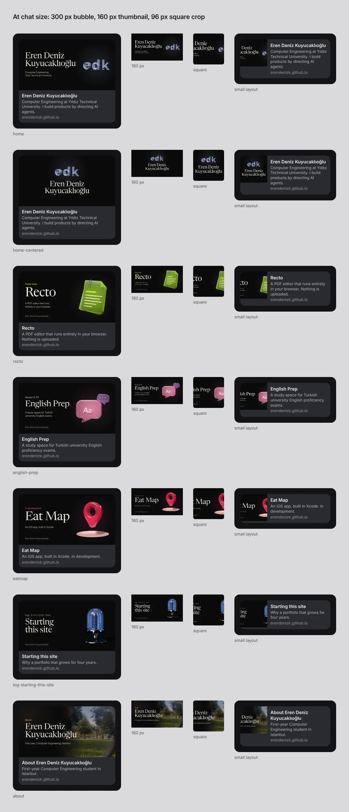
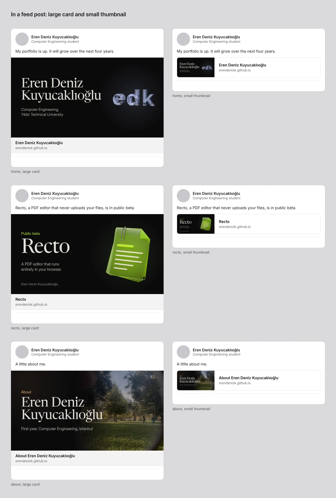
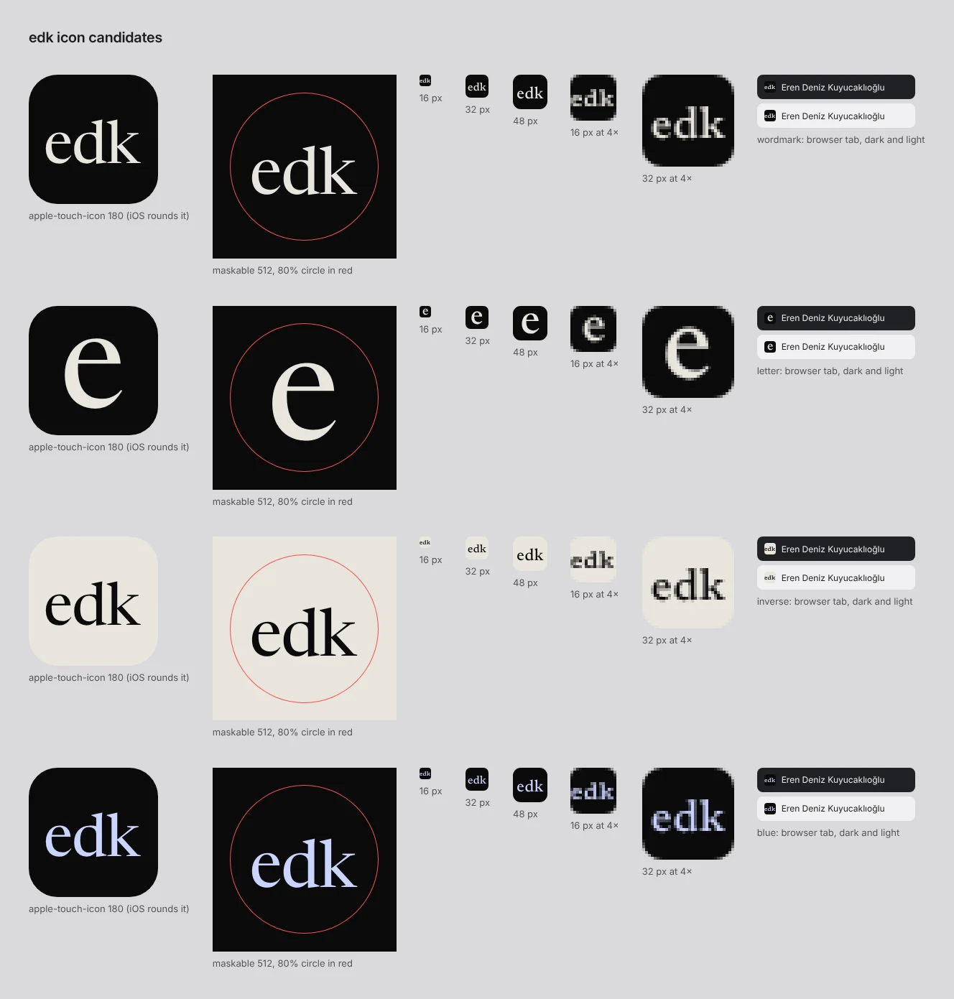

# Research: link previews, icons and structured data (2026-10-09)

**Status:** current. Built (`tools/og`).

The first impression of the site often happens inside someone else's app: a LinkedIn post or
the Featured section of a profile, a WhatsApp or iMessage chat, X, Slack, Discord, Telegram.
The brief makes this the main entry: the site is "the link that sits on a LinkedIn profile"
(brief §7, 2026-10-08), and friends share it through its preview (requirements §5). This file
collects what each platform does with a link, what the image has to survive, the icon set for
a dark site, and what JSON-LD can and cannot do. The generator that follows from it is
`tools/og/` (README there).

Evidence grades, as in `2026-10-requirements.md`:

- **E** a primary document opened in this research. **E (extract)** the platform's own page,
  read only through search extracts (the sandbox could reach developer.apple.com and GitHub,
  and nothing else: linkedin.com, developers.facebook.com, developers.google.com, docs.x.com,
  Slack, Discord and Telegram docs all failed DNS from here).
- **P** practitioner, **F** folklore (vendor guides, forums).
- **M** measured by us (the generator's output and contact sheets).
- **K** prior knowledge, not re-checked this round.

---

## 1. Platform by platform

| Platform | What it reads | Image | Text shown | Cache and refresh | Grade |
|---|---|---|---|---|---|
| **LinkedIn** | `og:title`, `og:image`, `og:description`, `og:url` (all four listed as required); falls back to `<title>` and page extraction | min 1200 × 627, ratio 1.91:1, ≤ 5 MB, JPG/PNG/GIF; under 401 px wide it shows as a thumbnail | title and host; description rarely | caches about 7 days; Post Inspector re-scrapes, but only new posts get the new card | E (extract) for specs; F for the 7 days |
| LinkedIn feed, organic posts | same | since late 2023 an organic post with a link shows a **small thumbnail beside the title**, not a full-width card; sponsored posts keep the large card | title, host | as above | P/F (Search Engine Land, Social Media Today, agencies) |
| **WhatsApp** | `og:title`, `og:description`, `og:image` | Meta's WhatsApp doc: ≥ 300 px wide, ratio 4:1 or narrower, under 600 KB; practitioners report previews vanish above about **300 KB**. Falls back to a small preview with a square thumbnail when requirements are not met | title, description, host | cached per URL; no public debugger | E (extract) for 600 KB; F for 300 KB |
| **iMessage** (Messages, iOS/macOS) | `og:title`, `og:image`, icon from `apple-touch-icon` / favicon; `og:video` plays inline if it is a direct MP4 | images ≥ 900 px wide; under 150 px wide treated as an icon; icons square, ≥ 108 px; page ≤ 1 MB, all resources ≤ 10 MB | title and host | no JS, no meta refresh; server redirects followed | **E** (Apple TN3156, rev. 2024-04-30) |
| **X** | `twitter:card` = `summary_large_image`, falls back to `og:*` | 2:1 wide card, center-cropped; ≤ 5 MB | since late 2023, link cards show the image with only the domain over it; the title is gone from the card | Card Validator's preview was removed; re-post to test | E (extract, old docs snapshot) / K for the 2023 change |
| **Slack** | `og:*`; some guides say `twitter:card` steers the unfurl type | about 360 × 200 in channel, larger on click; no redirects on the image; ≤ 5 MB reported | title (linked), description, site name | caches long (weeks reported); a new URL or query string busts it | F |
| **Discord** | `og:*`, `theme-color` colours the embed's side bar; `twitter:card summary_large_image` gives a large image | 1200 × 630 works | site name, title, description | cached; change URL to test | F |
| **Telegram** | `og:*` incl. `og:image:width/height` | sender chooses small (square thumbnail at the side) or large layout since 2023 | title, description | very sticky; @WebpageBot refresh is unreliable; a new image URL works best | F (bug tracker reports) |
| **Facebook / Messenger** | `og:*` | min 200 × 200; ≥ 600 × 315 for the large layout; 1200 × 630 recommended; ≤ 8 MB; `og:image:width/height` let it render on first share | title, description, host | 24 h cycle; Sharing Debugger re-scrapes; images cached **by URL**, so a changed image needs a new URL, and old images must stay online | E (extract, Meta images doc, 2026) |

### What this means for the image

1. **One 1200 × 630 JPEG per page, under 200 KB**, satisfies every row: it is ≥ 1200 × 627
   (LinkedIn), ≥ 900 wide (iMessage), ≥ 600 × 315 (Facebook), 1.91:1 (all), and well under
   WhatsApp's practical 300 KB. JPEG over WebP for `og:image`, because LinkedIn lists only
   JPG/PNG/GIF and WebP support in crawlers is not documented (E (extract)). Our cards are
   45–155 KB at quality 90 (M).
2. **The card is mostly seen small.** The large card appears in LinkedIn's Featured section,
   boosted posts, Slack, Discord, iMessage and WhatsApp (≈ 260–555 px wide); organic LinkedIn
   posts and small chat layouts show a thumbnail of roughly 130–160 px or a square crop of
   80–100 px (P/F, M from our mock frames). Design for the 300 px bubble first, and accept that
   at 160 px only the title and the object survive.
3. **Text in the image: little and large.** Apple asks for no text in preview images (E), but
   X has dropped the title from link cards (K), and LinkedIn's thumbnail shows only the title
   and host, so the name must be in the image to be seen at all. The compromise: the name or
   project title set large (≥ 96 px on the 1200 px card, ≈ 24 px in a 300 px bubble), one short
   line at 30–32 px, nothing else that has to be read.
4. **Safe zones.** Keep the title and object inside 80 px side margins and 64 px top and bottom
   (X and some clients crop edges; Telegram and WhatsApp small layouts crop a centre square of
   the middle 630 px). A left-aligned title is cut by the centre-square crop; the
   `home-centered` variant keeps the whole lockup inside the square (see §5, question 1).
5. **Refreshing.** Facebook and Telegram cache by image URL, LinkedIn for about a week, Slack
   longer. So: version the image file name (`og/recto.v2.jpg`) whenever a card changes, never
   overwrite in place, keep old files online, and re-run LinkedIn Post Inspector and Facebook's
   Sharing Debugger after a release (E (extract) for Facebook; F for the rest).

### Text lengths

- `og:title` without the site name (Apple: put branding in `og:site_name`, E). Keep it under
  about 60 characters so a phone shows it on one or two lines (LinkedIn's display limit is not
  documented; guides say 70–100, F).
- `og:description` 1–2 sentences, under about 155 characters; LinkedIn mostly ignores it,
  WhatsApp, Slack, Discord and Telegram show it (F).
- `og:site_name` = "Eren Deniz Kuyucaklıoğlu" (also what Google's site-name system reads).

---

## 2. Icons for a dark site

Minimum set (E for MDN and Google; P/F for the "six files" convention):

| File | Size | Notes |
|---|---|---|
| `/favicon.ico` | 16, 32, 48 in one ICO (PNG payloads) | browsers and crawlers ask for `/favicon.ico` even with `<link>` tags |
| `favicon.svg` (optional) | vector | needs the "edk" glyphs as outlines; not generated yet (no font-outline tool in the sandbox) |
| `apple-touch-icon.png` | 180 × 180, opaque, full bleed | iOS rounds the corners itself; Messages also uses it as the link icon (Apple: ≥ 108 px square) |
| `icon-192.png`, `icon-512.png` | manifest `"purpose": "any"` | |
| `icon-maskable-512.png` | manifest `"purpose": "maskable"` | the mark inside the central circle of 80 % diameter (MDN, W3C manifest) |
| Google | any square ≥ 8 px, strongly ≥ 48 px, one stable URL, crawlable | multiple `rel=icon` where one fails guidelines can lose the favicon (E (extract)) |

`theme-color`: `<meta name="theme-color" content="#0a0a0b">`. It tints Android Chrome's bar and,
reportedly, the side bar of a Discord embed (F). The site is single-theme dark, so one value;
the `media` attribute exists if a light theme ever comes (E, MDN). A dark site gets a dark
favicon tile: an ink mark on transparency disappears on light tab strips and a black mark on
dark ones, so the tile carries its own ground (M, contact sheet).

**What the mark does at 16 px (M).** "edk" at 16 px is three blurred letters about 5 px
tall: recognisable as a word shape, not readable. A single "e" at 16 px reads cleanly. At 32 px
and above the full "edk" works. See question 3.

---

## 3. JSON-LD and what Google shows

- **WebSite** on the home page with `name` (and optional `alternateName` "edk") is how Google
  picks the site name shown above the result (E (extract), Google site-names doc). It also reads
  `og:site_name`, `<title>` and headings.
- **ProfilePage** with a `Person` as `mainEntity` (`name`, `alternateName`, `image`,
  `sameAs` [GitHub, LinkedIn], `jobTitle`/`affiliation` optional) is documented for "any site
  where creators share first-hand perspectives"; Google uses it to understand creators and in
  Discussions and Forums features (E (extract)). For a personal site it labels and
  disambiguates; no rich result is promised, and none should be expected (requirements §20).
- `rel="me"` on the GitHub and LinkedIn links, and the same name everywhere.
- A sketch for the home page (to be generated from content data in Level 2, ADR-0002):

```html
<script type="application/ld+json">
{"@context":"https://schema.org","@graph":[
 {"@type":"WebSite","@id":"https://erendenizk.github.io/#site","url":"https://erendenizk.github.io/",
  "name":"Eren Deniz Kuyucaklıoğlu","alternateName":"edk"},
 {"@type":"ProfilePage","url":"https://erendenizk.github.io/","isPartOf":{"@id":"https://erendenizk.github.io/#site"},
  "mainEntity":{"@type":"Person","@id":"https://erendenizk.github.io/#me","name":"Eren Deniz Kuyucaklıoğlu",
   "alternateName":"edk","url":"https://erendenizk.github.io/",
   "affiliation":{"@type":"CollegeOrUniversity","name":"Yıldız Technical University"},
   "sameAs":["https://github.com/ErenDenizK"]}}
]}
</script>
```

(LinkedIn URL to add to `sameAs` when the owner gives it.)

### The meta block per page

```html
<title>Recto · Eren Deniz Kuyucaklıoğlu</title>
<meta name="description" content="A PDF editor that runs entirely in your browser. Nothing is uploaded.">
<link rel="canonical" href="https://erendenizk.github.io/work/recto/">
<meta property="og:type" content="website">            <!-- "article" for log entries, with article:published_time -->
<meta property="og:site_name" content="Eren Deniz Kuyucaklıoğlu">
<meta property="og:title" content="Recto">
<meta property="og:description" content="A PDF editor that runs entirely in your browser. Nothing is uploaded.">
<meta property="og:url" content="https://erendenizk.github.io/work/recto/">
<meta property="og:image" content="https://erendenizk.github.io/og/recto.v1.jpg">
<meta property="og:image:width" content="1200">
<meta property="og:image:height" content="630">
<meta property="og:image:alt" content="Recto, a PDF editor. Public beta.">
<meta name="twitter:card" content="summary_large_image">
<meta name="theme-color" content="#0a0a0b">
<link rel="icon" href="/favicon.ico" sizes="32x32">
<link rel="apple-touch-icon" href="/apple-touch-icon.png">
<link rel="manifest" href="/manifest.webmanifest">
```

All in the server-delivered HTML (no crawler runs JavaScript, E for Apple; F for the rest), with
absolute HTTPS URLs and no redirect on the image. GitHub Pages serves static files, so Astro
(ADR-0001) writes these at build time and the generator writes the images.

---

## 4. The cards (what was built)

`tools/og/` renders 1200 × 630 cards from `cards.json` with Playwright and the site's own type
(Newsreader display, Inter interface; craft audit §3.2) and posters (`media/objects/*/poster-1200.webp`,
ground-subtracted, drawn with `plus-lighter` over `#0a0a0b`). Layouts: home (name and the edk
object), home-centered (variant, square-safe), project (status in the accent, title, one line,
object with its light, byline), log (Log · date · kind, title, object), about (the courtyard,
graded into the ground). No mono, no caps, no numbering, no dots or rules (craft audit §1 P1.4).



*Each card in a 300 px chat bubble, as a 160 px thumbnail, as a 96 px centre-square crop and
in a small chat layout. Titles and objects survive at 300 px; the one-line descriptions are
borderline; bylines are texture. The square crop cuts every left-aligned title.*



*A generic feed post (555 px card) with the large card and with the small thumbnail organic
LinkedIn posts now use. In the thumbnail only the title and the object read.*



*Four candidates from the type mark: "edk" in ink, a single "e", inverse (ink tile), and "edk"
in the edk blue. Touch icon, maskable with its 80 % circle, favicons at 1× and 4×, and the
16 px favicon in dark and light tab strips.*

Measured (M): JPEG 45–65 KB for object cards and 155 KB for the photo card at q90; WebP 22–123
KB. Round 1 found the name colliding with the edk object and "English Prep" running into its
bubbles (the fit measured the box, not the text); fixed by measuring the text with a Range.

## 5. Open questions (for the owner)

1. Home card layout: split (name left, object right, like the site) or centred (object above
   the name, survives square crops)?
2. Byline on project and log cards: keep the name small at the bottom, replace it with the
   "edk" mark top left, or drop it (the host already shows in every preview)?
3. Favicon: "edk" at every size, "e" at 16/32 and "edk" from 48 up, or "e" everywhere?
4. Icon colour: ink on black, edk blue on black, or inverse (ink tile)?

## Sources

- Apple, TN3156 "Create rich previews for Messages" (developer.apple.com, revised 2024-04-30;
  first published 2017 as TN2444). Read in full.
- MDN content repository (github.com/mdn/content): `meta name="theme-color"`, manifest `icons`
  (`purpose`, maskable), "Define your app icons". Read in full.
- LinkedIn Help 46687 "Make your website shareable" (via search extracts); Wix support on
  LinkedIn cache; joinvalley.co, link.boo, taplio on Post Inspector.
- Search Engine Land and Social Media Today on LinkedIn's smaller organic link previews
  (2023–24); dsmn8, ostmarketing, shortmenu.
- Meta for Developers: Sharing → Images (2026) and Best practices (2022); WhatsApp Business
  Platform "Link previews" (via search extracts). Branch.io and Flarum on the 300 KB limit.
- X developer docs, Summary Card with Large Image (old snapshot via search extract).
- Slack: whitep4nth3r, nuxtseo, wholelottanothing on unfurling. Discord: htmlcsstoimage,
  meta.discourse.org (theme-color bar). Telegram: bugs.telegram.org threads, env.dev cheat sheet.
- Google Search Central: Profile page (ProfilePage) structured data; site names; favicon in
  search (via search extracts); Search Engine Journal on higher-resolution favicons.
- Favicon set: Evil Martians "How to Favicon" (via reposts), specification.website.
