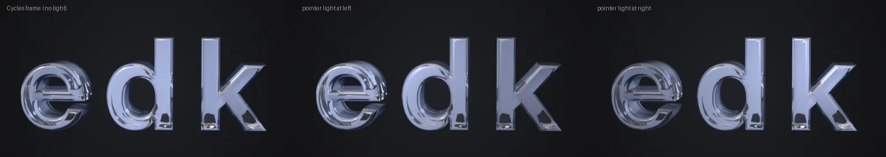
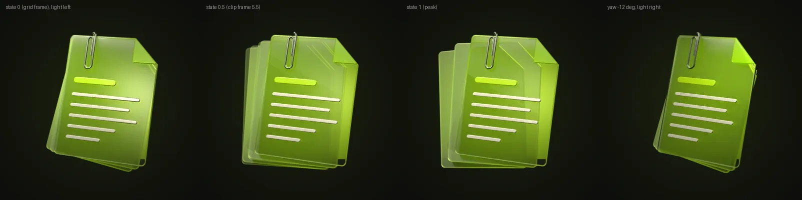

# Research: liveliness, how to bring E's life back without E's cost (2026-10-09)

Brief §7 (2026-10-09, after seeing v0): the owner misses prototype E's live, interactive
animation on desktop. "It doesn't have to be 3D; whatever is best. If we render well, phones can
get animation too." Desktop first; phones must benefit. This file diagnoses what made E feel
alive, measures the current site against it, grades seven families of method, reports two cheap
proofs, and ends with a recommended architecture and a Turkish summary.

Evidence grades as in the other research files: **E** measured or read in code here; **P**
primary but indirect; **F** forum or secondary; **M** recollection, not re-checked. Browser
numbers come from headless Chromium in this container (4 CPU cores, no GPU; WebGL runs on
SwiftShader, a software renderer). Treat GPU timings as relative, never as laptop or phone numbers.
Scripts, data and shots are in the session scratch folder `scratchpad/live/` (listed at the end).

## 1. Short answer

E did not feel alive because it was 3D. It felt alive because **nothing ever stopped and
nothing ever switched mode**: one simulation added float, sway, lean, per-part springs, the morph
and the light on top of each other every frame. The current site has the same ingredients as
separate media (idle video, lean canvas, interaction video, droplet video) and switches between
them. Measured: when the pointer moves, the idle motion stops and the object jumps 8–12°
(crossfaded); when the pointer rests, the object freezes for 4 s (61 % of frames identical),
then jumps 24° back into the idle loop. It is most alive when ignored and most still when touched.

The fix is not real-time 3D. It is a **frame engine**: Cycles frames treated as textures and
driven every frame by springs, so every motion adds instead of switching; interactions become
scrubbable state axes instead of fire-and-forget videos; and a **normal pass from Blender lets a
pointer-driven light move across the Cycles pixels**. Light is the cheapest kind of life and it
is the one that also runs on phones (one rest frame plus one normal map, about 20 KB extra).
Both proofs work (§6). Page-level life (coloured dot, lit tabs, colour morph) is CSS and can ship
first.

## 2. Diagnosis: what made E alive, what the site does (round 1)

### 2.1 Prototype E, from its code (E)

`prototypes/e-dark/index.html`, `step()` and `MICRO`:

| Ingredient | What E does | Effect |
|---|---|---|
| Continuous float | every frame: bob ±2.5 % of radius, yaw sway ±0.05 rad, pitch ±0.025 rad, three incommensurate sines | no dead frame while visible |
| Pointer lean | whole-viewport pointer to yaw ±0.12 rad, pitch ±0.09; a hovered element pulls ±0.16 rad toward itself; exponential follow 3.2/s (90 % in 720 ms) | soft, heavy, *added to* the float |
| Per-part springs | edk letters hop in sequence; Recto's pages follow a spring to `fan.to` = 1 on hover, 0 on leave; Prep pops; the Eat Map pin falls under gravity, bounces (restitution 0.34) and squashes; Log's LED pulses and rings ripple | responds instantly on hover, reversible, never the same twice |
| Morph | melt to a droplet over 800 ms with squash/stretch, a half-turn spin and a camera glide; the next object's `arrive()` plays its micro-interaction | the object is one thing changing, not two clips |
| Light | backdrop shader pools lerp to the new accent (3/s); rim follows; the `edk` dot and the tab underline transition colour in 600 ms | the page breathes with the object |
| Cost | three.js plus a 1 MB single file; transmission pass every frame | 3.6 s per frame here on SwiftShader (E): unusable without a GPU |

### 2.2 The current site, measured (E)

`timeline.mjs` records, every animation frame, which source the home stage shows (poster, idle
video, lean canvas, clip) and its pose (the idle pose is known from `encode.py`'s figure-of-eight,
the lean pose from the canvas state), through a scripted session at 1440×900:

| Phase | Frames shown | Still frames | Mode switches (pose jump at the switch) |
|---|---|---|---|
| load, no pointer (5 s) | poster 25, idle 264 | 8 % | poster to idle at 492 ms (0.3°) |
| pointer circling (4 s) | lean 245 | 3 % | idle to lean **8.0°** after 46 ms, 200 ms crossfade |
| pointer rests (7 s) | lean 267, idle 146 | **61 %** | lean to idle after 4.46 s: **24.4°** |
| pointer moves again | lean 118 | 7 % | idle to lean **12.2°** |
| click on the object | lean 85, clip 51 | 60 % | clip starts 191 ms after the click (local server); 2° jump at start and end |

Lean grid ready 590 ms after navigation from a local server (220 KB half grid; on a phone-grade
network this is seconds, M). The lean follow is *faster* than E's (90 % in 288 ms against 720 ms),
and the yaw range is similar (site ±11° at the far side, E ±7–9°). So **response speed and range
are not the problem.** What differs:

1. **Modal motion.** Idle and lean are separate media. Touching the object stops its life; resting
   freezes it; the hand-back is a large ghosted jump. E layers float on lean.
2. **No secondary motion while interacting.** The lean canvas has no float, sway or overshoot.
3. **Interactions are videos.** Home: click only. Work: 150 ms hover intent, then a video fetched
   on first use (82 KB AV1; on a network add RTT plus decoder start, about 200–400 ms, M). The clip
   always starts at the centre pose (a jump when leaned), cannot reverse on leave, cannot be
   interrupted, and is identical every time.
4. **Light is static per page.** The bar's mark has no dot; the tab indicator is neutral white;
   the stage glow is one CSS colour per document. The pointer glint is masked by the *poster*
   even when the lean shows another pose (slightly misregistered up to ±16°).
5. **Phones get the idle video only**, and a refused `play()` (Low Power Mode) leaves the poster.

### 2.3 Critique of round 1

The tempting reading ("E was real time, so go back to real time") is wrong on the evidence: the
quality bake-off measured real-time glass at SSIM 0.49 (edk) and 0.82 (Recto) against Cycles, and
the owner already rejected that look (ADR-0006). What the owner liked is behaviour: continuity,
immediacy, physics, colour. Behaviour can be driven by any renderer. So the question becomes:
**which methods give continuous, additive, interruptible motion and live light while keeping
Cycles pixels?**

## 3. Methods

Each scored on quality (against the Cycles look), liveliness, bytes per object (edk unless
noted), CPU/GPU, battery, phone feasibility, complexity, fit with ADR-0006 (ground-subtracted
media drawn with `plus-lighter`; every rest pixel a Cycles frame).

### (a) Real-time 3D on every desktop

- Quality: the measured ceiling (bake-off D) stays short for thick glass: three.js transmission
  sees one opaque layer, no glass behind glass, no internal reflection (E).
- Liveliness: maximal (E is the proof). Unlimited angles, true per-part physics.
- Cost: three.js about 142 KB gz plus GLBs; a transmission pass every frame; SSAA x4 for edges is
  3.2x the base cost (bake-off, E). Battery: continuous full-canvas rendering (M: several watts on
  integrated GPUs).
- Phones: no (owner: "feels heavy"; brief §7).
- ADR-0006: contradicts item 1. **Reject as the main path.**

### (b) Hybrid: real time while moving, Cycles at rest, crossfade

- The idea relies on motion masking. It works for fast, transient motion; it does not for a
  slowly leaning object, because the eye tracks it (smooth pursuit keeps the image steady on the
  retina and detail stays visible) (M, perception literature). The handoff happens exactly when
  motion stops, which is when attention is highest: the material visibly changes from frosted
  plastic to Cycles glass (SSIM 0.49 at the handoff for edk, E). The bake-off already rejected
  handing Cycles to real time for the droplet for this reason.
- Where masking would help (the 350 ms melt), a Cycles droplet clip already exists.
- Cost: all of (a) plus the frames. Phones: no.
- **Reject.** Keep three.js for experiments only (ADR-0006 item 7).

### (c) GPU capability tiering

Needed by any live method, decided by technique (CLAUDE.md), so it is specified here:

- **Gate, before loading anything heavy:** `prefers-reduced-motion`, Save-Data, no WebGL2,
  `WEBGL_debug_renderer_info` naming a software renderer (`SwiftShader`, `llvmpipe`,
  `Microsoft Basic Render Driver`; this container reports
  `ANGLE (Google, Vulkan 1.3.0 (SwiftShader Device ...))`, E). Safari reports a masked string
  (M), so the string can only reject, never promote.
- **Micro-benchmark (about 300 ms, after first paint, at idle):** draw the real engine shader at
  the target canvas size for 20 frames; median frame interval, and GPU time from
  `EXT_disjoint_timer_query_webgl2` where present (Chrome on some platforms, M). Pass if < 6 ms.
- **Watchdog, live:** rolling p90 of rAF intervals; above 22 ms for 2 s, step down: DPR 2 to 1.5
  to 1, then full grid to half grid, then relight off, then the still. Never step up within a
  page view (no oscillation).
- **Tiers** (§7): Still, Phone-live, Desktop-lite, Desktop-full. Cheap in code (about 1 KB), and it
  is what made E's failure mode (3.6 s per frame here) impossible.

### (d) Richer pre-rendered interactivity

| Technique | What it is | Verdict |
|---|---|---|
| **Frame engine** (springs over frame spaces) | Frames as WebGL2 texture-array layers; pose, state and float are springs stepped every frame; a 4-tap blend in yaw x pitch, a 2-tap blend in state or time | **Adopt.** Removes every mode switch of §2.2. Proof 2 |
| **State axes instead of timelines** | Render a parameter (Recto fan 0..1, pin height, letter hop height), not a clip; a spring or a physics sim picks the frame, so it reverses, interrupts and overshoots | **Adopt.** Recto's existing clip already works as one (frames 0–11 = fan 0..1, Proof 2) |
| **Per-part axes with ID masks** | Where parts do not see each other through glass (edk letters, Prep's dots and reply, Log's LED, Eat Map pin above plate), render each part's axis with the rest at rest, plus an object-index pass; composite by mask, drive each part by its own spring. Linear cost (3 letters x 12 heights = 36 frames, not 12³) | **Prototype.** This is E's "parts moving independently" in Cycles pixels. Overlapping glass (Recto's pages) must stay one joint axis |
| Interaction clips at 3 yaws | Clip rendered at −8°, 0°, +8°; blend the two nearest | Adopt for hover-heavy objects; removes the gather wait (below) at 3x clip render time |
| Sprite-sheet physics | The Eat Map drop as a height axis plus a squash axis, driven by a real gravity/bounce sim | Adopt via state axes: every drop differs, can be re-triggered mid-air |
| **Video as transport, textures as playback** | Ship clips (and possibly the grid) as AV1/H.264, decode once into texture layers (`requestVideoFrameCallback` while playing, or WebCodecs `VideoDecoder`), then scrub from GPU memory | **Prototype.** Bake-off: 75 grid frames are 813 KB as WebP, 314 KB as AV1 (E); seek latency, the reason video was rejected for the grid, disappears when unpacked once. Unpack reliability on iOS untested (M) |
| Rive-style state machines | A graph of states and transitions on top of the axes (rest, hover, pressed, arriving, leaving) | Adopt the *idea* as 40 lines of our own; Rive itself is a 370 KB runtime for vector art (tools research, E) |
| Optical-flow / frame interpolation (RIFE, `minterpolate`) | Synthesise in-between frames | Reject for glass: refraction breaks flow (media research, M). Render 2° steps instead |
| **Normal (and depth) pass relighting** | Render camera-space normals per frame; a shader moves a light across the Cycles pixels: a soft pool that scales them and a sharp glint on bevels, accent fresnel on edges | **Adopt.** Proof 1. Emission-override pass: 0.7 s/frame (edk), 3.4 s/frame (Recto) at 1040 crop, 8 spp (E): the whole grid in 36 s / 3 min |

The **gather problem** (E, measured on the proof): a clip rendered at the centre pose needs the
lean to come home before it starts. From a 10° lean a stiff critically damped spring takes about
300 ms (k 260) and the softer lean spring 450 ms (simulated). E started instantly at any pose.
Fixes, cheapest first: start the clip at once and crossfade from the current pose frame over its
first 120 ms while the clip barely moves (bake-off suggestion; a brief ghost inside motion);
render hover clips at three yaws; per-part axes rendered across the grid's yaw columns.

### (e) 2.5D: layered renders with parallax

- Separate layers per depth (backdrop, object, foreground), shifted by pointer. For glass, a part
  rendered on its own loses what other parts refract through it, so layers only work where parts
  do not overlap optically (same rule as per-part axes).
- The lean grid already has true parallax; 2.5D adds little to objects. Useful for photographs
  (About's courtyard; the owner deferred 2.5D photos, brief §7) and for depth between page light
  and object. **Later, photos only.**

### (f) Shader life layers in the page

- One pointer light for the whole page: a soft pool on the ground, a glint on the object (from
  (d)'s normal pass), the tab pill's under-glow, the edge of a hovered card. Everything is
  additive light, so it composites exactly with `plus-lighter` on the ground (ADR-0006 item 2:
  light can only add).
- Emissive parts are perfect real-time layers: Log's rings and LED glow, About's flare, the arrival
  sweep. Light adds, so a real-time additive ring over a Cycles frame is indistinguishable from a
  rendered one (E's rings were exactly this). Particles or an aura: only one, and quiet (UX
  research §3 lists glow-everything as a dark-template tell).
- Cost: a full-viewport fragment shader every frame costs fill rate; prefer a pre-rendered
  gradient element moved by `transform` (compositor only, no repaint) over updating a CSS
  background on `pointermove` (repaints a large layer each frame) (M).
- **Adopt, restrained**: one light model, shared coordinates.

### (g) CSS and View Transitions choreography

- The `edk` dot in the page colour; on navigation the dot carries a `view-transition-name`, so
  the old and new snapshots crossfade: the dot changes colour across documents. Same for the tab
  indicator, which already morphs (`tab-ind`): add a light under it in the page colour, so it
  slides and recolours in one move. The stage glow crossfades the same way.
- E's tab light sat in an odd place (brief §7: "not elegant"); proposal for the owner: a soft
  under-glow inside the pill that follows the pointer within it and rests under the current tab.
- Springs as `linear()` tokens (tools research). Zero runtime bytes; every tier including
  Firefox (instant navigation, colour still correct). Reduced motion: instant colour change.
- **Adopt first**: it answers two of the owner's specific complaints (dot, lit tabs) at no risk.

### Grading summary

| Method | Quality vs Cycles | Liveliness | Bytes/object | GPU/battery | Phones | Complexity | ADR-0006 | Evidence |
|---|---|---|---|---|---|---|---|---|
| (a) real-time 3D | low for glass | highest | 180 KB + 142 KB lib | high | no | medium | breaks | E |
| (b) hybrid | handoff visible | high | (a) + frames | high | no | high | bends | E/M |
| (c) tiering | n/a | enables | ~1 KB code | saves | yes | low | fits | E/M |
| (d) frame engine + axes | exact | high | as now, minus idle video | low | yes (rest frame) | medium | fits | E (proofs) |
| (d) relight from normals | exact + light | high (light) | +155 KB grid / +4 KB rest | low | **yes** | low | fits if additive; pool dims (owner call) | E (proof) |
| (d) per-part axes | exact | highest of frames | +30–100 KB | low | desktop | medium-high | fits | P/M |
| (d) video transport | exact (codec) | n/a | −60 % for grids | decode once | yes | medium | fits | E (sizes) / M |
| (e) 2.5D layers | breaks glass | low-medium | small | low | yes | medium | fits | M |
| (f) page light layers | n/a | medium | ~0 | low if compositor-only | yes | low | fits (additive) | M |
| (g) CSS/VT choreography | n/a | medium | 0 | ~0 | yes | low | fits | E (VT already in use) |

## 4. Round 2: critique of the draft ranking

- **Does relighting break "every pixel at rest is a Cycles frame"?** The glint is additive light,
  which ADR-0006 already allows for the CSS glint. The pool *scales* Cycles pixels (0.68 to 1.18
  in the proof). Options: keep the pool only while the pointer moves and let it relax to 1.0 at
  rest (rest = exact Cycles frame plus a glint), or accept a mild live pool as the look. Taste,
  so it goes to the owner.
- **Is the normal pass right for glass?** It gives the front surface only. The glint it computes
  is the reflection of a point light on that surface, which is physically what a glass surface
  shows; refraction of the new light through the body is not modelled. Seen: highlights land on
  bevels and curves, where Cycles' own highlights sit, so they read as the same material (§6).
- **Memory.** Full grid RGBA8 in GPU memory: edk 63 MB, Recto 108 MB; normals the same at full
  size. Too much for phones and wasteful on desktop. Normals at half size cost a quarter (soft
  light does not need more) and can drop to two channels (z rebuilt in the shader). Keep full
  beauty frames only for the current pitch row; half for the rest (as ADR-0006 item 3 already
  limits decoded frames).
- **Fill rate.** The proof drew the whole square; drawing only the grid's crop rectangle cuts the
  pixels to 28 % for edk (808×380 of 1040²) and 49 % for Recto. At DPR 2 the shader is about
  18 texture reads per pixel, roughly 1 Gtexel/s at 60 fps for the full square; integrated laptop
  GPUs manage tens of Gtexel/s (M). Same software renderer, same machine: E 3.6 s per frame,
  the proof 117–150 ms per frame for a 1040² canvas (E), so about 25x cheaper per pixel.
- **Battery.** "No dead frames" means rendering continuously. Mitigate: render only when the stage
  is in view and the page visible; 30 fps when idle (float and wandering light are slow), 60 fps
  while the pointer moves; after 60 s without input, let the light settle and stop (render on
  demand). E never stopped.
- **Phones and Low Power Mode.** The current phone tier depends on `video.play()`, which Low Power
  Mode refuses. A WebGL frame engine needs no autoplay permission; Safari throttles rAF to 30 fps
  in Low Power Mode (F). So the frame engine gives phones life exactly where video fails. To
  verify on the owner's iPhone.
- **Firefox.** No cross-document view transitions (tools research, F): it gets the colour change
  instantly; the frame engine itself works there.
- **Rejected again after critique:** real-time morphs (bake-off), optical flow, Rive/Lottie
  runtimes, 2.5D for glass.

## 5. Round 3: revised design, "one engine, one light"

1. **Frame engine (WebGL2, our own code, no three.js, ~6–8 KB gz, M).** One canvas per visible
   stage over the crop rectangle. Inputs: pose (yaw, pitch), state axes, clip time, float offset,
   light position. Every input is a spring stepped per frame. Sources: lean grid (half in motion,
   full for the current row), normals (half), state/clip frames. The idle video, the Canvas2D lean
   and the interaction videos go; droplet clips stay video (linear, played once) until a scrubbed
   droplet that starts from the current pose is worth its bytes.
2. **Float as an exact-frame transform.** E's bob and a tiny 2D rotation, applied to the whole
   frame, so a still object is a Cycles frame moved, never a blend. Yaw "breathing" through the
   grid stays off by default (it would show blends at rest).
3. **Light.** The pointer (desktop), touch and scroll (phones) drive one light position shared by
   the page (CSS variable on a compositor-moved layer) and the object (normal-pass shader). At rest
   the light wanders slowly; under reduced motion it does not.
4. **Interactions as axes.** Hover sets a state target, leave clears it, click pokes. Physics where
   the object implies it (pin gravity, letter hops). Clips start immediately with a short pose
   crossfade (gather fallback).
5. **Page choreography.** Coloured dot, lit indicator, glow crossfade (method g), timed with the
   droplet melt and the view transition.

## 6. Proofs (E)

Both run in `scratchpad/live/live.html` (one page, URL parameters `obj`, `freeze`, `lx/ly`,
`yaw`, `state`, `light=0`), from shipped media plus one new Blender pass.

**Proof 1: relighting a Cycles frame with a pointer light.** `normals.py` builds the object with
its own script, the same pivot and pose maths as `frames.py`, hides the floor, overrides every
material with an emission of the world normal, renders 8 spp without bounces or denoise, and
converts to camera space (51 frames: edk 36 s, Recto 184 s). Alignment with the shipped grid is
exact (checked by overlay). The shader blends the four nearest grid frames and their normals and
adds a travelling pool and a glint (`kPool` 0.68, radius 0.32 of the square, glint exponent 30).

Seen at 1440×900, DPR 2: the light reads as a lamp moving across glass; glints follow the
bevels of e and d and the arm of k; the ground stays exact (the shader only scales object pixels
and adds light). Static shots undersell it; in motion it is the most "alive" single change.
Bytes for the normal pass (encoded here): edk half size 155 KB AVIF 4:4:4 / 183 KB WebP for 51
frames, Recto 168 / 281 KB; one rest-pose normal map at half size is about 3–5 KB.

**Proof 2: spring frame engine with an interruptible state axis.** The same page drives yaw and
pitch by an underdamped spring (k 70, ζ 0.72: 90 % in 322 ms, 3.7 % overshoot, a sense of
weight), floats the exact frame, and maps Recto's shipped fan clip (frames 0–11) onto a state
spring (k 120, ζ 0.55): hover fans the pages, leave folds them back from wherever they are,
re-hover reverses mid-way. Clip frame 0 against the grid's centre frame: MAE 0.88 (edk) and
1.08 (Recto) levels, so the switch into the state axis is invisible.

Load of all textures from a local server: 0.4–2.6 s (PNG atlases; production would ship AVIF or
video transport). Per-frame JS under 0.2 ms. Limits found: the gather wait (§3 d); textures above
8192 px tall must be split (SwiftShader's limit, E); Recto's full-size data is 300 MB of
textures in this naive proof (grid, normals, clip at full size), which the memory plan of §4
brings under 60 MB. Phone layout at 390×844 renders the same engine (`shots/phone-edk.png`).

## 7. Recommended architecture

| Tier | Who | Gets | Extra bytes per object (edk) |
|---|---|---|---|
| **Still** | reduced motion, Save-Data, no JS, no WebGL2, software renderer, watchdog floor | poster, shadow, static glow; dot and tab colour per page (no motion) | 16 KB (as now) |
| **Phone-live** | coarse pointer, WebGL2, benchmark pass | rest frame plus a half-size rest normal map; exact-frame float; light that wanders and follows touch and scroll; tap plays the state axis or clip from frames unpacked from video (half size); droplet clips as now | +5 KB base; +80 KB with the tap clip. Replaces the 203 KB idle video |
| **Desktop-lite** | fine pointer, weak GPU or watchdog step-down, DPR 1 | half grid, normals at rest pose only, state axes, float, light | ~225 KB + clips |
| **Desktop-full** | fine pointer, benchmark pass | half grid in motion, full current row at rest, half normals for the grid, state and per-part axes, light, 60 fps on input, 30 idle | ~1.0 MB (as now: idle video out, normals in) |
| **Tablet** (1180×820 touch) | coarse pointer, large screen | Desktop-full content, touch-drag scrubs pose and moves the light, tap for hover actions | as Desktop-full |

Rules that stay: ADR-0006's ground subtraction, `plus-lighter`, loading order (poster first, no
loader), at most one playing video, pause offscreen and hidden. The engine is an enhancement:
the poster is the complete page. This amends ADR-0006 items 4 and 6 (interaction and tiers) and
keeps item 7 (no three.js); it needs a proposed ADR ("live frames") once the owner has seen it.

**Owner questions (taste):** how strong the light pool may be at rest (exact Cycles frame plus a
glint, or a mild moving pool); whether the object floats when untouched (E did); where the tab
light sits (under-glow proposal); whether phones should get tap interactions.

## 8. What to prototype next

1. **Page choreography (CSS only, a day):** dot in `edk`, lit tab indicator, glow crossfade across
   the view transition, the under-glow in the pill. Owner judges on desktop.
2. **Frame engine on the Home stage behind `?live`** in a `wip/` worktree: replace idle video,
   Canvas2D lean and interaction video; add relight; crop-rectangle canvas; tiering and watchdog.
   Owner A/B against the current site and against E on his own desktop; record real frame times
   and a 10-minute battery delta.
3. **One character object with per-part axes:** Eat Map pin (height x squash, real gravity) or edk
   letters (hop height per letter, ID mask). Add an object-index pass and a `--stage normals,axes`
   to `frames.py` (normals are seconds per frame).
4. **Video transport:** unpack the interaction clip and a lean row from AV1/H.264 into texture
   layers; measure bytes, unpack time and memory on the owner's iPhone (and Low Power Mode).
5. **Phone-live on the iPhone:** rest-frame relight, touch light, tap axis; check memory, heat,
   Low Power Mode, every tab twice (ADR-0006's checklist).

## Files (session scratch, not committed)

`scratchpad/live/`: `timeline.mjs` and `timeline-site-summary.json` (the §2.2 table),
`measure.mjs` and `measure-site.json` (screenshot sampling; too slow here to time latency),
`e-perf.mjs` (E on SwiftShader), `normals.py` (the Blender pass), `prep.py` (atlases),
`live.html` (both proofs), `shoot.mjs`, `fps.mjs`, `engine-test.mjs`,
`shots/proof-relight.png`, `shots/proof-state.png`, `shots/engine-hover-seq.png` (the light pool
following the pointer into the stage), `shots/phone-edk.png`.

## Sources

Read here (E): `prototypes/e-dark/index.html` (`step`, `MICRO`, CSS of `.mark i` and `.ind`),
`src/scripts/media.ts`, `src/scripts/site.ts`, `src/styles/global.css`, `tools/objects/frames.py`,
`encode.py`, `media/objects/*/manifest.json`; `research/2026-10-render-bakeoff.md` (SSIM, sizes,
grid density, morph), `2026-10-3d-quality.md` (studio patterns, depth relighting, ID maps),
`2026-10-media.md` (§5 lean and memory), `2026-10-tools.md` (Rive, GSAP, View Transitions);
ADR-0005, 0006, 0007; brief §7. Background (M/F): smooth pursuit and motion masking in vision
science; Safari's Low Power Mode rAF throttling; `WEBGL_debug_renderer_info` masking in Safari;
WebCodecs and `requestVideoFrameCallback` support; Codrops "Relighting images with depth maps"
(2026-08, via the quality research).

## Özet (lead için, sahibine iletilecek)

- E'yi canlı yapan 3D değildi: hiçbir şey durmuyordu ve mod değiştirmiyordu. Süzülme, imlece
  eğilme, parçaların yayları ve ışık her karede üst üste ekleniyordu.
- Şu anki sitede aynı parçalar ayrı videolar: imleci oynatınca nesne duruyor ve 8–12° sıçrıyor,
  bırakınca 4 saniye donuyor, sonra 24° sıçrayıp boşta döngüsüne dönüyor (ölçtük).
- Gerçek zamanlı 3D'ye dönmeyi önermiyoruz: cam yine plastik görünür ve telefonda ağır.
- Önerimiz: Cycles kareleri kalsın ama yaylarla sürülsün (her hareket ekleniyor, hiçbir şey kesilmiyor),
  etkileşimler geri sarılabilir "durum" olsun ve Blender'dan alınan normal haritasıyla imlecin
  ışığı camın üzerinde gezsin. İki deneme çalıştı (ışık ve yelpaze açılan Recto).
- Işık en ucuz canlılık ve telefonda da çalışıyor: bir kare ve küçük bir harita, yaklaşık 20 KB.
- İlk adım sadece CSS: "edk" noktası sayfa renginde, sekmelerin altında renkli ışık, sayfa
  geçişinde renk değişimi. Sonra Home'da bayrakla yeni motor; sen masaüstünde E ile karşılaştır.
- Senden tat kararı: ışık durgunken ne kadar güçlü olsun, nesne dokunulmadan süzülsün mü,
  sekme ışığı nerede dursun, telefonda dokununca etkileşim olsun mu.
