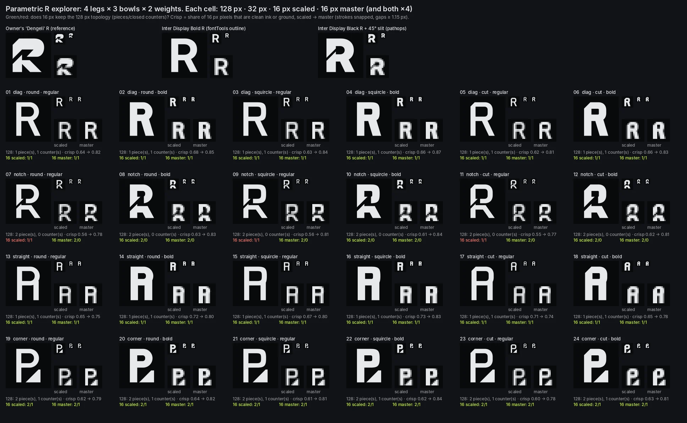

# Research: logo design with an agent, and the tools around it (2026-10-09)

**Status:** current, open. App logos are now explicitly needed (owner, 2026-10-10; `docs/PLAN.md`
track 10). Paths under `scratchpad/` cited here were session scratch, not kept.

**Why:** brief §7 (2026-10-09, "Home hierarchy"): Recto will later get a professional logo, and
the owner asks what tools could make 2D logo work strong. In conversation the owner added: how
good is Claude at 2D logos, which skills, apps or free alternatives could connect to it, which
programs on the Mac it could drive, and "what I see by default isn't that strong in 2D logos, but
we could be good; we need to try". The same question will come for English Prep, Eat Map and
`edk` later (`2026-10-family-audit.md` §6.2, the coloured terminal).

**Starting point (verified):** Recto already has the owner's own mark, the "Dengeli" R
(`/home/user/recto/docs/brand/README.md`, "The mark: files and usage", traced to two polygons in
`logo/recto-mark.svg`, mint `#69EAA3` → lime `#CBFF5F` → `#EDFA6D`). So the Recto job is first a
**refinement and system** job (construction, per-size masters, wordmark, lockups, tests), and
only second a search for something new. Which of the two the owner wants is open (§8).

**Evidence grades**, as in `2026-10-tools.md`: **E** verified here (run, measured, or read at
source in this container on 2026-10-09: tools installed and run, repositories cloned); **P**
primary source seen only through a search extract; **F** secondary sources (reviews, directories,
blogs); **M** recollection, unconfirmed.

**Could not reach:** WebFetch failed on every host (DNS), and the proxy refused `curl` to
help.penpot.app, developers.figma.com, recraft.ai, ideogram.ai, adobe.com, paulrand.design and
anthropic.com (403). GitHub clones worked, so Figma's and Penpot's own repositories and
`anthropics/skills` are E; vendor pricing and licence pages are P or F at best. Nothing was tested
on the owner's Mac.

## Summary

1. **What an agent does well is construction, not invention.** In code it is exact and tireless:
   grids, 45° systems, true Béziers, booleans, overshoot, stroke contrast, per-size pixel
   masters, 24 variants rendered and measured in four seconds (§1, E). What it does poorly is the
   first good idea and the final call of taste. Its unprompted marks are competent letterforms
   that look like a font, which is what the owner has been seeing.
2. **The experiment shows both sides** (§2, E). The explorer drew 24 R monograms with exact
   geometry and caught real problems automatically: the thin slit vanishes at 16 px unless a
   16 px master widens it (topology check), and masters raise pixel crispness from about 0.62 to
   0.81. It could not tell that the "corner" leg reads as a P or the straight leg as an A; a person
   sees that in one second.
3. **The best split for Recto:** the owner gives the idea and the taste (sketches, the Dengeli R,
   picks); the agent constructs, explores around the idea, and tests at every size and context;
   an AI image generator is optional, only for raw ideas, and its output is never shipped, only
   rebuilt (§6).
4. **Free-first toolkit, all headless and installed here:** Python + skia-pathops + fontTools,
   Inkscape 1.2 CLI (booleans and export by `--actions`), FontForge scripting, potrace/vtracer
   for tracing sketches, svgo, sharp, Playwright for context boards (§3, §7, E).
5. **GUI tools add most at two points:** sketching (paper, or an iPad) and fine curve editing by
   hand. Figma's official MCP server can now write to the canvas (free during its beta), and
   Penpot's official MCP server is open source and free; both let the agent draw into a file the
   owner can then touch by hand (§4, E from their repositories).
6. **Legal note for generators:** a mark made from prompts alone is not protected by US copyright
   (Copyright Office, January 2025), and free tiers of Recraft and Firefly are reported as
   non-commercial. Rebuilding by hand from an owner's sketch avoids both questions (§5).

---

## 1. What an agent can do well in code

| Capability | How, headless | Grade | Notes for logo work |
|---|---|---|---|
| Geometric construction | Coordinates computed from rules: a unit grid, circles, √2 or golden ratios, one angle family (Dengeli is a 45° system) | E | Construction is legible and repeatable: every edge has a reason that can be written next to it |
| Exact Bézier authoring | `pathops.Path.cubicTo`, SVG `C` commands; handle factor 0.5523 for a circle, larger for a squircle shoulder | E | The explorer uses true cubics, not polylines |
| Boolean operations | skia-pathops `op(…, UNION/DIFFERENCE/INTERSECTION)`; Inkscape `path-union` etc. by `--actions`; paper.js in Node (M) | E (pathops, Inkscape) | Inkscape 1.2 headless turned a rect + circle into one clean path with true arcs |
| Optical corrections | Overshoot of round forms (1–3 %), horizontals thinner than verticals, ink traps, optical centring, size-specific masters | E (implemented) | Must be told to do them; an agent left alone draws mathematically even shapes that look uneven |
| Parametric exploration | One function, N parameters, render a grid, measure, keep the best, iterate | E | The method in §2: cheap, and the agent's real advantage over a person with a mouse |
| Automated critique | Pixel topology at 16 px (pieces and closed counters), crispness, contrast in greyscale, silhouette overlap with competitors | E (first two) | Catches legibility failures; cannot judge character, meaning or beauty |
| Font-based marks | fontTools / opentype.js outline a glyph from an OFL font, then booleans cut it; FontForge scripts (`fontforge -lang=py`) for spacing, kerning a wordmark, export | E | Done here on Inter Display Black R (top row of the sheet). OFL allows a logo from an OFL font (Recto brand plan §4.2, P) |
| Tracing a sketch | potrace (black and white, GPL), vtracer (colour, MIT, PyPI) | E | On the Dengeli source PNG: potrace 128 numbers, vtracer (colour) 574, the constructed SVG 34. Tracing is a reference layer to rebuild over, never the deliverable |
| Context boards | Playwright screenshots of HTML mock-ups (browser tab, Home Screen grid, dock, social card, light/dark, greyscale, iOS tinted) | E (method used in Recto's brand plan §3.4 and this repo's icon work) | The test a professional runs; cheap for an agent |
| 3D marks | Headless Blender (`bpy`), as for the portfolio objects (ADR-0005/0006) | E (earlier research) | Extrude the final 2D mark into lime glass for the portfolio object (family audit C3) |

**Where it is weak (candid):**

- **The idea.** Without a strong brief and references, an agent produces the statistical centre
  of "logo": a clean letter, a generic symbol, a gradient. SVG benchmarks find frontier models
  write correct, semantically right SVG and degrade with complexity; style is the hardest task
  (SVGenius 2025 and SGP-GenBench 2025, P). Neither tests logo quality at all.
- **Seeing.** The agent sees its renders as images and can describe them, but its judgement of
  "this reads as a P" or "this feels cheap" is unreliable; it needs the owner's eye or a
  five-second test with people.
- **Hand curves.** Subtle, non-geometric curves (a calligraphic stroke, a mascot) are faster for
  a person dragging handles than for an agent typing coordinates.

## 2. Experiment: a parametric R explorer

**What it is (E).** `scratchpad/logo/explore.py` (session scratchpad, not committed): one
function draws an R from four legs (diagonal, Dengeli-like 45° notch, straight, detached page
corner) × three bowls (circle, squircle, chamfered) × two weights. Geometry is exact cubics and
skia-pathops booleans, with overshoot on round bowls and horizontals at 0.88 of the stem. Each
variant is written as SVG, rendered by **Inkscape's CLI in one `--shell` batch** (105 exports),
and checked in Python. A 16 px master is drawn per variant: cap height on whole pixels, strokes
snapped to whole pixels, gaps at least 1.15 px. Top row: the owner's Dengeli R, an Inter Display
Bold R outlined by fontTools, and an Inter Display Black R cut by a pathops slit. Whole run:
4.1 s.

**Measured (E).**

| Finding | Value |
|---|---|
| Pixel crispness at 16 px (share of pixels that are clean ink or ground), scaled → master | 0.55–0.73 → 0.74–0.87; mean about 0.62 → 0.81 |
| Topology at 16 px, scaled from 128 | The three regular-weight notch variants (07, 09, 11) lose the slit: 2 pieces become 1, the open counter closes. The masters keep it |
| Dengeli geometry (from `recto-mark.svg`) | Five diagonals at 45.0°, the counter diagonal at 46.7° (the gradient runs at 46.75°, so it may be deliberate); stem 225 units, top bar 266 (horizontals 18 % heavier than verticals, the reverse of the usual optical contrast); gap between the pieces 82 units vertical, 87 across the slit |

**What the checks missed (owner's eye needed).** Variants 19–24 read as a "P" with a triangle,
not an R. Variants 13–18 drift toward "A". The bold notch masters (08, 10, 12) are legible but
blobby at 16 px. The diagonal-leg R's (01–06) are clean and characterless: they look like a font,
which is the owner's complaint about default agent output. The notch family is the most
distinctive, and only because it borrows the owner's idea.

**What it shows about the method:** the agent's value is the loop (draw, render at real sizes,
measure, compare, redraw), and the per-size master; the idea has to come from someone.

## 3. Tools: headless (the agent alone)

| Tool | Version · licence | Grade | Role |
|---|---|---|---|
| skia-pathops | 0.9.2 · BSD (PyPI) | E | Booleans, simplify, exact cubics in Python |
| fontTools | 4.66.1 · MIT | E | Outline glyphs from fonts, pens, SVG path in and out |
| Inkscape CLI | 1.2.2 (Ubuntu apt) · GPL tool, output ours | E | Render SVG to PNG at exact sizes; `--actions` for select, union, difference, export plain SVG; `--shell` batches |
| FontForge | apt build, scripting via `fontforge -lang=py` · GPL | E (opened Inter Display Bold, read R) | Wordmark spacing and kerning, glyph cleanup, generating a logo font if ever needed. The Python module is not importable from the system Python 3.13 here; use the bundled interpreter |
| potrace 1.16 · GPL; vtracer 0.6.15 · MIT | E | Trace a sketch or a generator image into a reference layer |
| svgo 4.1 · MIT; sharp 0.35 · Apache-2.0; Playwright | E (already in the repo) | Optimise SVG; raster sets (PNG, WebP, ICO input); context boards |
| opentype.js, paper.js | MIT | M (named in `2026-10-tools.md`) | Same jobs in Node, if a JS pipeline is preferred |
| Blender `bpy` | 5.2 · GPL tool | E (earlier research) | 3D version of the final mark |

## 4. Tools: GUI apps and their bridges to Claude

| Tool | Cost | Can the agent drive it? | Grade | Verdict for Recto |
|---|---|---|---|---|
| **Figma** + official MCP server | Free Starter plan; Dev/Full seat on paid plans | **Write to canvas** on the remote server via `use_figma` (runs Plugin API JavaScript: `createVector`, `figma.union()/subtract()`, `createNodeFromSvg`). "Will eventually be a usage-based paid feature, but is currently available for free during the beta period." Starter plan or View/Collab seats: **up to 6 read tool calls per month**; write tools exempt from rate limits | E (`figma/mcp-server-guide` README and `skills/figma-use`, cloned 2026-10-09) | Useful as a shared board: the agent imports constructed SVGs as editable vectors, the owner nudges curves by hand. Not needed to draw. Nobody uses Figma today (`2026-10-tools.md` §4) |
| **Penpot** + official MCP server | Free, open source (MPL-2.0), hosted or self-hosted | MCP server talks to a Penpot plugin over WebSocket; tools include `execute_code` (arbitrary Plugin API code: create and modify shapes, `Path`, `Boolean`, `SvgRaw`), `export_shape`, `import_image`. `npx -y @penpot/mcp@latest` locally, or a hosted remote server | E (`penpot/penpot` `mcp/`, cloned; licence file read) | The free, open equivalent of Figma's bridge. Needs a browser tab with the plugin connected, so it is an owner-side setup |
| **Inkscape** (GUI on Mac) | Free | CLI as above (E); community MCP servers (inkmcp, AGPL, Linux D-Bus; several CLI wrappers) | E (CLI); F (MCP servers) | The CLI is enough; the GUI is the owner's free hand tool for nudging nodes |
| **Glyphs 3** (Mac) | Paid licence (M) | Python Macro panel and scripts inside the app; `glyphsLib` reads `.glyphs` files without the GUI | P (Glyphs docs) | Only if the wordmark becomes real type work |
| **Affinity** (Canva) | Free since October 2025; AI features need Canva Premium | Scripting Studio added in Affinity 3.3 (September 2026); no MCP bridge found | F | The owner's best free GUI vector editor on the Mac |
| **Illustrator** | Creative Cloud subscription | ExtendScript/UXP; community MCP servers (AppleScript on macOS, CEP panel) | F | Not worth a subscription for this |
| **Claude computer use** (desktop app) | Pro and Max plans; research preview since March 2026 | Screenshots plus mouse and keyboard on the Mac; asks per app; slow, and one reviewer used most of a five-hour allowance in 30 minutes; complex tasks failed | F (press reports); this harness offers a `computer-use` skill for a linked computer (E: listed, not tested) | Last resort for GUI apps with no API. For drawing, a script or an MCP bridge is faster, cheaper and reproducible |
| **Claude in Chrome** | Paid plans (M) | Drives the owner's real Chrome tab: could operate Figma or Penpot in the browser | E (skill listed in this harness, not tested) | Same as above; prefer the MCP servers |

## 5. AI image and vector generators

| Generator | Output | Commercial use (as reported) | Grade |
|---|---|---|---|
| **Recraft** (V4) | Native SVG from a prompt; vector and raster | Free plan: outputs owned by Recraft, public, not for commercial use; paid plans grant ownership and a commercial licence tied to the subscription | F (several reviews agree; one directory disagrees) |
| **Adobe Firefly / Illustrator Text to Vector** | Editable vectors | Paid Firefly plans include Text to Vector as a standard feature; free tier for trying, watermarked or labelled, treat as non-commercial | P (Adobe FAQ extract), F |
| **Ideogram** | Raster with good lettering; trace afterwards | FAQ: claims no ownership of outputs; free outputs are public; sources disagree on free commercial use; private generation needs a paid plan | P (FAQ extract), F |
| Image models in general (Midjourney, GPT image, Gemini image) | Raster | Varies by plan; none reachable here | M |
| **potrace / vtracer** | Trace raster to SVG | Free (GPL / MIT) | E |

**Two cautions.** (1) **Copyright:** the US Copyright Office's January 2025 report (Part 2) says
prompts alone do not make the user the author; human selection, arrangement or modification can
be protected case by case (P via several law-firm summaries). Trademark is a separate question:
a mark can still work as a trademark, but clearance matters more because generators converge on
similar forms (F). (2) **Quality:** generator output is raster-thinking even when it is SVG:
uneven curves, hundreds of nodes, no construction (see the trace counts in §1). A generator is
a sketchbook, not a delivery tool. For Recto, the owner's own Dengeli R and sketches make this
step optional.

## 6. How professionals make a mark, and how they judge it

**Process (common to the studios cited, F):** brief and positioning → research (category,
competitors, namesakes; Recto has a namesake list in its brand plan §1.1) → many rough sketches,
mostly on paper → a few directions developed → **construction** (grid, angles, curves) →
refinement (optical corrections, small-size masters) → **testing** at sizes and in contexts (tab,
Home Screen, dock, social card, one colour, greyscale, reversed, embroidered or printed) → the
**system** (clear space, minimum size, colour rules, lockups, motion, misuse).

**Judging a mark.**

| Criterion | Source | Grade | Test we can run |
|---|---|---|---|
| Appropriate: its feeling fits the product | Sagi Haviv (Chermayeff & Geismar & Haviv): three rules, appropriate, distinctive and memorable, simple | F (talk and course summaries; the book *Identify* not read) | Owner and five-second test: "what kind of product is this?" |
| Distinctive and memorable: the "doodle test", can people draw it from memory | Haviv | F | Show for five seconds, ask for a sketch (Recto brand plan §3.4 already plans this) |
| Simple, so it scales "to every pixel size" | Haviv | F | 16 px master; topology and crispness checks (§2) |
| A logo identifies; it does not explain the business; its meaning comes from the quality of what it stands for | Paul Rand, "Logos, Flags, and Escutcheons" (1991) | P (paulrand.design extract) | Resist marks that illustrate "PDF" (Recto's brand plan already dropped the file icon) |
| Meaning accrues through use; a new mark looks weaker than it will | Michael Bierut (Pentagram), as summarised | F (no primary quote found) | Judge after living with it in context boards for a week, not on first sight |

## 7. Free-first toolkit

| Need | Tool | Cost |
|---|---|---|
| Sketching | Paper and a phone photo; Procreate or Freeform on an iPad if owned | Free (M) |
| Tracing sketches | potrace, vtracer | Free |
| Construction and exploration | Python + skia-pathops + fontTools (the explorer), Inkscape CLI | Free |
| Wordmark | Inter Display (OFL) outlined by fontTools; spacing in FontForge | Free |
| Hand nudging by the owner | Inkscape or Affinity on the Mac | Free |
| Shared editable board (optional) | Penpot + official MCP server (free) or Figma + MCP (write free in beta) | Free |
| Context boards and assets | Playwright, sharp, svgo; Recto's planned `tools/brand/` pipeline | Free |
| 3D version | Blender headless | Free |
| Raw ideas (optional) | One paid month of Recraft or Firefly, only if the owner wants them | Paid; skip by default |

## 8. Recommended workflow for Recto's logo

| Step | Owner | Agent |
|---|---|---|
| 0. Decide the job | Refine Dengeli, or open a search for a new mark with Dengeli as one candidate? Which tool made Dengeli, and is a source file (not the PNG) available? | Prepare a one-page brief from the brand plan (BR-B1…B6, §3.3 "what must be true") |
| 1. References | Pick 5–10 marks you love and 3 you dislike (any category) | Collect namesake and category icons for comparison; no generator by default |
| 2. Sketch | 10–20 rough sketches on paper, photographed | Trace them (potrace) as reference layers |
| 3. Construct | — | Rebuild each promising sketch on a grid (45° family, unit = stem/8), exact curves; write the construction next to it |
| 4. Explore | Choose parameters worth exploring (gap, leg angle, bowl, chamfer) | Parametric sheets of 24–50 variants around the chosen idea, with 16/32 px masters and automatic checks |
| 5. Refine | Pick 2–3; say what feels wrong in plain words | Optical pass: overshoot, stroke contrast (Dengeli's horizontals are heavier than its verticals; decide on purpose), equal gaps (82 vs 87), the 46.7° edge, per-size masters 16/32/180 |
| 6. Test | View boards at 100 % on phone and laptop; five-second test with 3–5 people | Context boards: tab strip light/dark, Home Screen grid, maskable circle, iOS tinted, greyscale, one colour, social card, README, a lime-glass Blender still for the portfolio |
| 7. System | Approve | Wordmark (Inter Display, redrawn), lockups, clear space, minimum size, colour rules, `tools/brand/` outputs, an ADR in the Recto repo |

**Optional generator branch:** if the owner wants more raw ideas at step 2, use a paid plan
(commercial terms) for 20–50 rough images, pick shapes not finished art, and rebuild from scratch
in step 3. Nothing generated ships.

**For later marks** (English Prep's `ep.`, Eat Map, `edk`): the same loop; the coloured terminal
(family audit §6.2) becomes one parameter in every explorer.

## Sources

Verified here (E): Inkscape 1.2.2, FontForge, potrace 1.16 installed with apt and run;
skia-pathops 0.9.2, vtracer 0.6.15 and fontTools 4.66.1 from PyPI; Inter Display from
`/usr/share/fonts/opentype/inter/`; `/home/user/recto/docs/brand/README.md` and
`logo/recto-mark.svg` (read-only); cloned on 2026-10-09:
[figma/mcp-server-guide](https://github.com/figma/mcp-server-guide) (README, `skills/figma-use`),
[penpot/penpot `mcp/`](https://github.com/penpot/penpot) (README, server tools, LICENSE),
[anthropics/skills](https://github.com/anthropics/skills) (canvas-design 129-line SKILL.md + OFL
fonts, posters from a "design philosophy"; algorithmic-art 404 lines, seeded p5.js; brand-guidelines
73 lines, Anthropic's own colours and type; theme-factory 10 preset themes; none covers logo
construction).

Search extracts and secondary sources (P/F):
[Figma MCP listing](https://github.com/mcp/com.figma.mcp/mcp),
[Figma MCP rate limits guide](https://instagit.com/figma/mcp-server-guide/figma-mcp-rate-limits-and-billing-information.md),
[Penpot MCP help](https://help.penpot.app/mcp/),
[Penpot MCP write-up](https://dev.to/creeta/penpots-mcp-server-runs-on-five-tools-figmas-uses-dozens-354e),
[Recraft pricing review](https://www.eesel.ai/blog/recraft-ai-pricing),
[Recraft licence comparison](https://licenseorg.com/compare/recraft-vs-midjourney),
[Adobe Firefly plans FAQ](https://www.adobe.com/cc-shared/fragments/products/firefly/plans/faq),
[Ideogram FAQ](https://docs.ideogram.ai/frequently-asked-questions),
[Ideogram licensing](https://ideogram.ai/licensing/),
[Ideogram ToS analysis](https://conductatlas.com/platform/ideogram/ideogram-terms-of-service/),
[USCO Part 2 summary, Copyright Alliance](https://copyrightalliance.org/ai-report-part-2-copyrightability/),
[IPWatchdog on Part 2](https://ipwatchdog.com/2025/01/29/part-two-copyright-office-ai-report-says-creative-prompting-doesnt-constitute-authorship/),
[Gerben Law on AI trademarks](https://www.gerbenlaw.com/blog/ai-guided-trademark-development-mitigating-infringement-risks/),
[PCWorld on Claude computer use](https://www.pcworld.com/article/3097542/claude-controlled-my-mac-for-half-an-hour-it-was-a-wild-worrisome-ride.html),
[Thurrott on Claude controlling a Mac](https://www.thurrott.com/?p=334111),
[Affinity 3.3, CG Channel](https://www.cgchannel.com/2026/09/canva-releases-affinity-3-3/),
[Affinity free, CGPress](https://cgpress.org/archives/canva-reimagines-affinity-studio-and-releases-it-free-to-all-users.html),
[Glyphs scripting docs](https://docu.glyphsapp.com/),
[FontForge Python docs](https://fontforge.org/docs/scripting/python),
[vtracer](https://github.com/visioncortex/vtracer),
[inkmcp](https://lobehub.com/mcp/shriinivas-inkmcp),
[Illustrator MCP](https://glama.ai/mcp/servers/jinkeda/Illustrator_MCP),
[SGP-GenBench](https://www.arxiv.org/pdf/2509.05208),
[SVGenius](https://arxiv.org/abs/2506.03139v1),
[Sagi Haviv interview, Logo Design Love](https://www.logodesignlove.com/sagi-haviv-interview),
[Haviv's three rules (talk)](https://production-blue.amara.org/videos/Jd0UC4Jk5HxE/info/the-3-rules-of-good-logo-design),
[Haviv on Skillshare](https://www.skillshare.com/en/classes/designing-brand-symbols-the-principles-and-process-of-making-logos-that-last/404415631),
[Paul Rand, "Logos, Flags, and Escutcheons"](https://paulrand.design/writing/articles/1991-logos-flags-and-escutcheons.html),
[Bierut on logos (GLG)](https://glg.com/videos/the-significance-of-logos-and-brand-design).
