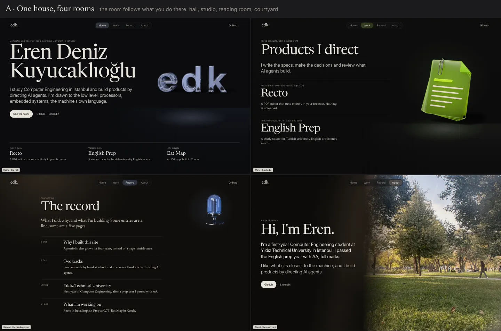
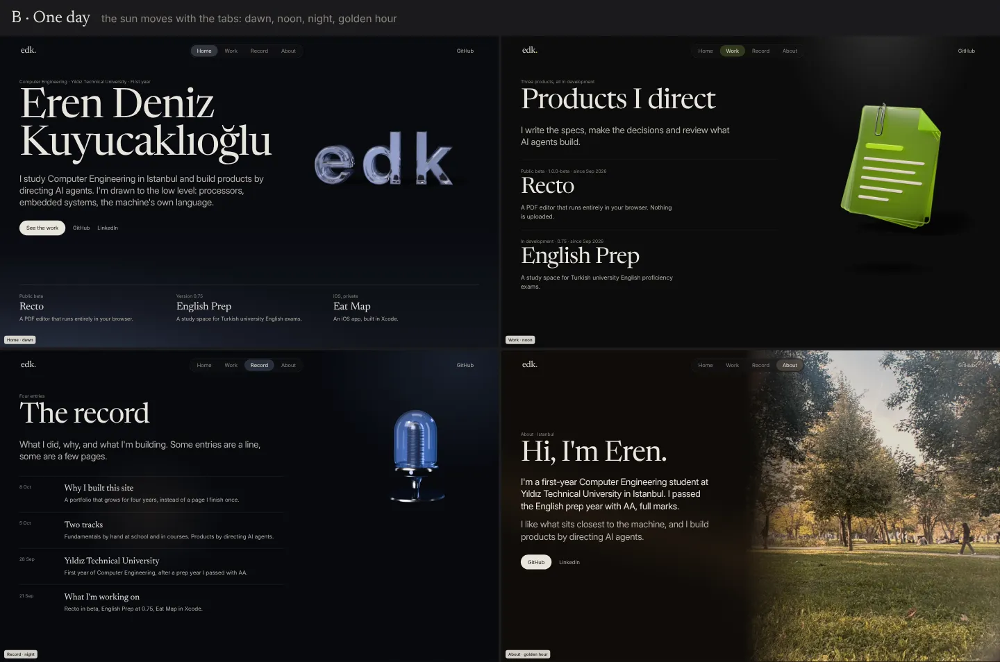
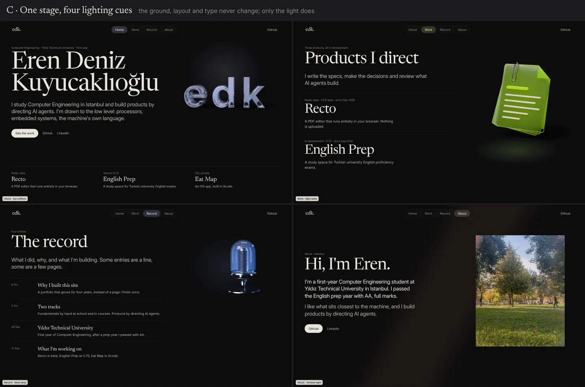
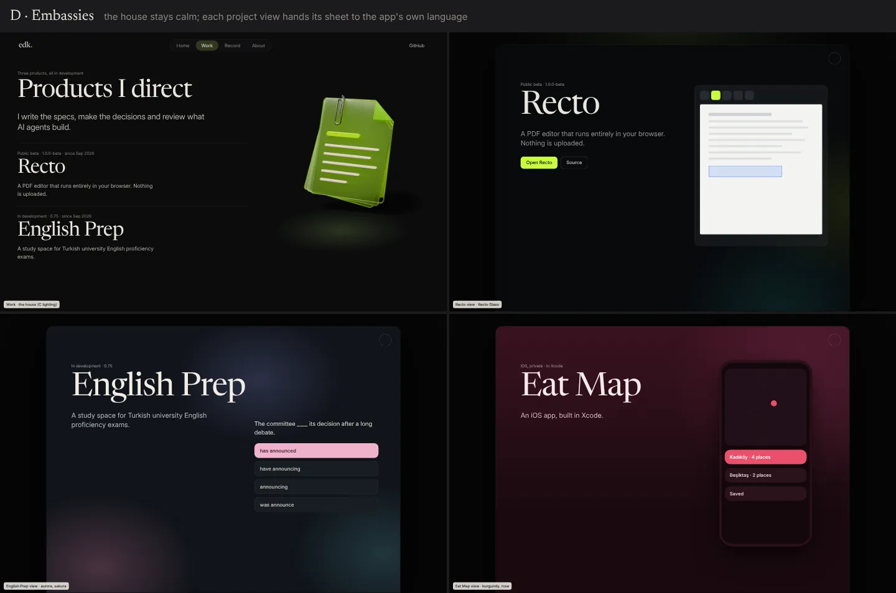

# Research: page worlds, a character for each page that keeps the site one (2026-10-09)

**Status:** superseded 2026-10-10. "One house, four rooms" was never prototyped; the owner shelved
radical per-page worlds. Paths under `scratchpad/` cited here were session scratch, not kept.

The owner's request (brief §7, 2026-10-09, after seeing v0): every page is black and they all feel
alike; give each page its own character so the site feels richer. Light atmosphere per page is
already decided (each tab lit in its object's colour). "Separate worlds" per page is allowed only
in a controlled way that keeps the whole: think it through, present findings, and prototype only
if the owner approves and only for a big change.

This file defines what may vary per page and what may not, collects precedents, proposes four
concepts with static mood boards, and ranks them. Nothing here is built.

Evidence grades, as in `2026-10-craft-audit.md`: **E** primary source opened, **P** practitioner
write-up, **F** secondary or aggregated (search extracts, reviews), **M** measured by us,
**K** prior knowledge, not re-checked. The fetch tool could not resolve most hosts in this
session (linear.app, mit.edu and theartnewspaper.com all failed), so most outside evidence is F
from search extracts or K. Treat it as direction, not proof.

---

## 1. What is wrong now, precisely

Looking at `tests/shots/desktop-{home,work,log,about}.png` and `prototypes/f/shots/` (M):

- **Same ground.** All four pages are `#0a0a0b` (OKLCH L 0.145). The light changes colour, but it
  is one radial pool behind the object at about 11% (`global.css` `.m-glow`), small enough that
  the page reads black at a glance.
- **Same composition.** Home, Work and Record are the same layout: kicker, serif title and lede
  on the left, object on the right, rules below. Only About breaks it (the courtyard photo), and
  About is the page the owner already finds most alive.
- **Same voice and tempo.** Same measure, same spacing rhythm, same everything. Record suffers
  most: the owner said plain black-and-white reading is "neither fun nor easy" (brief §7).

So "every page is black" is partly about colour and mostly about **sameness of composition and
space**. A colour change alone (the decided light atmosphere) fixes the first point only.

## 2. What "separate world" should mean here

Taking the phrase literally (four art directions, four games) breaks the site: it is a
presentation page first (brief §2.1) and a record that must look continuous over four years
(§2.2). Four reasons to read it more narrowly, and one reason to read it more widely.

1. **Districts, not countries.** Kevin Lynch's city image work (1960) found that people map a
   place by paths, edges, districts, nodes and landmarks; a *district* is an area with a
   recognisable character, and it is legible because the landmarks stay put (F, summaries of
   *The Image of the City*). On this site the landmarks are the bar, the mark and the type; the
   districts are the pages. A district changes texture, light and density, not the street signs.
2. **Character should come from what you do there.** Henry Jenkins describes game spaces that
   tell a story through evoking known places, staging events, embedding information in the scene
   and supporting emergent stories (F, extracts of "Game Design as Narrative Architecture",
   2004). A page that *evokes* a known kind of room ("reading room") makes its use clear before
   any word is read. A page dressed as something unrelated to its use is a costume, the
   "CircuitOS" anti-reference of `2026-10-references.md` §5.
3. **The tab change is a threshold, and thresholds are designed.** Christopher Alexander's
   *Entrance Transition* (pattern 112) asks for a passage marked by a change of light, surface,
   level, enclosure and above all view (F, extracts). That is exactly the material of a
   cross-document view transition (ADR-0007): the change of room should be felt in the 320 ms of
   the tab change, not added on top of it.
4. **Few pages, few views per visit.** There are four tabs; a LinkedIn visitor sees one or two.
   A page's character must work on its own, not only in contrast to the others. It also means
   the risk of four rooms is low in practice: nobody tours them all in a row except the owner.
5. **The wider reading: the site already has worlds, and they are not the tabs.** Each project's
   focus view is the visitor's entry into an app that has its own, hard-won language: Recto Glass
   (graphite `#08090c`, one interaction lime `#c8fb3d`, an aurora), English Prep (slate, three
   aurora clusters, sakura answers), Eat Map (burgundy ground, rose). The family vision (brief §7)
   asks that each keeps its character and they meet at a shared origin. The focus view is the
   place where a *real* separate world belongs: there it is truthful, because it is someone
   else's house (concept D).

**Working definition.** A page world is *a room in one house*: the house (nav, mark, type, ground
family, object language, motion grammar) never changes; the room changes its light, its ground
temperature, one surface, its spacing and measure, and its tempo, each by a bounded amount, and
each change is justified by what the visitor does in that room.

## 3. Two hard constraints the medium already sets (M)

- **The ground has a lightness window.** Objects are Cycles frames with the ground subtracted,
  drawn with `plus-lighter`, and the contact shadow with `multiply` (ADR-0006 §2, `Media.astro`).
  Additive media can only add light: on a lighter ground the glass loses its dark refractions and
  looks washed. Every ground in the mood boards stays within OKLCH L 0.134 to 0.161 and chroma
  ≤ 0.012; warm ink `#e9e5de` stays ≥ 15.4:1 and `--ink-3` ≥ 5.4:1 on all of them (M). A ground
  outside about L 0.17 needs re-rendered posters. (English Prep's slate `#10141a`, L 0.19, and
  Eat Map's burgundy `#3a1220` work only inside a sheet that does not hold a site object.)
- **The light direction is baked.** One rig (`tools/objects/rig.json`) lights every object: warm
  key `#fff4e8` from upper left front, rim in the page colour from behind right. CSS light that
  comes from elsewhere contradicts the render and looks pasted. A room may change the *colour,
  shape and spread* of light freely, but its *direction* agrees with the rig unless the objects
  are re-rendered (an overnight render per object, ADR-0006 consequences).

These two facts are what keep worlds from "flying off": they are physical, not stylistic.

## 4. The design space

| Dimension | May vary per page | Range (guardrail) | Fixed for the house |
|---|---|---|---|
| Ground tone and temperature | yes | OKLCH L 0.13–0.165, C ≤ 0.012, any hue | the near-black family; ink contrast ≥ 15:1 |
| Light colour | yes | the accepted page colours (brief §7) | one light per view (ux-patterns §3) |
| Light shape and spread | yes | pool, cone, plane, window; ≤ ~8% luminance lift (audit §5.3) | no glows on UI, no blobs as wallpaper |
| Light direction | no (yes only with re-render) | agrees with the rig key, upper left | — |
| Surface | one per page | grain 3–7%, a floor or table plane, paper fibre | grain never animated; no skeuomorphic texture |
| Typographic voice | within the pairing | which face sets the lede (Inter or Newsreader), title one scale step up or down, measure | the two faces, the nine-step scale, no italics, no mono caps |
| Layout grid | yes | column offset, measure 32–60em, where the object sits | 12-column grid, gutters, bar height |
| Spacing "acoustics" | yes | dense (studio) to reverberant (hall): section gap 48–120px | the spacing tokens |
| Motion tempo | choice within tokens | which of `--d-2…--d-5` a page uses for its own events | one duration family per event, springs ζ ≥ 0.6 |
| Object environment | yes | floor, table, plinth, none; shadow strength | glass material language; Cycles look |
| Photography treatment | About and entries | grade temperature, crop, bleed | no mats, no tilt, blacks meet the ground (audit §5.1) |
| Mark | the dot only | "edk." dot takes the room's light (E's detail the owner liked) | the letters |
| Navigation | the indicator tint | ≤ 14% of the light over the pill fill | position, shape, labels, behaviour |

A **variance budget** makes "controlled" testable: beyond the light, a page may move **at most
three** of ground temperature, surface, typographic voice, layout/measure and tempo. Every page
must pass the same contrast checks and the same object seam check on its own ground.

## 5. Precedents

| Precedent | What it does | Lesson | Grade |
|---|---|---|---|
| Hades (Supergiant) | Palette changes per biome (Tartarus, Asphodel, Elysium) but "never random"; contrast and brightness controlled so gameplay stays readable; UI shared | vary the room, fix legibility and the UI | F |
| Persona 5 (Atlus) | A unique design for every menu, held together by one red/black/white base and one highlight colour; director calls it "really annoying" to build | distinct rooms need a fixed base; cost is real | F |
| Super Mario Odyssey | Kingdoms wildly different in style, unified by one protagonist, constant polish, and a per-kingdom moon colour | the constant (Mario, here the glass object) carries coherence | F |
| SFMOMA, Joseph Cornell show | Wall blue darkens room by room toward the centre, then lightens toward the exit | one dimension can change gradually and still read as one show | F |
| Museum design standards | Neutral grounds dominate; bright colour reserved for signalling content | colour is a signal, the ground stays quiet | F |
| Linear UI redesign (2024) | Themes generated from three inputs (base, accent, contrast) in LCH, deriving every surface | define a room as a few inputs, derive the rest | P (Linear's own post, via extract) |
| Apple product pages | Pro products on black stages, consumer products on light grey; same nav, type, grid | a product family varies the stage, not the house | K / F |
| Bloomberg Businessweek 2010 | Small colour cues per section; 2017 redesign moved back to unity and consistency | section identity as a cue, not a costume; it was reined in | F |
| NYT Magazine 2015 | One custom type family (29 fonts by Henrik Kubel); special issues get their own treatments | the system is fixed; special *occasions* get a world | F |
| Active Theory v5 | Switchable real-time environments (Venice Beach, Amsterdam), each playing the reel | worlds as scenery around constant content; heavy | F |
| Nothing | One display face (Ndot) for product names, one editorial face, mono labels, across site and hardware | one signature element can unify very different objects | F |
| Teenage Engineering | Product is the focal point on clean grounds; each product is its own colourful object on a constant page | objects carry character, the page stays plain | F |
| Bruno Simon, igloo.inc, Lusion | Full worlds as the site itself | the bar for "world"; out of scope after ADR-0003 and ADR-0006 | K |
| Christopher Alexander, pattern 112 | Entrance as a transition of light, surface, level, view | design the tab change as a threshold | F |

The pattern across all of them: **the more the rooms differ, the stronger the fixed base must be**,
and the variation follows a rule (biome, product line, issue) rather than taste per page.

## 6. Four concepts

### A. One house, four rooms

*Each page is a room, and the room follows what you do there.*

| Page | Room | Ground | Light | Surface | Type and layout | Tempo |
|---|---|---|---|---|---|---|
| Home | hall | `#0a0b0d` (L 0.149, cool) | a tall cone from above onto edk, cool white-blue `#c9d4ff` | a floor plane under the object (only in its half), grain 5% | as now; reverberant spacing | slow arrival, `--d-4` |
| Work | studio | `#0b0b0b` (neutral) | a light table: a pale plane under the object, tinted by the hovered project | table surface with a faint ruled edge, grain 4.5% | denser; objects stand on the table | quick, `--d-2` for hover changes |
| Record | reading room | `#0f0d0b` (L 0.161, warm) | a warm lamp pool from upper left (the rig's key) across the reading column; Log blue only as the mic's rim | paper-fibre grain 7% | one column offset to the centre, measure ≈ 34em; lede and summaries in Newsreader; title one step smaller | calm, `--d-3` |
| About | courtyard | `#0c0b09` (warm neutral) | daylight from the photo, gold `#f3b886` spilling onto the text side | the photo as the room's window, bled to the edge | open, generous; the ID badge later sits here | still |

- **Stays:** bar, mark (only the dot changes colour), both faces and the scale, ink, the glass
  objects and the rig, motion tokens, grid.
- **Risk to coherence:** medium-low. The floor and table planes are the most likely to look like
  stage props; they must stay in the object's half and below 2% luminance (first draft of the
  board ran a horizon under the text; it read as a band and was masked). Record's warm ground
  plus blue object is a deliberate contrast that must be checked on a phone in a dark room.
- **Cost:** moderate, no re-render. A `data-room` attribute and five to eight tokens per page, a
  grain tile, two or three gradient layers, one layout variant for Record. Two to three days
  including screenshots and checks.
- **Phones and reduced motion:** all of it is static CSS, so phones get the same rooms; the floor
  and table planes collapse to a soft glow under the object at 390px. The room changes inside
  the existing root crossfade (320 ms); with reduced motion, navigation is instant and the room
  simply is there. Nothing in a room moves, so there is nothing to switch off.
- **Family:** the portfolio becomes the house in which the apps are shown; it does not borrow
  their languages, which keeps the origin neutral.

### B. One day

*The sun moves with the tabs: dawn, noon, night, golden hour.*

| Page | Time | Ground | Light |
|---|---|---|---|
| Home | dawn | `#080a0f` (blue-black) | low cool light from bottom left, a faint horizon |
| Work | noon | `#0b0b0b` | a hard overhead cone, short dark shadow |
| Record | night | `#06080d` (L 0.134) | moonlight from upper right, a small warm lamp |
| About | golden hour | `#0e0b08` | low warm light from the right, long diagonal ray; photo graded warm |

- **Stays:** everything in the house; layout identical.
- **Risk:** high. The light direction changes per page, which contradicts the single rig: every
  object needs a re-render per time of day to match (four rigs, five objects). The accepted page
  colours do not fit a day in tab order (Record blue = night comes before About gold = golden
  hour), so the arc breaks or the colours change. The metaphor is arbitrary to the content: why
  is Work noon? Visitors see one or two pages, so the "day" is never perceived.
- **Cost:** high (re-renders, rig variants, posters per page).
- **Phones and reduced motion:** static, fine.
- **Family:** none in particular.
- **Worth keeping:** the idea that the tab change could *move* the light rather than swap it. If
  ever wanted, a small move of the CSS pool along the rig's key direction is enough.

### C. One stage, four lighting cues

*The ground, layout and type never change; only the light does, like cues on one stage.*

| Page | Cue |
|---|---|
| Home | a softbox above edk, cool white-blue |
| Work | a light table under the object, in the project's colour |
| Record | a narrow warm desk-lamp cone over the column, blue rim on the mic |
| About | a slanted gold window beam across the page; photo as a print |

- **Stays:** everything except the light layers. Ground `#0a0a0b` everywhere.
- **Risk:** lowest. This is the already-decided light atmosphere, done with more shape than one
  radial pool.
- **Cost:** low (one day). Applies on top of the current pages.
- **Limit:** the mood board shows it plainly: the pages are still the same page with a different
  lamp. It does not answer "neither fun nor easy" on Record, or the identical compositions.
- **Role:** the floor. Whatever else is chosen, this is the minimum and it is part of A.

### D. Embassies

*The house stays calm; each project's view hands its sheet to the app's own language.*

- **What changes:** only inside a focus view. The sheet takes the app's own tokens: Recto's
  graphite `#08090c`, lime only on the one primary action, a faint teal-mint aurora, glass panel;
  English Prep's slate, its three aurora clusters under one opacity cap, a sakura answer card;
  Eat Map's burgundy ground and rose. Real screenshots or captures replace the mock UI.
- **What stays (the shared origin):** the sheet frame and close control, the project name in the
  portfolio's Newsreader, the meta line in Inter, the case-study structure (teaser, what, why,
  how, learned, next), the motion of the sheet. The visitor always knows they are on Eren's site
  looking *into* another house.
- **Risk:** medium. Three foreign palettes in one site; mitigated because only one is ever on
  screen, and each is the app's truth rather than invented decoration. The site object must not
  sit on Eat Map's burgundy (lightness window, §3); inside a sheet the app's capture replaces it.
- **Cost:** medium, and grows with the projects: each sheet needs a token block (copied from the
  app's own token file, not invented) and real captures. Best done when project texts are written
  (brief §7: content later).
- **Phones and reduced motion:** the phone sheet is full height, so the app's ground fills the
  screen; English Prep's aurora uses its own reduced-motion pools.
- **Family:** this is the family vision made visible: each app keeps its character; the
  portfolio is the origin they share.

## 7. Ranking

1. **A, One house, four rooms**, built with C as its floor and the §4 variance budget. It is the
   only concept that fixes the actual problem (sameness of composition and space, Record's
   reading), stays inside both physical constraints of §3 without re-rendering, and gives each
   page a reason for its character that a visitor understands without being told. Precedents
   that work (Hades, Persona, Odyssey, Apple) all vary rooms under a fixed base, which A has.
2. **D, Embassies**, as a separate, later step. It is the truest "separate world" on the site and
   the natural home of the family vision, but it belongs to the focus views and waits on project
   content and captures. It does not compete with A; it completes it.
3. **C, One stage, four lighting cues.** Safe, cheap, already decided in spirit; on its own it
   leaves the pages too alike. Ship it as part of A.
4. **B, One day.** Poetic, but it fights the single lighting rig, needs re-renders, does not fit
   the accepted colours in tab order, and its metaphor is invisible to a one-page visitor.

## 8. Recommendation

- **Prototype A**, and only A, if the owner wants the change. It is a big enough change to
  deserve a prototype (new ground per page, a new surface layer, a different Record layout) but
  small to build: a branch on the real Astro pages, not a separate single-file prototype, so the
  owner sees it with the real objects and transitions. Order: Record first (largest gain, answers
  the reading complaint), then Work (the light table), then Home and About.
- **Prototype checks:** screenshots at 1440×900, 1180×820 touch and 390×844; contrast of every ink
  token on each room's ground; the poster seam check on each ground (ADR-0006 iPhone list); the
  room change inside the 320 ms root transition; reduced motion instant.
- **Record D for later** as an item under "project views" in the roadmap, to start when the
  project texts are written. Copy each app's tokens from its own repo, never redraw them.
- **Do not build B.** Keep only its thought that the light can move with the tab change.
- If A is accepted after the prototype, the room tokens and the variance budget go into an ADR
  ("rooms") so later pages (the hand-written work section, a now page) get a room by the same
  rule instead of a new idea each time.

## 9. Mood boards

Static HTML/CSS mockups at 1440×900, four pages per concept, real fonts (the site's Newsreader
and Inter subsets) and real posters and photo. Built in the session scratchpad (`worlds/page.html`,
`board.html`, `shoot.mjs`). Revised once after review: Home and Work floor planes were masked to
the object's half (a horizon under text read as a band), the lens rim was cropped out of the
courtyard photo, C's softbox moved off the nav bar, D's quiz card moved clear of the title.
Mockups show light and layout only; they are not designs of record.

- `assets/2026-10-worlds-a-rooms.webp`
- `assets/2026-10-worlds-b-day.webp`
- `assets/2026-10-worlds-c-light.webp`
- `assets/2026-10-worlds-d-embassies.webp`

## 10. Özet (Türkçe, sahip için)

- "Her sayfa siyah" sorunu yalnızca renk değil: Home, Work ve Record aynı düzende (solda başlık,
  sağda nesne), aynı boşluk ve ritimle duruyor. Sadece ışık rengini değiştirmek bunu çözmez.
- "Ayrı dünya"yı tek evin odaları olarak öneriyorum: menü, edk işareti, iki yazı tipi, cam
  nesneler ve hareket dili sabit; her oda ışığını, zemin sıcaklığını, bir yüzeyini, satır
  genişliğini ve temposunu sınırlı ölçüde değiştirir, ve her değişikliğin sebebi o sayfada ne
  yapıldığıdır.
- Teknik sınır zaten var: nesneler koyu zemine ışık ekleyerek çiziliyor ve hepsi aynı ışık
  düzeniyle render edildi; bu yüzden zemin hep çok koyu kalmalı, ışığın yönü değişmemeli.
- Sıralama: 1) A "Tek ev, dört oda" (salon, stüdyo/ışık masası, okuma odası, avlu), 2) D
  "Elçilikler" (proje görünümleri uygulamanın kendi dilini taşır; aile vizyonunun asıl yeri,
  proje metinleri yazılınca), 3) C "Tek sahne, dört ışık" (A'nın tabanı), 4) B "Bir gün" (her
  sayfaya ayrı render gerekir, kabul edilen renklerle uyuşmuyor; önermiyorum).
- Öneri: onaylarsanız yalnızca A'yı gerçek sitede bir dalda prototipleyelim, önce Record
  (okumayı kolaylaştırır), sonra Work. Görseller: `docs/research/assets/2026-10-worlds-*.webp`.

## Sources

Search extracts (F unless noted); the fetch tool could not open these hosts in this session.

- Lynch, *The Image of the City* (1960): [Wikipedia](https://en.wikipedia.org/wiki/Kevin_A._Lynch),
  [interconnected.org](https://interconnected.org/home/2003/12/19/in_the_image_of_the_city),
  [MERL TR99-07](https://www.merl.com/publications/docs/TR99-07.pdf)
- Jenkins, "Game Design as Narrative Architecture": [MIT copy](https://web.mit.edu/~21fms/People/henry3/games&narrative.html),
  [SFU thesis](https://summit.sfu.ca/item/209)
- Alexander, *A Pattern Language*, 112 Entrance Transition: [bolandbol](https://blog.bolandbol.com/?p=7353),
  [Jack Cheng](https://jackcheng.com/sunday/250-entrance-room/)
- Gallery colours: [The Art Newspaper, 2025](https://theartnewspaper.com/2025/05/09/muted-grey-bloody-red-or-dark-blue-how-do-gallery-colours-help-us-to-see-and-think),
  [CMHR exhibition standards 4.1](https://id.humanrights.ca/exhibition-design-standards/colour-palettes-for-gallery-spaces)
- Linear (P): [How we redesigned the Linear UI](https://linear.app/now/how-we-redesigned-the-linear-ui)
- Hades: [Shacknews, best art style 2020](https://shacknews.com/article/122029/shacknews-best-art-style-of-2020-hades);
  Persona: [The Outer Haven, director notes](https://theouterhaven.net/2024/10/persona-director-notes-that-beloved-in-game-feature-is-actually-annoying-to-make),
  [Mechanics of Magic](https://mechanicsofmagic.com/2022/04/23/visual-design-of-games-persona-5/);
  Odyssey: [Critical Hit](https://criticalhit.net/review/super-mario-odyssey),
  [Engadget](https://www.engadget.com/2017-06-14-super-mario-odyssey-hands-on.html),
  [Silicon Sasquatch](https://www.siliconsasquatch.com/blog/2017/12/24/goty-2017-best-art-direction)
- Businessweek: [Creative Review](https://www.creativereview.co.uk/bloomberg-businessweek-redesign/),
  [It's Nice That](https://www.itsnicethat.com/news/bloomberg-businessweek-redesign-rob-vargas-creative-director-160617);
  NYT Magazine: [magCulture](https://magculture.com/new-york-times-magazine-redesigned/),
  [Slate](https://www.slate.com/blogs/the_eye/2015/02/19/new_york_times_magazine_redesign_includes_a_new_logo_fonts_and_social_media.html)
- Active Theory: [Communication Arts](https://www.commarts.com/webpicks/active-theory-1),
  [Awwwards](https://www.awwwards.com/active-theory-v4-wins-january-2018-site-of-the-month.html)
- Nothing: [shadcn design analysis](https://www.shadcn.io/design/nothing); Teenage Engineering:
  [Blake Crosley guide](https://blakecrosley.com/es/guides/design/teenage-engineering)
- Apple stages: [refero style note](https://styles.refero.design/style/764b6a64-c233-4e0f-b8e1-bc01e2f8aa16) (F), otherwise K
- Own measurements (M): OKLCH and WCAG contrast of every ground in this file, computed locally;
  `tools/objects/rig.json`; `src/styles/global.css`; `src/components/Media.astro`.
