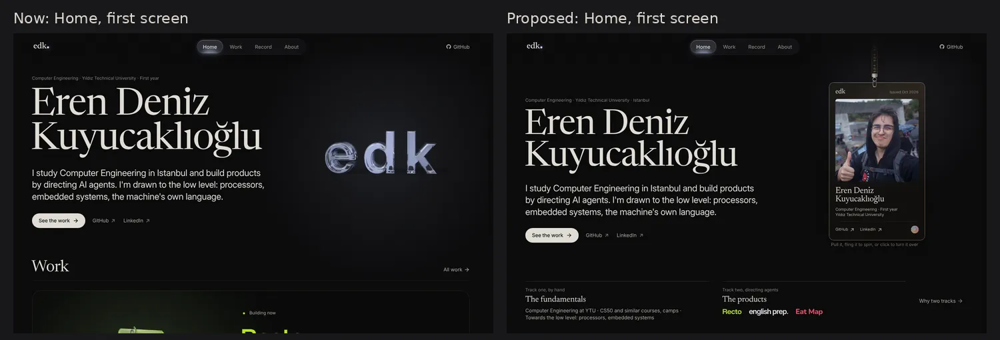
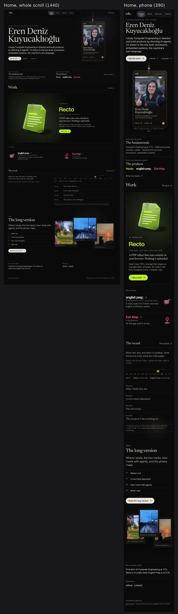
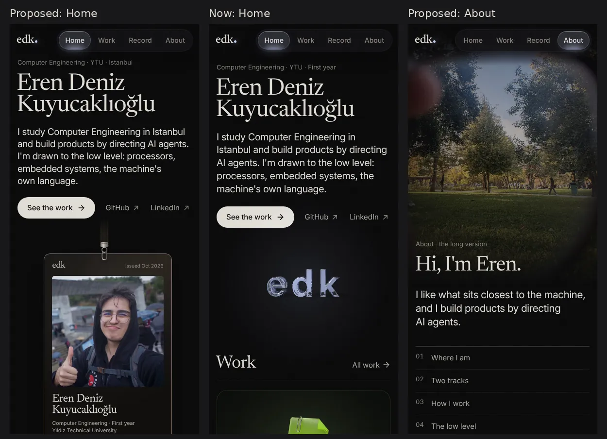
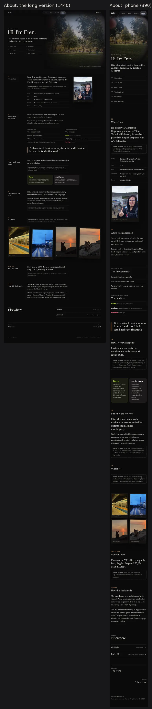
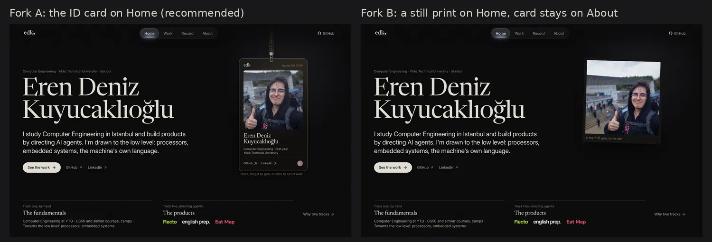

# Research: the portfolio's story, flow and presentation (2026-10-10)

Brief §7 (2026-10-10): About introduces the owner better than Home, so Home feels dull. Round 1
(`2026-10-home-about-and-worlds.md`) was judged: F1's Home is good, its About (the line through
Istanbul) is bad, F3 is "not bad", and the three radical per-page systems were ugly and broke the
site's unity. This round designs the whole path through the site as one story, in the existing
visual language, and prototypes Home and About.

Nothing here is built on `dev`. The prototypes are static pages assembled from fragments of the
real build (the bar, the ID card with its script, the showcase, the courtyard figure) and the
site's own CSS, plus new markup (`scratchpad/flow/build.mjs`, `flow.css`). All copy comes from
`content/site.json`, `content/projects/*.md`, `content/photos/README.md` and this brief. Missing
owner text is shown in a dashed box labelled "Owner to write".

Evidence grades as in the other files: **E** primary source opened, **P** named practitioner,
**F** secondary, **M** measured by us, **K** recollection not re-checked. No outside site was
fetched this round; exemplar claims are carried from `2026-10-requirements.md` (M survey of 20
engineers' repos) and round 1 (mostly F and K, because rauno.me, paco.me, brianlovin.com,
emilkowal.ski and lynnandtonic.com could not be reached). Treat them as direction.



---

## 1. The story

### 1.1 What a visitor should take away

| Time | Who reads this far | What they must leave with |
|---|---|---|
| **10 seconds** | everyone, from LinkedIn | *This is Eren Deniz Kuyucaklıoğlu, a first-year Computer Engineering student at YTÜ in Istanbul. Here is their face. They build real products by directing AI agents and learn the machine by hand.* |
| **1 minute** | a recruiter, a friend, an engineer deciding whether to look closer | *There are two tracks, and both are deliberate. The lead product is Recto, a PDF editor in public beta that never uploads your file; English Prep is at 0.75; Eat Map is an iOS app in Xcode. The work is dated and moving. GitHub and LinkedIn are one click away.* |
| **5 minutes** | an engineer or interviewer before a call; a friend who is curious | *Inside a product: what it is, why, how it is verified (tests in three engines, exports re-opened, blind-reviewed questions). The record shows when things moved. The long About tells how they study, how they work with agents, what draws them to the low level, and what they see through a camera.* |

The five questions, answered in that order of time:

1. **Who:** name, face, school, year, city. (10 s)
2. **What they make:** three products, led by Recto. (10 s to 1 min)
3. **How they work:** two tracks; specs, decisions and review with agents; fundamentals by hand. (1 min to 5 min)
4. **Why believe it:** real captures, versions, dates, verification facts, the record. (1 min to 5 min)
5. **What next:** for a recruiter, LinkedIn; for an engineer, open Recto or its code; for a
   friend, the card and the photos; for anyone, the record's feed.

### 1.2 What each page carries

The rule: **Home is the whole story told short; every other page is one chapter told long.**
Nothing strong lives only behind a tab (round 1, §2: no strong site keeps the weak version in
front and the better one behind).

| Page | Carries | Does not carry |
|---|---|---|
| **Home** (trailer) | who (name, face via the ID card, school), the two-track thesis in one strip, the lead product and the other two, the record as proof of motion, a door to the long About, now, links | case-study depth, the facts table, the colophon, photos beyond a glimpse |
| **Work** (catalogue) | every product at full size, each with its embassy; later the "by hand" group | the person |
| **Record** (proof) | dated entries, the year strip and spine | introductions |
| **About** (the long version) | education, the two tracks explained, how they work with agents, the low level, photos as the owner's eye, now and next, colophon, contact | the ID card (Home has it, fork A), a second product showcase |

### 1.3 The path

```
LinkedIn ──► Home ─┬─► a product (embassy) ──► "In the record" ──► Record entry ──► the product
                   ├─► Work ──► an embassy
                   ├─► Record
                   └─► "The long version" ──► About ──► "Continue: The work / The record"
```

- Every page ends with a **next step on the path**, never a dead end: Home ends on "The long
  version" and the links; About ends on Elsewhere (GitHub, LinkedIn) and "Continue: The work ·
  The record"; an embassy ends on "In the record" and the next project (already built); a record
  entry ends on its project and Older / Newer (already built).
- The two-track strip on Home links each wordmark to its embassy and "Why two tracks" to About's
  chapter 02, so the thesis is a door, not a slogan.

### 1.4 Exemplars (graded; designed for this person, not copied)

| Pattern | Seen at | Grade | What we take |
|---|---|---|---|
| The introduction *is* Home; no About, or a thin one | Paco Coursey, Brian Lovin, Emil Kowalski, Sindre Sorhus | M (Paco's repo), K | the face and thesis must be on Home's first screen |
| Home as a short trailer, About as the long, personal page with photos and story | Josh Comeau, Lynn Fisher, Tobias van Schneider | F | the long About is worth having when it is a read, not a CV |
| Engineers lead with dated work or a short bio, not a hero | 9 of 12 established engineers | M | the record belongs on Home as proof, quietly |
| Recruiter guidance: name, plain specialisation, GitHub, LinkedIn above the fold; projects within two sections | career blogs, consistent | F | links in the first screen; Recto plate right after |
| A /now line | Derek Sivers | P | the now line closes Home; About's chapter 06 is its long form |

What we do not take: a whole-site metaphor (rejected as unity-breaking in round 1), a photo
under the name (house rule: photos never under text), typewriters, logo walls.

---

## 2. Diagnosis of the current pages (M, live build of 2026-10-10)

Screens: `scratchpad/live/{d,p}-*.png` at 1440×900 and 390×844.

| Page | What it communicates now | Where attention goes | Missing | Repeats |
|---|---|---|---|---|
| **Home** | a name, one sentence, a glass logo | the 122 px name, then the `edk` glass letters, which say "logo" a second time | a face; the two-track idea; any sign of the person beyond text; proof that the work moves | `edk` (the bar already has it); "Now" duplicates About's Now |
| **Home, below** | Recto plate (good), two small "also" rows, a now line, an empty log line | the lime Recto plate, rightly | a bridge to About; a reason to scroll after the plate | — |
| **About** | the person: face on the handled card, courtyard, the two tracks, facts, colophon, now | the card and the photo, both strong | a reading rhythm: below the hero it becomes a facts table and two lists; five of the seven photos are unused | the hero lede and the facts table say the same five facts; the track lists repeat Work |
| **Work** | three products, one per screen, objects large | objects and names | nothing structural; it is the catalogue the brief asked for | the intro dek restates the two-track "products" track (fine) |
| **Record** | an honest empty state with a legend | the card-file object | entries (none yet, by design) | — |
| **Phone, Home** | name, lede, then the `edk` letters and "Work" | the letters | the face, until About | — |

The core fault is one of **order, not of material**: the site already owns the best assets
(the card, the photos, the thesis, the Recto plate), but the first screen spends its right half
on a mark that the bar repeats, and About spends its lower half on a table.

---

## 3. The direction: one front page, one long read

One coherent direction in the existing language: black ground, warm ink, Newsreader for the
maker's voice, Inter for the interface, colour as light, one object per page, the bar and pill
unchanged. It is round 1's F1 Home (liked), refined, plus a new About designed as a long,
personal read (replacing the rejected line through Istanbul). No page changes its system.

### 3.1 Home, first screen (desktop 1440×900)



| Zone | Content (all from `site.json`) | Notes |
|---|---|---|
| Left, 7/12 | kicker *Computer Engineering · Yıldız Technical University · Istanbul*; the name in two lines (Newsreader, clamp 52–112 px); the lede; **See the work**, GitHub, LinkedIn | the name drops from 122 to 112 px so the strip fits; lede capped at 27 em (three lines) |
| Right, 5/12 | **the ID card**, hanging on its lanyard from under the bar, ~270 px wide; pull, fling, spin, click to turn (existing `card3d.ts`, ADR-0008) | this is Home's object; the `edk` glass letters leave Home's hero (they stay as the bar mark, favicon, link card, and may become the 404's object) |
| Bottom band | **the two tracks**: *Track one, by hand · The fundamentals* with its three items; *Track two, directing agents · The products* with the three wordmarks as links; *Why two tracks* to About §02 | the thesis on the first screen; the wordmarks in their own faces read as products, so "who is the person, what is a project" is never confused (brief: Home hierarchy) |
| Light | edk's cool white-blue pool behind the card, ≤ 8 % mix | the room's light; the dot in `edk.` keeps taking it |

Measured in the prototype at 1440×900: name from y 220 to 420, card 147–620, strip 745–860; the
whole first screen fits with no scroll. At 1180×820 (touch) the card falls back to the flip, as on
About today (not shot this round; to check on the branch).

### 3.2 Home, phone (390×844)

Kicker (with *YTU*), name, lede, links, then the card hanging from a short strap (64 vw). The face
is inside the first screen (card photo from y≈540). The track strip follows directly, stacked.
The phone card keeps the simple flip the owner approved.



### 3.3 Home, the whole scroll

1. **First screen**: person and thesis (above).
2. **Work**: the existing Recto plate and the "Also building" pair, unchanged. It is already the
   strongest block on the site; it now follows a first screen that has said who made it.
3. **The record**: a heading, the record's dek, the 2026 year strip with real marks only (Recto
   and English Prep both started in September, from their `started` fields), and the latest
   three entries. With no entries the section stays **hidden** (brief: unwritten sections hidden);
   the prototype shows it with the four first entries the brief lists, labelled as a sample.
4. **The long version**: a door to About. Left: *About*, "The long version", one line on what is
   inside, four chapter names, **Read the long version**. Right: three prints (the courtyard,
   Bostancı in rain, the sea wall at sunset) in About's gold light. This is the transition the
   site lacked: Home tells you there is more of the person, and shows it is worth reading.
5. **Now and Elsewhere**: the now line, GitHub · LinkedIn; footer.

### 3.4 About: the long version



A page people want to read: a reading column with chapters, a gold light, prints in the margin,
one pull quote, one change of texture in the middle. Not a list.

| Part | Content | Form |
|---|---|---|
| **Opening** | the courtyard (brief: it carries About) bleeding from the right, as now; *About · the long version*; "Hi, I'm Eren."; one lede (*I like what sits closest to the machine…*); a six-item contents list | the card no longer hangs here (it moved to Home), so the courtyard has the right half to itself; F3's "photo as threshold" lives here, never under the text |
| **01 Where I am** | the YTÜ / prep AA sentence as an opening line; *owner to write* (why Computer Engineering, why YTÜ); the five facts as a compact table under the prose; the gate selfie as a print in the margin | the face for visitors who land on About directly, which the About link card (gate selfie) promises |
| **02 A two-track education** | the two track texts as prose; the two lists side by side (product names as wordmark links); the pull quote *Both matter. I don't stay away from AI, and I don't let it stand in for the first track.* | the thesis, now explained rather than tabled |
| **03 How I work with agents** | *I write the specs, make the decisions and review what AI agents build.*; *owner to write* (one real spec, a rejected result, a diagnosed bug); two proof tiles in the product's light: Recto (exports re-opened, tests in three engines), English Prep (CI validation, blind review, zero runtime dependencies) | requirements §13: the human work is the credibility; the tiles link to the embassies |
| **04 Drawn to the low level** | the low-level line; the "by hand" note from `site.json`; *owner to write* (CS50 sets, camps: names to confirm; what next) | becomes the bridge to Work's future "By hand" group |
| **05 What I see** | *owner to write* (one or two lines on taking photos); four prints breaking out across the full width: metro platform, Bostancı, the sea wall, the same kitten | the change of texture readability §6 asks for; photos are the owner's eye, not decoration; captions are descriptions until the owner writes them |
| **06 Now and next** | the now text set large; *owner to write* (next, one line per track) | the long form of Home's now line |
| **Colophon** | how the record and the site are made (existing text) | quiet, at the end |
| **Elsewhere · Continue** | GitHub, LinkedIn as large rows; *Continue: The work · The record* | the path never ends |

Type: reading prose in Newsreader 21 px / 1.55 at weight 420, 28 em measure (readability T1–T2);
19 px on phones. Chapter numbers in About gold. The left column holds the sticky chapter head on
desktop (from 1100 px); below that, heads sit above their chapter.

What was cut against the current About: the hero's second lede that repeated the facts, the
full-width facts table (now compact, inside chapter 01), the separate Now box.

### 3.5 Work and Record in the story

- **Work** stays as built (one product per screen, large objects, embassies). Two small links into
  the story: the intro's dek already says the role; add a quiet line at its foot, *How I work with
  agents* → About §03, so a reader who asks "what did you do yourself?" gets the answer.
- **Embassies** end on "In the record", the per-project thread (accepted). That is the bridge from
  a product to the proof.
- **Record** keeps the spine and year strip (accepted). Its only story job is to be linked from
  Home's record section and from every embassy; its foot links "How this is written" (About's
  colophon).
- **One object per page holds:** Home has the card (and the Recto object inside its plate, as
  now), Work the product objects, Record the card file, About the courtyard photograph.

### 3.6 Still twins and accessibility

The card already has its still twin (no JS: hangs straight; phone: flip; keyboard: Enter/Space
turns; links on the front). The two-track strip, the record section and the prints are plain
HTML. No text animates in; arrival motion stays on the card and the page light only.

---

## 4. Forks (only where taste decides)

### Fork 1: where the ID card lives, and how the face appears on Home



| | A. The card moves to Home *(recommended)* | B. A still print on Home; the card stays on About | C. The card on both |
|---|---|---|---|
| Home | the handled object as the front door: face, name, school, links on one physical thing | a framed, slightly turned print of the gate selfie | as A |
| About | the gate selfie as a margin print in chapter 01 | the card in the hero, as now | as now |
| For | the owner's favourite object meets every visitor; Home gains the liveliness the owner asked for; About becomes a read | About keeps its strongest moment; Home still shows the face | most presence |
| Against | About loses its toy | the print is calmer and less alive than the card; Home stays the less playful page | the same object twice; the second meeting is flat |

### Fork 2: the `edk` glass letters

| A. Leave Home's hero; stay as mark, favicon, link card; become the 404's object *(recommended)* | B. A small sign-off at the end of Home | C. Keep them on Home beside the card |
|---|---|---|

One object per page is the house rule; the card is Home's object. B is harmless but adds a second
object; C brings back the hierarchy problem the owner raised.

### Fork 3: the form of About

| A. The long letter: one reading column, chapters, prints in the margin, one full-width photo band *(prototyped, recommended)* | B. Chapter spreads: each chapter one screen, photo half and text half alternating | C. Keep the current About and only add the photos |
|---|---|---|

A reads best (readability L1: nothing beside the column but a print), and grows cheaply as the
owner writes. B is more magazine-like and shows the photos larger, but every chapter needs a
photo, and some chapters have none. C does not answer the problem.

### Fork 4: what Home's record section shows before entries exist

| A. Hidden until the first entry *(recommended; brief: unwritten sections hidden)* | B. The year strip with the projects' start marks only | C. "First entries coming" with the planned titles |
|---|---|---|

---

## 5. Owner text this direction needs (never invented)

1. About 01: why Computer Engineering, why YTÜ (two or three sentences).
2. About 03: one real example of working with agents (a spec, a rejected result, a bug).
3. About 04: what has been done by hand so far (CS50 sets, camps: exact names) and what is next.
4. About 05: one or two lines on taking photos; a caption per photo; which photos may be shown
   (the metro platform shows strangers from behind; README asks for a crop before close use).
5. About 06: next, one line per track.
6. Home: the Recto pitch line is still `summary`; the brief foresees a Home-only pitch the owner
   writes.

## 6. Build order (after the owner chooses)

1. Home first screen on a `wip/` branch: move `IdCard` to Home, add the track strip, drop the
   hero `Media`; check 1440×900, 1180×820 touch, 390×844.
2. Home's long-version door and the hidden-until-written record section.
3. About as the long version: chapters from `site.json` (new optional fields per chapter, so the
   owner's text is data, ADR-0002), prints from `content/photos/`.
4. The small path links (Work foot → About §03, About end → Work/Record).

## 7. Images

- `assets/2026-10-flow-home-first-screen.webp`: now and proposed, Home's first screen at 1440×900
- `assets/2026-10-flow-home-scroll.webp`: proposed Home, whole scroll, desktop and phone
- `assets/2026-10-flow-about.webp`: proposed About, whole scroll, desktop and phone
- `assets/2026-10-flow-phones.webp`: proposed Home, current Home, proposed About at 390×844
- `assets/2026-10-flow-fork-face.webp`: fork 1, card or print on Home

Prototype sources (scratchpad, not committed): `flow/build.mjs`, `flow/flow.css`,
`flow/home.html`, `flow/home-print.html`, `flow/about.html`.

---

## Türkçe özet (sahip için)

**Durum.** Sitenin en güçlü parçaları zaten var: ipten çekilen kimlik kartı (yüzün), fotoğrafların,
iki yol fikri ve Recto plakası. Sorun malzeme değil sıra: Home'un ilk ekranının sağ yarısı, menüde
zaten yazan "edk" harflerine gidiyor; About'un alt yarısı ise bir bilgi tablosuna dönüyor. Bu yüzden
About daha iyi tanıtıyor gibi görünüyor.

**Önerim, tek yön.** Home, hikâyenin kısa hâli olsun: solda adın ve bir cümle, sağda ipte asılı kart
(yüzün ilk ekranda), ilk ekranın altında iki yol şeridi (elle temeller; ajanlarla ürünler: Recto,
english prep., Eat Map). Sonra Recto plakası, sonra Record (ilk yazı çıkınca görünür), sonra "Uzun
hâli" kapısı: üç fotoğraf ve About'a bir bağlantı. About ise okunmak istenen uzun bir sayfa olsun:
avlu fotoğrafıyla açılış, altı bölüm (nerede okuyorum, iki yol, ajanlarla nasıl çalışıyorum, düşük
seviye, gördüklerim, şimdi ve sonra), kenarda fotoğraflar, ortada geniş bir fotoğraf şeridi, sonda
GitHub ve LinkedIn. Görsel dil aynı kalıyor; sayfaların sistemi değişmiyor, site tek parça.

**Senin seçmen gerekenler:**

1. **Kart nerede dursun?** Kart sitenin en sevilen nesnesi; ya ön kapı olur ya About'ta kalır.
   a) Kart Home'a geçsin, About'ta kapıdaki selfie fotoğraf olarak dursun (önerim) · b) Home'da
   sabit bir fotoğraf baskısı olsun, kart About'ta kalsın · c) Kart iki sayfada da olsun.
2. **Cam "edk" harfleri ne olsun?** Her sayfada tek nesne kuralı var; Home'un nesnesi artık kart.
   a) Home'dan çıksın; menü işareti, favicon ve paylaşım kartı olarak kalsın, 404'ün nesnesi olsun
   (önerim) · b) Home'un sonunda küçük bir imza olsun · c) Kartın yanında kalsın.
3. **About'un biçimi?** Uzun okuma mı, dergi gibi açılan sayfalar mı.
   a) Tek sütunlu uzun mektup, kenarda fotoğraflar, ortada bir fotoğraf şeridi (önerim, prototipi
   hazır) · b) Her bölüm bir ekran: yarısı fotoğraf, yarısı yazı · c) Şimdiki About'a sadece
   fotoğraf eklensin.
4. **Henüz yazı yokken Home'daki Record bölümü?** Boş görünen tarih şeridi terk edilmiş gibi durabilir.
   a) İlk yazı yayınlanana kadar gizli kalsın (önerim) · b) Sadece projelerin başlangıç işaretleriyle
   yıl şeridi görünsün · c) "İlk yazılar geliyor" diye planlanan başlıklar görünsün.
5. **Senden gereken yazılar** (ben uydurmam): neden Bilgisayar Mühendisliği ve neden YTÜ; ajanlarla
   çalışmana gerçek bir örnek (yazdığın bir şartname, reddettiğin bir sonuç); elle yaptıkların
   (CS50, kamplar, adlarıyla); fotoğraf çekmek üzerine bir iki satır ve her fotoğrafın altyazısı;
   her yol için "sırada ne var". Hepsini sesli not olarak gönderebilirsin.
