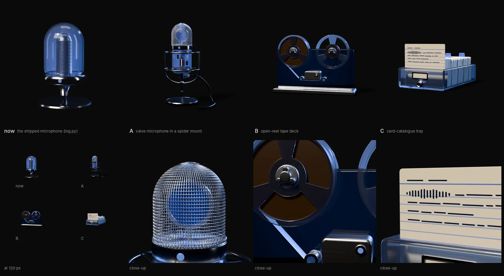

# Research: the Record's object (2026-10-09)

**Why:** brief §7 (2026-10-09, after seeing v0): "the microphone looks too simple; rethink it
from every angle." The family audit (C3) adds that the objects read as glossy, toy-like generic
symbols rather than crafted things in their subject's language. This file proposes three
concepts for the owner to choose from. It decides nothing.

**Method:** ten directions judged on paper, three modelled as headless-Blender scripts on the
shared rig (`rig.json`, ADR-0006) and rendered in Cycles at 600², 64 samples with denoising
(concept quality, not shipping quality). Three rounds of renders, each one looked at before the
next. Scripts: `tools/objects/record_a.py`, `record_b.py`, `record_c.py`, with shared finishes in
`record_kit.py` (brushed and spun metal, tape oxide, paper, ruled card stock).

## What the object is about

The Record is the owner's public, dated log, written from voice notes, in three kinds (note,
entry, essay), kept up for four years. Three ideas compete for the object: **voice becoming
text**, **time piling up** and **a record of work kept in public**. The microphone has only the
first, and only as a symbol: a glass dome over a ribbed core, no engineering a sound engineer
would recognise. The page around it is becoming a warm reading room with a desk lamp
(`2026-10-page-worlds.md`, concept A), so the object should also feel at home on a desk.

## Ten directions

Judged on: reads at 120 px and at 520 px; fits the glass family and the one rig (front camera
nearly level, droplet morph at the end); has one or two named parts for a micro-interaction;
works in blue light; not a cliché; not toy-like.

| # | Direction | Says | Verdict |
|---|---|---|---|
| 1 | **Engineered valve microphone**: woven grille, visible diaphragm, glass body with the valve inside, spider mount, cable | voice | **Kept (A).** The safe step: keeps the meaning, adds real craft |
| 2 | **Open-reel tape deck**: two glass reels, one full, one just started | voice and time | **Kept (B).** Strongest outline; the tape is the four years |
| 3 | **Card-catalogue tray**: dated index cards, year dividers, one card drawn out | dated entries, the reading room | **Kept (C).** The only one that is about text |
| 4 | Waveform frozen in a glass slab, turning into lines of text | voice to text, exactly | Flat and abstract; at 120 px it is a chart. Too close to Recto's lined page. Its best idea moved onto C's card |
| 5 | Vinyl disc ("on the record") | the word "record" | A pun, and it says music, not words. A disc is a thin line from a near-level camera |
| 6 | Desk lamp over an open notebook | the reading room | The lamp is the room's light (CSS), not the subject. Two objects, competing with the page |
| 7 | Hourglass of letters | time | A cliché; letters vanish below 300 px |
| 8 | Typewriter key cluster | writing | Typing, not voice. Keycaps go toy-like fast |
| 9 | Rotary date stamp with bands of dates | dated, official | Fine craft, but says bureaucracy, and voice is gone |
| 10 | Wax-cylinder phonograph (the first voice recorder) | voice written as a groove | The best story on paper. Without the horn it reads as a rolling pin; with the horn it is the gramophone cliché |

## The three concepts

All three keep the family's language: clear glass lit by the accent backlight, Record blue only
where a meaning sits (glass, an LED, dividers), and a few material contrasts instead of a single
glossy body: brushed and spun steel, satin rubber, warm paper or tape oxide. Polished steel was
dropped after round 1: the studio environment is dark, so mirror steel rendered black.

### A. Valve microphone in a spider mount (`record_a.py`)

Woven steel grille with an anodised blue diaphragm visible through it, a thin glass body showing
the valve, its warm heater and two capacitors, a steel band with the on-air lamp, elastic cords
on two rings, a short desk stand and a right-angle plug whose cable runs off over the desk.

- **Parts:** `body`, `grille`, `band`, `capsule`, `valve`, `spine`, `mount`, `stand`, `cable`, `led`.
- **Micro-interaction:** the lamp goes on air, the heater warms up, and the microphone rocks once
  in its cords and settles: the spider soaking up a knock.
- **Render notes:** round 1's grille was too coarse and too opaque, and read as a glass-block
  lamp; round 2 used finer, thinner wire (44 rows, 96 columns) and closed the pole with a spun
  button, which removed a spike. Round 3 shortened the stand so the microphone fills more of the
  frame. Still the weakest at 120 px: tall and thin, the cage turns to noise.
- **Against:** it is still a microphone, the symbol the owner has already seen.

### B. Open-reel tape deck (`record_b.py`)

A smoked glass faceplate in a brushed steel plinth, two reels with clear glass flanges on spun
hubs, standing proud of the plate. The left reel is full and the right one has just started: the
tape still to be recorded is the years ahead. The tape runs round two steel guides under a
brushed head cover with the record lamp.

- **Parts:** `deck`, `plinth`, `reel_left`, `reel_right`, `pack_left`, `pack_right`, `tape`,
  `guides`, `heads`, `led`.
- **Micro-interaction:** the record lamp lights, both reels turn (the flange windows show the
  turn), and a little tape moves across: `pack_left` shrinks a hair and `pack_right` grows by
  the same amount, then everything comes to rest. Each new entry could add a turn, so the
  object really is the record.
- **Render notes:** round 1's pale faceplate read as painted plastic; smoked glass with an
  absorbing volume (rounds 2–3) keeps the plate dark, so the blue arrives as light through glass
  and the reels stand out. Raising the reels above the plate's top edge broke the rectangle and
  gave the outline that reads at 120 px. The hubs and lobes needed satin steel to stop rendering
  black.
- **Against:** reel-to-reel is retro. It reads as a working tool, not nostalgia, because it is
  clean and engineered, but the owner should judge that.

### C. Card-catalogue tray (`record_c.py`)

A clear glass drawer of index cards on a catalogue rod, with a steel label holder and pull, four
blue glass year dividers, and a steel follower at the back. The front card is half drawn out: a
dated heading, and on its first rule a short waveform that turns into handwriting. It is the
only concept that shows a voice note becoming an entry.

- **Parts:** `tray`, `cards`, `dividers`, `card`, `rod`, `plate`, `follower`.
- **Micro-interaction:** the drawn card lifts out of the stack, tips slightly toward the viewer,
  and drops back. With the three kinds of entry: a note lifts a little, an essay all the way.
- **Render notes:** round 1's writing was even bars that read as interface placeholders; rounds
  2–3 split it into words of uneven length on a wandering baseline. The year tabs were raised so
  they show above the stack. The close-up (waveform into writing) is the best single image in
  the set.
- **Against:** at 120 px it is "a box with a card", close to a generic archive icon; the
  waveform only reads from about 300 px.

## Recommendation

**B, the tape deck.** It is the only concept that holds both halves of the Record: the dictated
voice (a recorder) and the years piling up (a full reel and an empty one). It has the clearest
outline of the four at 120 px (two circles on a plate), its interaction is both natural and
meaningful (reels turn, tape moves from past to future), and its glass reels give the backlight
something to pass through. Two things could come across from C: the waveform-into-writing
motif as a small screen-printed mark on the faceplate, and year marks on the tape pack's edge.

C is the alternative if the owner wants the reading room more than the voice; A if the
microphone should stay and only gain craft.

## Before it ships (not done here: the owner chooses first)

- Add the chosen object's clip to `frames.py` (`CLIPS`) and its row to `tools/objects/README.md`,
  rename it to `record.py` (replacing `log.py`) and run the full pipeline at 1200² and 128
  samples.
- Check the droplet morph from the chosen outline. B and C are wider than they are tall, so the
  droplet grows out of a wider footprint than the microphone did.
- Check the warm reading-room ground and the blue object together on a phone in a dark room
  (`2026-10-page-worlds.md`).
