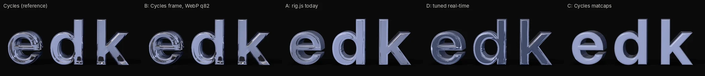
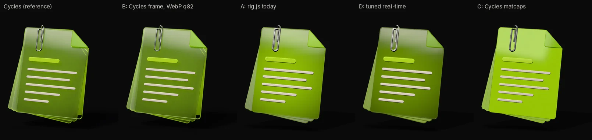
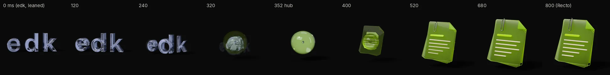
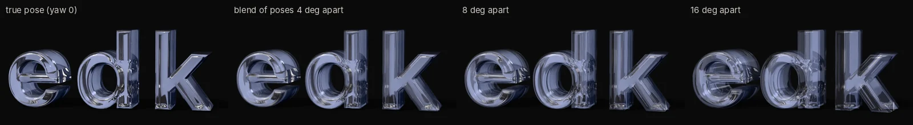

# Research: render bake-off, real-time vs pre-rendered (2026-10-09)

PLAN track 2. The owner's verdict on prototype E: the in-page three.js objects look worse than
the Cycles renders. The brief makes lighting the bar and asks that the page match the render
(brief §7, 2026-10-09). This round tested four ways to get Cycles quality on the page, on edk
and Recto, at hero size: 520 CSS px square at DPR 2 = 1040² device px (the square the stage
frames each object in). It ran in the agent container: Cycles on 4 CPU cores, Chromium on
SwiftShader.

The owner chose a direction while the test was running. Real-time 3D feels heavy. They want it
faked with very high-resolution pre-rendered frames and video: a poster paints first, the
animation loads behind it, then plays at full resolution, full quality, full performance. The
measurements below support that choice. The second half of this file is the pipeline for it
(variant B), written to be reproduced.

Every number is measured in this container unless marked *est.* (an estimate from the
measurements) or *recollection*. Browser timings come from headless Chromium decoding in
software on a loaded 4-core CPU: read them as upper bounds, not as phone numbers. Scripts and
outputs are in the session scratch folder (listed at the end), not committed.

## Result

The pose is yaw +8°, pitch 0, on purpose: no poster shows it, but the page's lean reaches it.
The reference is a Cycles frame rendered for that pose (32 spp + OIDN), composited on
`#0A0A0B`, lossless. Error is over the object and its shadow: MAE in 8-bit levels (lower is
better) and SSIM on luma (1 is identical).

| Variant | edk MAE | edk SSIM | Recto MAE | Recto SSIM |
|---|---|---|---|---|
| B: the Cycles frame as WebP q82 | **2.7** | **0.991** | **1.7** | **0.989** |
| A: rig.js today | 28.8 | 0.49 | 22.7 | 0.82 |
| D: tuned real-time | 45.6* | 0.41* | 12.5 | 0.84 |
| C: Cycles matcaps | 32.9 | 0.55 | 37.0 | 0.78 |

\* The edk D shown is the version that reads most like glass (inner walls visible). It is
darker than Cycles, so it scores worse than A. The best-scoring edk tuning (backlight × 0.6) only
reached MAE 34.4 / SSIM 0.35 at the centre pose, against A's 36.5 / 0.34. No setting got edk
much past A.

| Variant | What it is | Look vs Cycles | Cost in the page | Verdict |
|---|---|---|---|---|
| **A** | rig.js today: MeshPhysical transmission, PMREM studio HDRI, key + rim, PBR Neutral | edk: smooth frosted plastic, no inner walls. Recto: too saturated and opaque; the back pages are missing from inside the front glass | three.js ~142 KB gz + GLB 35–40 KB; a transmission pass every frame | baseline |
| **B** | Cycles frames for a pose grid, plus Cycles clips, drawn as images | identical; the only loss is the codec, MAE ≈ 2 levels | 0.3–0.8 MB per object on desktop; no WebGL | **chosen** |
| **C** | Cycles lighting baked into a matcap per material, MeshMatcapMaterial, no transmission | worst: glass becomes clay, since a matcap cannot refract; only the steel clip reads right | cheapest real-time (~0.55× A's frame time) | rejected for glass |
| **D** | A plus tuning: per-object backlight, IOR, thickness, transmission, an opaque back-face "inner wall" pass, SSAA, bloom | Recto gets close (MAE 22.7 → 12.5). edk gains inner walls but never the refraction and internal reflection Cycles shows | SSAA ×4 ≈ 3.2× A; bloom ≈ 1.3× A, and through the composer it tone-maps the ground darker than `#0A0A0B` | ceiling reached, still visibly short |

**Why A and D cannot close the gap.** three.js transmission refracts one screen-space layer of
*opaque* things (`renderTransmissionPass` draws only opaque objects into its buffer). It never
sees other glass, such as Recto's back pages or the inside of an edk letter, and it has no
internal reflection. Thick clear glass is exactly what the objects are, so the largest
difference sits where the eye looks.

The tuning that helped most is per object. For Recto: backlight × 0.55, lime glass
transmission 0.8, frost tinted `#d4ec9a` at transmission 0.7, clear glass roughness 0.08,
env 1.2. Keep it for any real-time fallback. No setting brings back the glass inside the glass.

**Why C fails.** A matcap is a lit sphere looked up by normal, so a flat glass face (one
normal) gets one colour. A classic UV bake would only help the opaque diffuse parts (Recto's
text bars), which are a few percent of the pixels. The glass would still need A's transmission.

## The morph between tabs, pre-rendered

Tested: **a hub clip per object.** Each object gets one Cycles clip from rest to a shared glass
droplet. The page's melt (each vertex pulled toward the centre) runs in Blender. Over the last
45% a real glass sphere grows while the parts shrink inside it, and the camera glides from the
object's own camera to one canonical camera. So every clip ends on the same frame, apart from
the backlight colour.

A change plays the leaving object's clip forward and cross-fades for about 100 ms at the
droplet. Then it plays the arriving object's clip backwards, which is exactly the page's
arrival curve (`1 − easeOut(q) = easeIn(1 − q)`). N objects need N clips, not N(N−1) pair clips.
With About dropped, that is five clips.

Findings:

- **The radial melt alone does not make a droplet.** Each part lands on its own patch of the
  sphere, so the end shape is an open shell that differs per object; prototype E has the same
  shape. The grown sphere makes the hub seamless. Only the accent glow behind the droplet
  changes colour (cool for edk, lime for Recto), and that reads as the light changing.
- **14 frames is too few.** The cubic ease puts most of the change into the last two frames.
  The 320 ms frame of the strip shows the ghost of that step. Render 24 frames, spaced more
  densely toward the droplet.
- **Starting from a leaned pose.** The clip starts at the centre pose. A change from a leaned
  pose blends the current pose frame into the clip over the first quarter of the leaving half,
  where the cubic ease barely moves the object, so the switch does not show.
- **Cost:** edk 14 × 73 s = 17 min; Recto 14 × 65 s = 15 min. Sizes: 76 KB / 48 KB as AV1,
  211 KB / 234 KB as WebP stills.

Alternatives considered:

- A real-time droplet during the transition, with sequences at rest. It keeps three.js and its
  load for 800 ms of screen time, and it hands a Cycles frame over to a real-time one, which is
  exactly the mismatch the owner objected to.
- A shader dissolve between two sequences. It needs no clips, but it reads as a video effect,
  not as matter changing shape.

The hub clip is cheaper than both and stays at Cycles quality.

## Pointer lean on frames: how dense the grid must be

The page leans the object about ±9° yaw (±12° with the float) and ±7° pitch today. On frames,
the pointer picks a point in a yaw × pitch grid and the page blends the four nearest Cycles
frames (bilinear). The table gives the error of the blended midpoint against the true middle
pose (edk):

| Grid step | Midpoint cross-fade MAE | Snapping to the nearest pose |
|---|---|---|
| 2° (blend of poses 4° apart) | 14.6 | 19.2 |
| 4° (8° apart) | 22.6 | 28.5 |
| 8° (16° apart) | 34.6 | 40.4 |

At a 2° step the blend is invisible in motion. At 4° thin edges soften, which motion mostly
hides; Recto was rendered at 4° and holds up. At 8° edges double. So yaw goes in 2° steps. The
prototype also settles on the nearest rendered pose about 300 ms after the pointer stops, so a
still object is always a true Cycles frame, never a blend. Pitch moves less: 4° steps are
enough.

## The B pipeline (proposal)

### What gets rendered per object

Everything comes from the object's existing script and `rig.json`, so geometry, materials,
camera, lights, backlight and ground stay single-sourced. The bake-off driver
(`render_seq.py`) imports the object script with `--no-render --no-export` and adds a pivot at
the bounds centre (the page's lean pivot). It then renders a pose list, a melt clip or single
poses. Frames are RGBA, composited on the ground afterwards, exactly as `common.py` does for
posters.

| Asset | Content | Frames | Render time here (1040², 32 spp + OIDN) |
|---|---|---|---|
| Poster | centre pose at 128 spp; also the first paint | 1 | 2–5 min |
| Lean grid | yaw ±16° in 2° steps × pitch −4°/0°/+4° (17 × 3) | 51 | edk-like 51 × 25 s ≈ 21 min; Recto-like 51 × 79 s ≈ 67 min |
| Idle | synthesised from the grid, no rendering: a 4 s figure-of-eight through the poses | 120 | 0 |
| Interaction clip(s) | the object's own move (Recto's pages fan out, the pin drops, the mic pulses) at the centre pose; played forward on hover, backward on leave | 30–45 | *est.* 15–60 min |
| Droplet clip | rest → shared droplet, as above | 24 | *est.* 24 × 70 s ≈ 28 min |

That is about 1–2.5 h per object at 1040². A 1400² render (a ~700 CSS px hero at DPR 2) costs
about 1.8× (*est.*, scales with pixels). Five objects fit in one night as a background job. A
CUDA/OptiX GPU would be 20–50× faster (*est.*); it is optional.

Settings that made this affordable:

- **Samples:** 32 spp + OIDN looks like the 128-spp poster.
- **Bounces:** 12 transmission bounces instead of 24 changed the frame by 1.8 levels MAE.
- **Crop:** `use_border` crops to the object's band.
- **Persistent data:** `use_persistent_data` cut the per-frame time from 85 s to about 22 s on
  edk.
- **Fixed seed:** `use_animated_seed = False`, so the denoiser does not flicker between
  neighbouring poses.

The first frame of a run costs 2–4× more (BVH, kernels). Measured speed:

- edk: 25.3 s per frame (crop 894×498).
- Recto: 79 s per frame (crop 916×926, frosted, layered glass).
- Droplet clips: 65–73 s per frame (full 1040²).

### Formats and sizes

Measured on edk (75-frame grid, 894×498; bytes per frame in brackets). Recto's row is in
`enc_recto/report.json` (WebP 19.8 KB/frame, AV1 4.5 KB/frame at 916×926).

| Delivery | Bytes for 75 frames | Object MAE after decode | Ground decodes to | Notes |
|---|---|---|---|---|
| PNG (reference) | ~13 MB | 0 | 10,10,11 | |
| WebP q82 stills | 813 KB (11.1 KB) | 1.8 | 10,10,10 | random access; 4.6 ms decode per frame in Chromium |
| AVIF q60 4:4:4 stills | 642 KB (8.8 KB) | 1.7 | **9,11,10** | decode 11 ms; shifts the ground green |
| H.264 all-intra | 667 KB | 2.2 | 10,10,10 | Playwright's Chromium has no H.264; Chrome and Safari do |
| H.264, GOP 8 | 483 KB | 2.3 | 10,10,10 | |
| VP9, GOP 8 | 515 KB | 2.1 | 10,10,10 | seek 24 ms median, 46 ms p90 |
| AV1, GOP 8 | 314 KB (4.3 KB) | 2.4 | 10,10,10 | seek 19 ms median, 31 ms p90 |
| WebP at half resolution (low tier) | 346 KB (4.7 KB) | 2.3 | 10,10,10 | |
| WebP with alpha (to sit over the aura) | ×1.94 of opaque | | | the shadow's alpha covers the whole frame |
| Idle loop, 4 s, AV1 / H.264 | 193 KB / 433 KB | | 10,10,10 | made from the grid frames |

Recommendation:

- **Lean grid: WebP stills, not video.** Scrubbing needs random access. A video seek takes
  20–45 ms and lands a frame late. A decoded bitmap draws at once, which is the "full
  performance" the owner asked for. AV1 is 2.5× smaller, but seek latency makes it feel sticky.
- **Linear clips (idle on phones, interactions, droplet): video.** AV1 in MP4 with an H.264 MP4
  fallback (`<source>` order: AV1, then H.264). Safari decodes AV1 only on hardware with an AV1
  decoder (*recollection*: A17 Pro / M3 and later); H.264 plays everywhere. Clips play
  linearly, so GOP length does not matter.
- **Drawing:** blending four frames on a 2D canvas took 20 ms per frame here, but that is
  headless software raster. A GPU-composited canvas, or the frames as WebGL textures with a
  four-tap blend shader, is about 1 ms (*est.*). The real component should use the WebGL
  path: it is a few lines, not three.js.

### Tiers

*est.* from the measurements, for a 51-frame grid:

| Tier | Gets | Bytes per object |
|---|---|---|
| Everyone, first paint | poster WebP (1040² or 1400²) | 25–40 KB |
| Desktop, low | half-resolution grid, WebP | ~240 KB (edk) – ~440 KB (Recto) |
| Desktop, full (DPR 2) | full grid, WebP; interaction and droplet clips, AV1/H.264 | ~570 KB – 1 MB, plus ~150 KB of clips |
| Phone | poster, then the idle-loop video and the droplet clips (AV1/H.264); touch-drag scrubs the centre row once it is cached | ~200–450 KB |
| Reduced motion, Save-Data, no JS | poster only | 25–40 KB |

A phone hero about 350 CSS px wide at DPR 3 is about 1050 device px. The desktop frames
therefore serve phones at full sharpness: the phone gets fewer moves, not lower quality.

Memory: one decoded 894×498 frame is 1.8 MB, so a decoded 75-frame grid would be 134 MB, too
much for phones and heavy on desktop. Keep the grid as compressed blobs. Keep decoded bitmaps
(or textures) only for the current pitch row and its neighbour, as an LRU of about 25–40
frames (45–70 MB on desktop), and decode ahead in the pointer's direction. Phones never hold a
grid unless the visitor drags.

### Progressive loading

1. HTML paints the poster ``. It is the grid's centre pose, framed by the same camera, so
   nothing jumps when the frames take over.
2. After first paint, at idle: the low grid (half-resolution stills, about 5 KB each). The
   canvas replaces the poster once the pose under the pointer is decoded.
3. The full grid replaces the low one frame by frame: the same pose, only sharper.
4. This object's interaction and droplet clips, then the most likely next object's poster and
   droplet clip (the tab the pointer is nearest).
5. The gates stay as ADR-0005 §5 says: reduced motion and Save-Data stop at step 1; phones skip
   steps 2–3.

The proof-of-concept page loads in exactly this order. In the headless test, from local disk,
it reached poster 11 ms, low 229 ms, full 507 ms, clips 747 ms; on a network the byte sizes
above set the pace.

### How pointer and interaction map onto frames

- **Pointer → (u, v) in the grid.** Same mapping and spring as the page's lean today
  (`tx = ptr.x × 0.12` rad → u). Bilinear blend of four frames while moving; settle on the
  nearest rendered pose at rest.
- **Idle** (no pointer for 2.5 s): a slow figure-of-eight through the grid. The same frames,
  so the object breathes without one extra render.
- **Hover or poke:** play the interaction clip forward from the centre pose and backward on
  leave. The current lean eases to centre over about 150 ms first, as at a change.
- **Tab change:** the droplet hub, 800 ms, timed like the page today (split 0.44).
- **Float and squash:** the ±2.5% bob and the squash stay as transforms of the whole frame.
  They are 2D moves that need no new light.

### Colour: frames on `#0A0A0B`

- **The ground is baked into every frame** (Cycles shadow catcher composited over `#0A0A0B`,
  as the posters already are). PNG keeps it exact.
- **Every lossy path decodes the ground to 10,10,10, not 10,10,11.** This held for WebP, H.264,
  VP9 and AV1 (BT.709, limited range), in ffmpeg and in Chromium. 8-bit 4:2:0 cannot represent
  10,10,11, because the blue falls between two chroma steps. AVIF 4:4:4 gave 9,11,10, so avoid
  AVIF here. One level of blue near black is invisible on its own, but a hard-edged rectangle
  of it could show on a good OLED.
- **Fixes, in order:**
  1. Feather the frame's edge into the page with a radial `mask-image` from 82% to 100% (in
     the proof of concept). Any one-level offset disappears into the gradient. The object
     stays inside the 82% circle, which the framing (fill 0.74) already ensures.
  2. Tag every video explicitly: encode through
     `-vf scale=out_color_matrix=bt709:out_range=tv,format=yuv420p` and add `-colorspace bt709
     -color_primaries bt709 -color_trc bt709 -color_range tv`. A 601-vs-709 matrix mismatch
     barely matters on a near-grey ground. A range mismatch (limited read as full) would lift
     the ground to about 25,25,25, and that is what makes video boxes visible.
  3. Optional: 10-bit AV1 gets closer to 10,10,11, at some cost in decoder support on older
     phones. Or set the page ground to `#0A0A0A`, which is a design-token change and the
     owner's call.
- **Not verifiable here:** Safari's colour handling of video and stills on the owner's iPhone
  and Mac. The bake-off's `bseq.html` reports what each format decodes to; run it once per
  device before shipping.
- **Frames over the aura or a photo** would need alpha. WebP with alpha costs ×1.94; video
  alpha is not portable (VP9 alpha in Chrome and Firefox, HEVC alpha only in Safari). It is
  better to keep the aura out of the object's square, or to render the aura's light into the
  frames.

### What B gives up

- **Free 3D interaction** (orbit, any angle). Only rendered poses and clips exist. The
  interactions planned in the brief and SPEC (lean, fan, drop, pulse, change) all fit a pose
  grid plus short clips.
- **Objects that react to what you read** (brief §7) still work if they react with a pose, a
  clip or a 2D move. Continuous new geometry would need real time.
- **Every object change costs a re-render** of about 1–2.5 h here. That is acceptable for a
  four-year site that grows level by level, and the script makes it one command.
- **Bytes:** about 0.7–1.2 MB per object on desktop, instead of a ~40 KB GLB plus ~140 KB of
  shared three.js. Lazy per-tab loading keeps the first load at the poster.
- **Real time stays possible** for one future object that truly needs it. Use D's per-object
  tuning there; A is the floor.

## Recommendation

Adopt B as ADR-0006:

- Cycles-rendered pose grids (WebP stills) for the lean, with the idle motion synthesised from
  the same frames.
- AV1 + H.264 clips for interactions and for the droplet hub.
- The poster first, then frames progressively, tiered as above.
- Drop three.js from the hero path. Keep the GLBs as exported source of truth.

Next steps:

1. Turn `render_seq.py`, `encode.py` and `idle.py` into `tools/objects/frames.py` (grid,
   clips, encode, report) and add a list of clips to each object's `stage`.
2. Render 24-frame droplet clips.
3. Render all five objects overnight.
4. Build the hero component from the proof of concept, with WebGL blending, the feathered mask
   and the LRU decoder.

## Files (session scratch, `…/scratchpad/bakeoff/`, not committed)

- `render_seq.py`: Cycles driver (pose grid, poses, melt-to-droplet clip). `run2.sh` is the
  batch that produced everything.
- `encode.py`: WebP, AVIF, H.264, VP9 and AV1 encodes with decode-back MAE and ground check.
  `idle.py`: idle loop from the grid. `matcap.py`: variant C. `cmp.py`: metrics and montages.
- `web/rt.html` + `shoot_rt.mjs`: A, C and D with all knobs. `web/bseq.html` +
  `shoot_bseq.mjs`: in-browser decode, colour and seek test.
- **`web/hero.html`: the B proof of concept.** Poster → low → full progressive load, pointer
  lean on the grid, idle, settle-on-pose, click to morph edk ↔ Recto through the droplet. Serve
  it with `web/serve.mjs` (it maps `/bo/` to the scratch folder and `/` to the repo).
- Outputs: `seq_edk/` (75 frames), `seq_recto/` (13), `melt_edk/`, `melt_recto/` (14 each),
  `enc_*`/`encm_*` (encodes + `report.json`), `idle_edk/`, `mc_*/` (matcaps), `rt/` (real-time
  renders).
