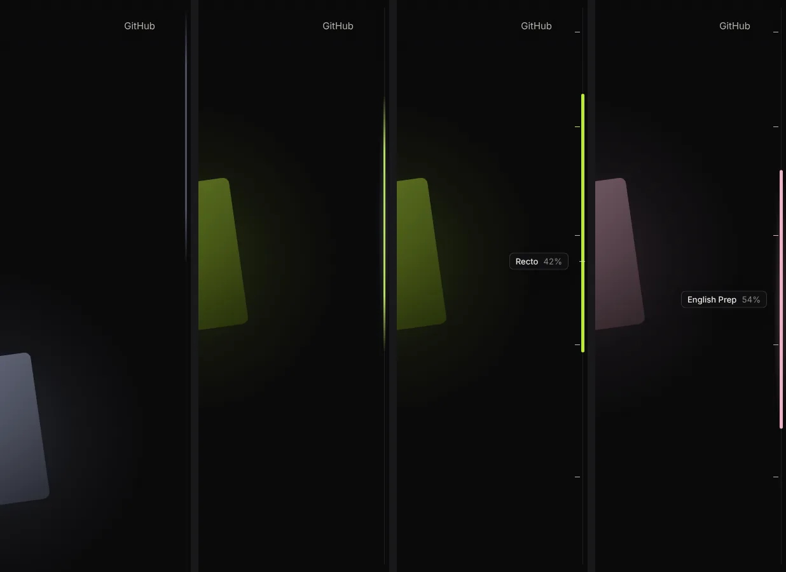
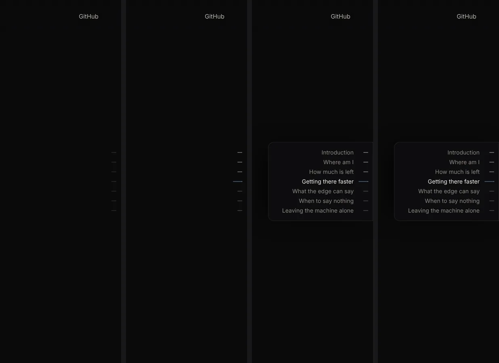
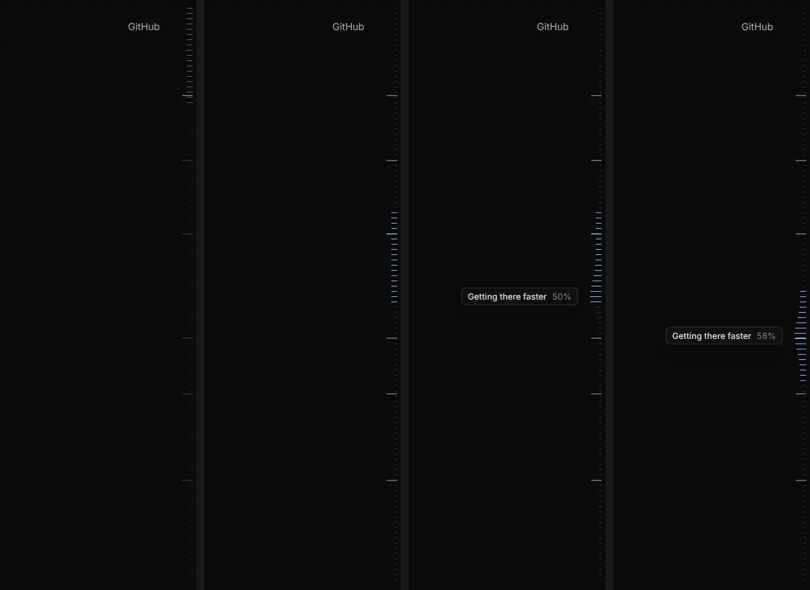
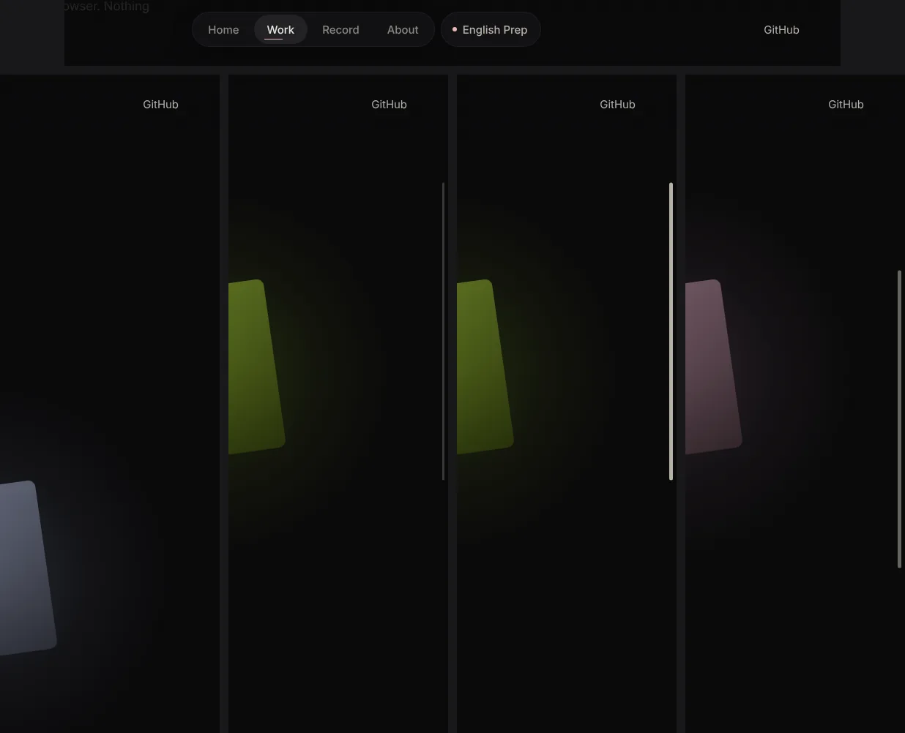

# Research: a custom scroll rail (2026-10-09)

The owner dislikes system scrollbars and asked for "a custom thin rail, newly designed (not a
copy of English Prep's, which did not turn out as the owner imagined)" (brief §7, 2026-10-09,
"Scrollbar"). Already decided: hide the native bar and draw a rail; desktop first, phones must
not break. This file collects the evidence, proposes four concepts, reports what the prototypes
measured, and recommends one. Nothing here is binding until an ADR is accepted.

Evidence grades, as in `2026-10-craft-audit.md`: **E** verified (primary data opened here),
**P** practitioner, **F** folklore or vendor copy, **M** measured in our own prototype, **K**
prior knowledge, not re-checked. The sandbox blocked MDN, W3C, WebKit, web.dev and every blog
host for direct fetches; browser support therefore comes from `@mdn/browser-compat-data` 8.1.5
read from npm (**E**), and everything else from search extracts (graded by who wrote it).

Prototype: one file in the session scratchpad, `rail/concepts.html` (four concepts, four page
types, switchable; `?c=a..d&p=essay|work|record|short`), plus `rail/checks.cjs` (Playwright).
Filmstrips: `docs/research/assets/2026-10-rail-*.webp`.

---

## 1. What the platform gives us

| Fact | Grade |
|---|---|
| `scrollbar-width: none` hides the bar and leaves the element scrollable: Chrome 121, Firefox 64, Safari 18.2 (desktop and iOS). Baseline 2024. | E (BCD) |
| `::-webkit-scrollbar { display: none }` covers older Chromium and Safari < 18.2. | E (BCD) |
| `scrollbar-gutter: stable`: Chrome 94, Firefox 97, Safari 18.2. With the bar hidden there is no gutter to reserve. | E (BCD); M |
| `scrollbar-color` only from Safari 26.2; restyling the native bar cannot make it thin and lit anyway (no width in px, no position, no content). | E (BCD); P |
| Scroll-driven animations (`animation-timeline: scroll()/view()`, `ScrollTimeline`): Chrome 115, Safari 26, Firefox only behind a flag/preview. | E (BCD) |
| Safari did not accelerate scroll-driven animations as of April 2025 (WebKit bug 290671, engineer's comment); Chromium runs them off the main thread. | P |
| `forced-colors` media query: Chrome 89, Firefox 89, Safari 16. | E (BCD) |
| macOS: Show scroll bars = Automatically / When scrolling / Always (System Settings > Appearance). Windows 11: Accessibility > Visual effects > "Always show scrollbars". Neither is visible to CSS. | P (macmost, Windows Central) |
| Apple HIG: the indicator's position says where you are, its length how much there is; indicators may be hidden, so show partial content at edges; custom scrolling must keep the elastic feel people expect. | P (HIG extract) |

Consequence: hiding is now cross-engine and cheap. Drawing a rail needs a little JavaScript for
geometry (thumb length depends on the page), so the native bar must only disappear when that
script runs, and must come back for forced colours and touch.

## 2. Accessibility and what goes wrong with fake scrollbars

- **Never emulate scrolling.** Libraries that move content themselves lose middle-click
  autoscroll, momentum, wheel inside nested areas and assistive technology support; SimpleBar's
  model (keep native `overflow: auto`, draw only the picture) is the safe one (P: SimpleBar
  README, CSS-Tricks; F: Front-End Checklist "scrolljacking"). Our rule: the rail *reads*
  `scrollY` and, while dragged, *writes* it with `scrollTo(…, 'instant')`. Wheel, trackpad
  momentum, Space, Page Up/Down, Home/End, arrow keys, find-in-page and anchor jumps are the
  browser's own (M: all pass in §5).
- **Once you restyle, WCAG applies to you** (P: Roselli, "Baseline rules for scrollbar
  usability"; Bailey, "Don't use custom CSS scrollbars"). 1.4.11 asks 3:1 for the parts needed
  to identify a control; a thumb "nearly the colour of the page" made users think there was no
  scrollbar (P, Roselli via extract). Auto-hiding bars hurt people who need to see a target
  before they can grab it, which is why both OSes added "always show" (P: Bailey; Mozilla
  DevTools thread).
- **Keyboard.** A page scrollbar is not a tab stop in any browser; keyboard users scroll with
  keys. So the track itself stays `aria-hidden` and out of the tab order (a second, fake
  scrollbar would add noise, and `role="scrollbar"` needs `aria-controls` / `aria-valuenow`
  upkeep for no gain; P: MDN role page, W3C ACT rule). What the rail *adds* (jump to a section)
  must be reachable by keyboard: section markers are real links in a `nav`, focusable, with a
  visible 2px ring inside the viewport (2.4.7; 2.4.11 not obscured; E: WCAG 2.2 "What's new").
- **Target size** 2.5.8 (AA): 24×24 px or the 24px spacing circle (E, W3C summary). The visible
  line is 1–5px; the hit area is a 28px column and each marker is a 28×24 link.
- **Forced colours**: the CSS WG resolved that scrollbar colours compute to `auto` there,
  because the platform has no system colour for them (E, 2020 resolution in the list archive);
  nothing says `scrollbar-width: none` is undone. So we undo it ourselves: native bar back,
  rail gone.
- **Reduced motion**: browsers do not suppress scroll-linked animation for you (Chrome team,
  TAG thread, P). The still twin: opacity crossfades ≤150ms, no width or transform transitions,
  section jumps instant instead of smooth (audit §4.4).
- **Layout shift**: with classic scrollbars (Windows, macOS "Always", Linux) the page is 15px
  narrower (M). Hiding after first paint would shift everything once; the class that hides the
  bar is set by a tiny inline script in `<head>` before first paint (M: 0px shift).

## 3. What the rail should say, and when to be silent

From the brief and the current site:

1. **Where am I, how much is left** (the HIG's two jobs): an honest thumb whose length is the
   viewport's share of the page. A dot or a fixed-size grip loses "how much".
2. **What is here**: essay headings (`.post-body h2`), Work entries (the tiles), Record years and
   months (and the new "date spine with project-coloured marks and a year strip" of the Record
   redesign, brief §7). Section ticks sit exactly where the heading is: a tick lies inside the
   lit thumb exactly while that heading is on screen (classic scrollbar mapping, kept when the
   thumb hits its 40px minimum).
3. **The page's light**: the thumb takes the accent of the section you are in (Log blue on
   essays; Recto lime, English Prep sakura, Eat Map rose as you pass the tiles on Work). This is
   the brief's "lit, coloured" detail (§7, E's details) on the one element that really moves with
   the reader.
4. **Time**: on the Record, dragging shows the month and year under the thumb (Photos-style
   scrubber label), which turns the rail into a way through four years of work.
5. **Silence**: no rail when overflow is under a quarter of a screen (About, 404, short pages):
   keys and wheel are enough. At rest the rail is a faint stretch of line; it brightens only
   when you scroll or reach for it ("still by default, motion as an event", audit §4).

What English Prep's rail did (`english-prep/docs/design/scroll-rail-v073.md`): a 1.5px thread
with a 5×38px grip that can be pinched inward up to 14px, Bézier bow, dots riding the curve. The
concepts below avoid all of its ideas: no grip object, no elastic deformation, no pull gesture.

## 4. Four concepts

All four share one engine (about 200 lines): passive scroll listener plus one rAF write of two
CSS variables, a `ResizeObserver` for geometry, pointer capture for drag, jump-to-spot on a
track click that continues into a drag, Escape during a drag restores the start, and section
links that scroll smoothly (instantly under reduced motion). Frames in each filmstrip: rest,
scrolling, hover, drag (right 300px of a 1440×900 window).

### A. Filament: a hairline whose lit stretch is the viewport

A 1px track (9% ink, visible only while active) and a 3px thumb with feathered ends, like light
inside a fibre. At rest the thumb is a faint stretch (0.55 opacity after the contrast check, §5); scrolling lights it in the section's
accent with a faint halo for ~1.1s. Hover widens it to 5px, shows 8px section ticks, and a ghost
mark under the pointer with a label saying where a click would land ("Recto 42%"); dragging
moves the label with the thumb ("Getting there faster 58%", or "Mar 2027" on the Record).

### B. Contents ladder: one dash per section

Dashes at mid-height, one per section, evenly spaced (a contents list, not a scrollbar); the
current one is longer and fills with the accent as you read through that section. Hover opens a
panel of titles beside the dashes; dragging along the dashes scrubs section by section.
Strength: lovely on essays and the Record. Weakness: it loses "how much is left" and the page
position on Work (four marks), and it duplicates the essay's own left-hand contents list.

### C. Ruler: a measured edge

Fine ticks every 8px on a canvas; ticks inside the viewport are lit and longer (the thumb is a
band of lit ticks); section starts are 16px ticks; ticks swell under the pointer like a dock.
It is the most "machine" of the four (the low-level theme, brief §5). Weakness: busy at rest,
reads as decoration on a site whose audit's main finding was accumulated decoration (§1).

### D. In the pill: progress joins the navigation

A 1.5px accent line under the current tab fills with scroll; after the head, a small capsule
beside the pill names the current section and opens a list of sections. The edge keeps a plain
neutral thumb that appears only on scroll or hover. Weaknesses: the audit removed the glowing
underline from the pill (P2.4, "three cues for one state"); the first prototype re-centred the
pill when the capsule grew, sliding the tabs under the cursor (M, fixed by hanging the capsule
outside the pill); and the section list is not keyboard-reachable until you scroll.

## 5. Measurements (Chromium, Playwright; `rail/checks.cjs`)

| Check | Result |
|---|---|
| Horizontal overflow, 4 concepts × 4 pages at 1440×900 | none; `clientWidth == innerWidth` (M) |
| Native bar width, classic mode | 15px; with the rail 0px and no shift at load (M) |
| Short page | rail hidden in all four (M) |
| Wheel over the rail | page scrolls natively (M) |
| PageDown, Space, End | 787px, 1574px, bottom reached (M) |
| `scrollIntoView` (anchor / find equivalent) | current tick follows (M) |
| Drag 100px on the thumb | 618px of page = 100 / k, exact (M) |
| Escape mid-drag | returns to the start (M) |
| Tab reaches section links | A, B, C yes; D only after scrolling (M) |
| Focus ring | 2px `--focus`, inset so the viewport edge cannot clip it (M; first build clipped it) |
| Forced colours | rail `display: none`, native 15px bar back (M) |
| Reduced motion | section jump instant; thumb transitions only opacity and colour (M) |
| 390×844 and 1180×820 touch | rail off, native indicators kept, no overflow (M) |
| A hidden-but-focusable button in D | found and fixed (`visibility: hidden` until shown) (M) |

Contrast of the thumb against `#0a0a0b` (M, WCAG 2 formula): every accent at full opacity is
≥5.5:1 (Eat rose 5.5, Log blue 9.9, Recto lime 14.4). At the prototype's rest opacity 0.34 all
fall to 1.6–2.5:1, below 1.4.11's 3:1; at 0.55 all but Eat rose pass (3.6–4.8; rose 2.4).

## 6. Recommendation: A, Filament

Reasons:

1. **It is still a scrollbar.** Proportional thumb, drag, click-to-jump: the HIG's two answers
   and every habit stay. B and D drop "how much is left"; C keeps it but costs calm.
2. **It carries the page's light without decoration.** One thin line that turns lime, sakura,
   rose as you pass the projects is the "lit, coloured, alive" detail the owner liked in E
   (brief §7), on the element that is literally moving with the reader.
3. **It explains itself only when asked.** Rest: a faint line. Scroll: lit. Hover: ticks and a
   landing preview. Drag: where you are, in words (section and %, or month and year on the
   Record). Motion is always an answer to the reader (audit §4).
4. **It is new.** Nothing of English Prep's grip, bow or pull. Its idea is light in a fibre, not
   a thread you pinch.
5. **It survives every still twin:** no JS, touch, forced colours and reduced motion all get a
   complete page with the platform's own bar.

Borrow from the others: B's "current section fills" could come back later as a thin fill inside
the thumb on essays; C stays a reserve if the owner wants more machine character.

### Spec for the build (technique, to record in an ADR)

- **Hide**: inline `<head>` script adds `rail-on` when `(hover: hover) and (pointer: fine)` and
  not `forced-colors: active`; `html.rail-on { scrollbar-width: none }` and
  `html.rail-on::-webkit-scrollbar { display: none }`. Keep `scrollbar-gutter: stable` for when
  the bar is native.
- **Geometry**: fixed column `top/bottom: 12px; right: 0; width: 28px` (hit area), line at 7px
  from the edge. Thumb length `max(40, track × vh / sh)`, position `scrollY × (track − thumb) /
  max`. Ticks at `(top − 0.3vh) × k + 0.3 × thumb` (inside the thumb exactly while visible). The
  reading line (30% of the viewport) is the same one the current TOC script uses.
- **States**: rest thumb 3px at an opacity solved per accent to ≥3:1 (≈0.55; Eat rose needs
  ≈0.75 or its lighter pink), track hidden; active (scroll, 1.1s) thumb 100% accent, track 9%,
  halo; hover 5px solid, ticks, ghost + landing label; drag label follows the thumb. Durations
  `--d-2` (hover), `--d-3` (fade), `--d-4` (accent change), `--ease-out`.
- **Halo**: the audit says "no glows on UI" (§5.3) while the owner liked E's lit tabs; the halo
  is 22% accent, only while moving. Ship it behind one token so it can be removed in one line.
- **Accent source**: `data-accent` per section in content data (tiles already carry `--p`;
  essays use `--log`; Record marks use the project colour of the entry under the thumb). No code
  change per project (ADR-0002).
- **Keyboard and screen readers**: track `aria-hidden`; section ticks are links in
  `<nav aria-label="Sections on this page">` after `main`; `aria-current="location"` on the
  current one; on essays, where the left contents list already exists, the rail's links are
  `aria-hidden` and `tabindex="-1"` (the visible list is the equivalent, 2.5.8 exception).
- **Performance**: one passive scroll listener, one rAF, two custom properties; layout read
  only on resize. The thumb's translate can later move to `animation-timeline: scroll(root)` in
  Chromium/Safari 26 with the JS path kept for Firefox.
- **Other scrollers**: the focus sheet's `.sheet-scroll` is its own scroll container (it
  currently uses `scrollbar-width: thin`); the engine takes any element, so the sheet gets a
  rail inside its rounded edge with the project's accent, and the brief's "the focus view must
  not scroll sideways" stays a separate fix.
- **Record**: the redesign plans a date spine and a year strip on the page. The rail must not
  become a second spine: keep it a plain position line there, with the month and year label on
  drag, and let the year strip own the years.
- **Phones (later)**: keep the native overlay indicator. If ever wanted, a non-interactive
  2px accent thumb that appears only while scrolling; no drag target over the reading column.

## 7. Questions for the owner (taste)

1. Filament as the direction, or does the Ruler's machine character appeal more?
2. Should the thumb's colour follow the section (lime, sakura, rose on Work) or stay one colour
   per page?
3. Halo while scrolling: keep or drop?
4. At rest: a faint visible line (recommended, for discoverability and 3:1) or fully hidden like
   macOS overlay bars?

## Sources

- `@mdn/browser-compat-data` 8.1.5 (npm), keys `css.properties.scrollbar-width`,
  `scrollbar-gutter`, `scrollbar-color`, `css.selectors.-webkit-scrollbar`,
  `css.properties.animation-timeline`, `api.ScrollTimeline`, `css.at-rules.media.forced-colors`.
- CSS Scrollbars Styling Module Level 1 (w3.org/TR/css-scrollbars-1) and CSS WG forced-colours
  resolution (lists.w3.org public-css-archive 2020-12), via search extracts.
- WCAG 2.2 "What's new" (w3.org/WAI/standards-guidelines/wcag/new-in-22/), via extract.
- Adrian Roselli, "Baseline rules for scrollbar usability" (2019); Eric Bailey, "Don't use custom
  CSS scrollbars"; CSS-Tricks "Styling scrollable areas"; SimpleBar README; Front-End Checklist "scrolljacking"; Mozilla Discourse "New DevTools scrollbars
  hurt accessibility"; all via search extracts.
- MDN "ARIA: scrollbar role"; W3C ACT rules 4e8ab6 and in6db8; via extracts.
- Apple HIG "Scroll views", via extract. macmost.com "Mac scroll bar options"; Windows Central
  "How to always show scrollbars on Windows 11".
- Chrome for Developers "Scroll-driven animations"; WebKit bug 290671; Chromium
  `docs/speed/debug-janks.md`; via extracts.
- VS Code overview ruler lanes (extension API docs, via extract); Framer "Section Timeline" and
  the "Scrollbar of Contents" extension (heading marks on the scrollbar), via extracts. No
  primary material on Readwise Reader, iA Writer or Stripe Press progress indicators was found.
- English Prep `docs/design/scroll-rail-v073.md` (the owner's repo), read as what not to copy.
