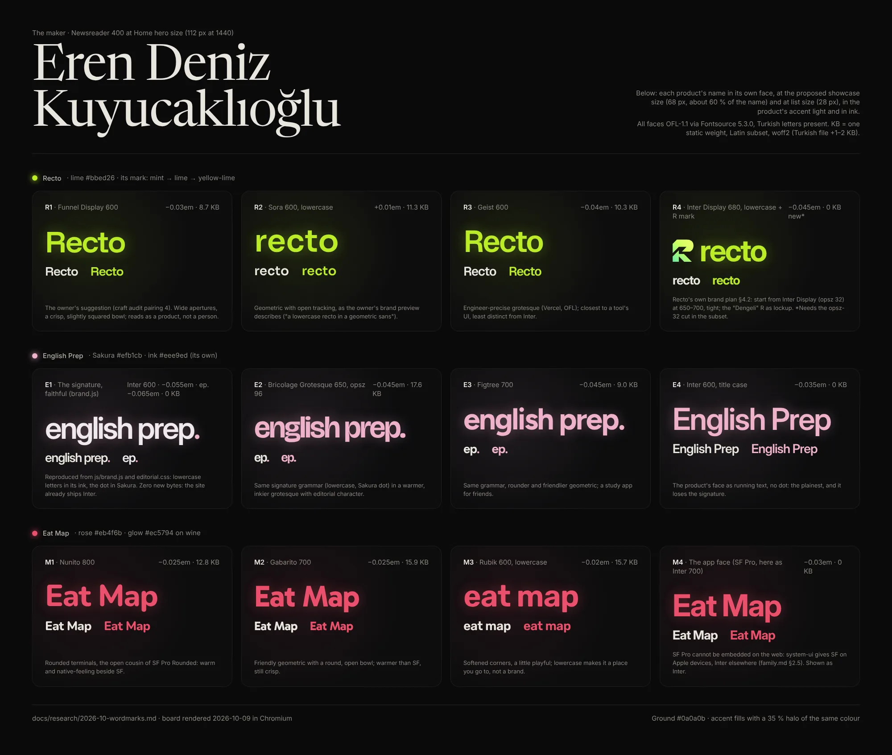
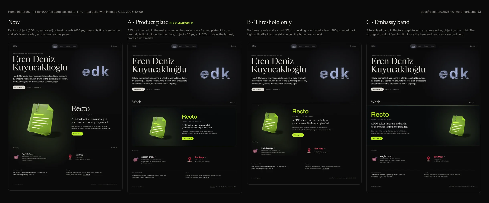

# Research: product wordmarks and Home's hierarchy (2026-10-09)

**Status:** current. The product plate and wordmarks are accepted and built.

**Why:** brief §7, "Home hierarchy" (2026-10-09). On Home the showcase project (Recto, large) is
bigger than the hero's "edk" object, so at first glance it is unclear which is the owner and which is
a project. The owner's idea: set each product's name in its own display face (Recto in pairing 4's
Funnel Display, for example), so projects read as products, distinct from the maker's serif voice.
This follows family.md §2.5: **Newsreader is the maker's voice; each product's face is the product's
voice.**

**Sources and method.** Measured (M): fonts from Fontsource 5.3.0 (`@fontsource-variable/*`),
subset and measured with fontTools; the board and mocks rendered in Chromium from the real build
(mocks inject CSS into the built Home, nothing faked). Read (E): `docs/design/family.md` §2.5,
`docs/research/2026-10-family-audit.md`, `docs/research/2026-10-craft-audit.md` §3; Recto's
`docs/brand/README.md` (§4.2 wordmark, the "Dengeli" mark SVG) and `apps/web/src/home/Launcher.module.css`;
English Prep's `js/brand.js`, `css/editorial.css` (`.brand-mark`) and `css/interactions.css`.
Recollection (R) is marked where used.

---

## 1. What the board tests

Each candidate is set in the product's accent light (fill plus a 35 % halo of the same colour) on the
house ground `#0a0a0b`, at the proposed showcase size (68 px, about 60 % of the hero name's 112 px at
1440) and at list size (28 px, Home's "also building" strip and roughly Work's row titles), in ink and
in accent. The hero name sits above at true size so the hierarchy can be judged at a glance.

All twelve faces are OFL-1.1 and carry the Turkish letters (ğ Ğ ş Ş ı İ ç Ç ö Ö ü Ü; checked in the
Latin and Latin-ext files). Sizes are one static weight, Latin subset, woff2 (M); the Turkish file
adds 1–2 KB and loads only when a name contains those letters.

## 2. Candidates

### 2.1 Recto (lime `#bbed26`; its mark: mint `#69EAA3` → lime `#CBFF5F` → yellow-lime `#EDFA6D`)

| | Face | Setting | KB | Reading |
|---|---|---|---|---|
| R1 | **Funnel Display** (NORD ID, 2024) | 600, "Recto", −0.03 em | 8.7 | The owner's suggestion. Wide apertures, a squarish bowl, a sharp `t`: precise and a little glassy. The most distinct from both Newsreader and the house Inter, so it reads as a *logo*, not as UI text. |
| R2 | **Sora** (Barnbrook and Julián Moncada, 2020) | 600, "recto", +0.01 em | 11.3 | Geometric with open tracking: closest to the owner's own brand preview ("a lowercase recto in a geometric sans with open tracking", Recto brand README). Calm, slightly generic. |
| R3 | **Geist** (Vercel, 2023) | 600, "Recto", −0.04 em | 10.3 | Engineer-precise; closest to a tool's UI, but too close to Inter to separate product from house. |
| R4 | **Inter Display** (Recto's own face) | 680, "recto", −0.045 em, with the Dengeli R | 0 new (needs the opsz-32 cut) | Recto's brand plan §4.2: start from Inter Display at 650–700, tight, later redrawn as SVG. The truest heritage, but on this site Inter is the *house* UI face, so a big Inter "recto" reads as the house talking. |

### 2.2 English Prep (Sakura `#efb1cb`, its ink `#eee9ed`)

| | Face | Setting | KB | Reading |
|---|---|---|---|---|
| E1 | **The signature, faithful** (Inter, its `js/brand.js`) | 600, lowercase "english prep", −0.055 em (full) / "ep" −0.065 em (compact), letters in its ink, the dot in Sakura | 0 | Reproduced from `brand.js` and `.brand-mark` exactly. The product already has a wordmark; this *is* it. |
| E2 | **Bricolage Grotesque** (Mathieu Triay, 2023) | 650, opsz 96, same grammar, −0.045 em | 17.6 | Warmer, inkier, editorial; would be a new identity for a product that has one. |
| E3 | **Figtree** (Erik Kennedy, 2022) | 700, same grammar, −0.045 em | 9.0 | Rounder and friendlier; same objection. |
| E4 | Inter, title case | 600, "English Prep", −0.035 em | 0 | The plain name in the product's face; loses the dot, the one constant the family shares (family.md V3). |

### 2.3 Eat Map (rose `#eb4f6b`, glow `#ec5794` on wine)

| | Face | Setting | KB | Reading |
|---|---|---|---|---|
| M1 | **Nunito** (Vernon Adams, Cyreal) | 800, "Eat Map", −0.025 em | 12.8 | Rounded terminals: the open cousin of SF Pro Rounded, so it sits beside the app's SF without fighting it; warm. |
| M2 | **Gabarito** (Naipe Foundry, 2023) | 700, −0.025 em | 15.9 | Friendly geometric, crisp; warmer than SF but not native-feeling. |
| M3 | **Rubik** (Hubert & Fischer) | 600, "eat map", −0.02 em | 15.7 | Soft corners, lowercase: a place you go to. A little toy-like. |
| M4 | The app's face (SF Pro) | 700, −0.03 em | 0 | SF Pro is licensed for Apple platforms only and cannot be embedded (family.md §2.5). `system-ui` gives SF on Apple devices and Inter or Segoe elsewhere, so the mark would change by platform. Shown as Inter. (`ui-rounded` would give SF Pro Rounded, Safari only; R.) |

## 3. Home hierarchy

What made the two read as peers (M, "Now" on the board): the Recto object was 600 px wide and saturated,
edk 470 px and glass; Recto's title was set in Newsreader at up to 104 px, the same voice and nearly
the scale of the 122 px name; and its light spread across the page like the hero's own.

| Variant | What it does | Verdict |
|---|---|---|
| **A · Product plate** (recommended) | A **Work** threshold in the maker's voice (Newsreader h2, "All work" beside it, a rule). The lead project on a plate of its own: 28 px radius, a hairline of its colour, a near-black ground tinted 2.5 % by its light, the light clipped to the plate. Object 400 px (edk 470 stays the largest). Wordmarks for every product. | The hierarchy is unmistakable: the hero is open and personal, the plate is an exhibit. The light no longer reaches the hero or the strip. Works at 1180 touch and at 390. |
| B · Threshold only | A rule and a small "Work · building now" label; no frame; object 380 px; wordmark. | Better than now, but the boundary is quiet and the light still drifts into the strip. |
| C · Embassy band | A full-bleed band in Recto's graphite with an aurora edge line; object on the right. | The strongest product feel, but the object sits on the same side as edk and the band reads as a second hero. Better kept for the embassy (project view) itself. |

## 4. Recommendation and what shipped

**Recto R1 (Funnel Display 600), English Prep E1 (its faithful signature), Eat Map M1 (Nunito 800),
on variant A.** Reasoning: the hierarchy problem is solved by structure (threshold, plate, size); the
wordmarks finish it by changing the *voice* (a sans product name against the serif maker). For Recto
the owner's idea also wins on the type logic: a Funnel Display "Recto" cannot be mistaken for the
house's Inter or Newsreader, and it is an interim mark until the professional logo arrives, which
drops in through the `image` field without a code change. English Prep already has a wordmark, so it
is reproduced, not replaced. Eat Map has none yet; Nunito is the warmest face that still sits beside
SF.

**Implemented (Home only):**

- `src/components/Wordmark.astro`: a product's name from its `wordmark` content field (face, weight,
  tracking, case, optional `text`, `color`, signature `dot`, and `image` for a future SVG logo in
  `src/assets/wordmarks/`). The text node stays the plain title (case is `text-transform`, the dot is
  `::after` with empty alt text), so screen readers and `sheet.ts` read "English Prep", not
  "english prep.". Size comes from the caller, so Work can adopt it at its own scale.
- `src/lib/wordmarks.ts`: the allowed faces and the weights their subsets carry; the content schema
  rejects others. `src/styles/wordmarks.css`: the `@font-face` rules and metric-matched fallbacks.
- Fonts: `funnel-display-latin.woff2` 9.1 KB, `nunito-latin.woff2` 12.9 KB (plus TR files of 1.3 and
  1.6 KB), one static weight each, from `tools/fonts/subset.py`. Not preloaded: the plate starts
  below the first screen at 1440×900, so the first-paint budget is unchanged (Home 170.1 KB of 200).
- Home: the Work threshold (`site.home.showcase.title`, `.all`), the plate, the 400 px object
  (180 px on phones, where edk is 210 px), wordmarks for the lead and the "also building" strip.
  Work, Record, About, the nav and the scrollbars are untouched.

## 5. Questions for the owner (taste)

1. **Recto's wordmark:** (a) Funnel Display "Recto", as built; (b) Sora lowercase "recto", closest
   to your own preview; (c) Inter Display lowercase "recto" with the Dengeli R, Recto's own plan;
   (d) wait for the professional logo and use (a) until then.
2. **Show Recto's R mark beside the wordmark on the plate?** (a) no, the glass object already plays
   that role (as built); (b) yes, small, before the name; (c) only in the project view.
3. **Eat Map:** (a) Nunito 800, as built; (b) Gabarito; (c) Rubik lowercase "eat map"; (d) the
   system face (true SF on Apple devices, different elsewhere). Do you want a dot or another sign
   for Eat Map, the way English Prep has its Sakura dot?
4. **The plate:** (a) framed plate, as built; (b) no frame, threshold only (B); (c) full-bleed band
   (C). And should the plate's ground take each product's own ground (Recto graphite, English Prep
   plum, Eat Map wine) rather than one near-black?

## 6. Tools for 2D logo work (the owner's question)

Recollection (R), not tested here. For a mark and wordmark that hold from 16 px to a billboard:
**Figma** (free tier) or **Affinity Designer** for vector drawing with boolean shapes and precise
grids; **Inkscape** if free and offline matters; **Glyphs** or **FontLab** when the wordmark's letters
are redrawn as type (spacing and optical overshoot are where most home-made wordmarks fail); Apple's
**Icon Composer** for the layered app icon on Apple platforms. Whatever the tool, deliver SVG masters
with outlined text (an OFL face may be the starting point of a logo; Recto brand README §4.2), and
test at 16, 32, 64 px and on light and dark grounds. The strongest route for Recto remains the one its
brand plan names: commission a specialist with the Dengeli R and this board as the brief.

## Licences

All faces OFL-1.1 (Fontsource package metadata, M): Funnel Display, Sora, Geist, Bricolage
Grotesque, Figtree, Nunito, Gabarito, Rubik, Inter. The OFL allows embedding and subsetting; the
subsets keep the original name tables. SF Pro: Apple's licence limits it to Apple platforms; not
embedded.
